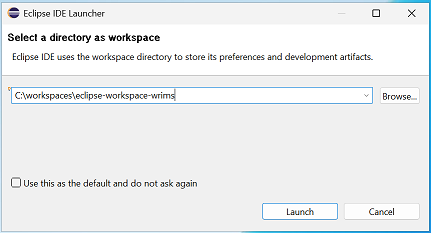
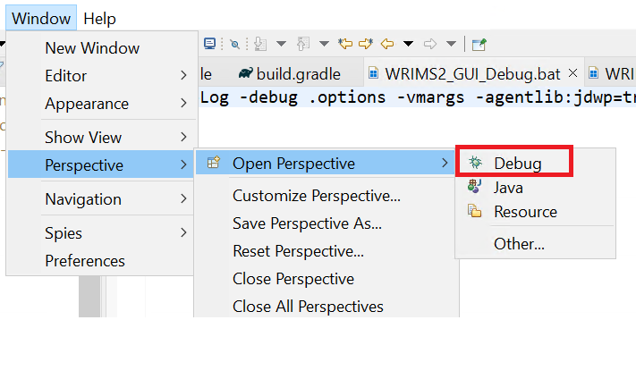

# Building WRIMS v2.x from this repository
The devops migration of WRIMS from native Eclipse to Gradle has allowed the WRIMS application to 
be built headlessly through github and streamlines the configuration of a developer build environment.

## WRIMS 2.2.x Gradle Structure
The Gradle integration involved refactoring the primary modules into the these root folders:
1. wrims-core: Compute Engine source
2. third-party: Collection of all third-party/external jars
3. wrims-ide: WRIMS Plugin source
4. dwr-hecdssvue: HEC-DSSVue Plugin source
5. jdiagram: Schematic View source
6. xtext: xtext processor source
7. xtext-ui: xtext editor source
8. wrims-install: module used to assemble the WRIMS GUI application and Patch installers. 

# WRIMS Developer Build Setup - Using Gradle:
PREREQUISITES:
- Java JDK 1.8 installed (https://www.oracle.com/java/technologies/javase/javase8u211-later-archive-downloads.html)
- JAVA_HOME environment variable set to installed JDK 1.8 (optional)
  - This is only required to build the project from the command line. 
- Git
  - https://github.com/git-guides/install-git
- IDE Eclipse
  - Latest Eclipse RCP download site:
  - https://www.eclipse.org/downloads/packages/release/2024-12/r/eclipse-ide-rcp-and-rap-developers
- \<USER-DIR\>\\.gradle\gradle.properties configured with token for access to the CentralValleyModeling GitHub repository
  - Example: C:\\Users\\\<username\>\\.gradle\gradle.properties
  - NOTE: If you have to create the gradle.properties file, make sure it's not a "gradle.properties.txt" file. 
```
...
cvmUserId=<githubUserId>
cvmPassword=<githubPersonalAccessToken>
...
```

The cvmPassword is preferably set to a GitHub personal access token that has been granted access to 
the CentralValleyModeling GitHub repository with public_repo access and read:packages enabled.<br>

You can generate a personal access token here: https://github.com/settings/tokens/new


> [!WARNING]
> If you don't set the cvmUserId and cvmPassword in your gradle.properties file, you will get errors 
> when you load the project into Eclipse. If that happens, you'll need to set the missing parameters in your gradle.properties file.
> Then remove and re-import the project to eclipse to clear the errors and load correctly.<br>
> Make sure your gradle.properties file is in the correct location under your user directory and not a .txt file.<br>
> <br>
> Never add your github username/token to any properties within project source code or it risks
> being committed & exposed to the public.

## 1. Pull Source from GitHub & build the project
- Clone the repository to your local machine.
  - Repository Clone URL: https://github.com/CentralValleyModeling/wrims.git
- CD into the wrims directory.
- Checkout the "Feature/wrims-devops" branch.
- Build the project with gradle (optional).

The following commands will clone the repository, switch to the wrims-devops branch, and build the project from a command prompt.
Alternatively, you can use your preferred git repo manager tool to clone the wrims repo and checkout the wrims-devops branch. 
```
git clone https://github.com/CentralValleyModeling/wrims.git
cd wrims
git switch Feature/wrims-devops
.\gradlew.bat build
```

> [!NOTE] If you do not prebuild the project from command line and run into
> issues with the Eclipse import, you may need to run the gradle build from the command line 
> first and re-import the project into Eclipse.

## 2. Open Eclipse with a new/clean workspace



### Configure the Eclipse Workspace java settings

Open the Preferences window from the menu bar: Window->Preferences


Set Gradle > "Java Home" to an appropriate JDK (1.8) </br>
Click Apply.


Open the Java > Installed JRES </br>
Add and select the same Java 1.8 version that was set as the Gradle Java Home. </br>
Click Apply.


Open the Java>Compiler>Errors/Warnings. </br>
Set "Deprecated and restricted API" > "Forbidden reference (access rules)" to "Warning". </br>
Click "Apply and Close" on the preferences window.


## 3. Import the wrims project into Eclipse
Close the "Welcome" window if it appears.
Click File-> Import... and select Import as an Existing Gradle Project


Select the wrims project directory and click next.


Complete the import with default settings. </br>
Verify that the Java home directory shows a version 1.8 JDK. </br>
Click Finish to import.


> [!NOTE] Click OK on this error window if it appears:


Once the build is complete, you should see 0 errors in the Problems window.</br>
Gradle Tasks & Gradle Executions windows default to the bottom of the Eclipse window.


 


## 4. Build WRIMS with Gradle task
From the "Gradle Tasks" window, run the "build" task on the root project.

NOTE: This will not build an installer, only the code.


## 5. Building / Running the WRIMS Installer with Gradle Tasks

The following gradle tasks have been added to build/run the gradle installer:

- installer
  - buildWrimsInstall: Builds the WRIMS GUI installer (but does not create a zip)
- run
  - runWrimsGui: Runs the WRIMS GUI application (the WRIMS install must be built first)
- release
  - zipWrimsInstall: Builds the WRIMS GUI installer and creates a zip file
  - zipWrimsPatch: Builds the WRIMS patch zip file


> [!WARNING] 
> If the buildWrimsInstall task fails with a 401 error like this: <br><br>
>   Could not GET 'https://maven.pkg.github.com/CentralValleyModeling/wrims/gov/ca/dwr/run-libs/maven-metadata.xml'. 
>   Received status code 401 from server: Unauthorized <br><br>
> You are likely missing the cvmUserId and cvmPassword prerequisite settings in your gradle.properties file

## 6. Remote Debug the WRIMS GUI Application

After the WRIMS source has been configured and the installer has been built, you are ready to remote debug WRIMS.

> [!NOTE]
> Remote Debugging means the WRIMS GUI application is fully assembled under the wrims-install module and
> run with "Remote Java Debugging" enabled as a flag in the launch script (e.g. the "remote java process). 
> All the Luna Eclipse plugins and jars are included within the installer \plugins directory and are used to launch the WRIMS GUI application.
> The developer can then connect their eclipse IDE to the running WRIMS GUI application and debug the code using a Remote Debug session (debugger java process) that is linked to the local java files.
> <br><br>
> Local Debugging implies running/debugging the application directly from a single jvm in the Eclipse IDE.
> A working configuration for local running/debugging has not been established yet.

### Launch the WRIMS GUI application with Remote Debug enabled

The following gradle tasks hava been added to launch the WRIMS application with remote debugging enabled:


Run either the debug>debugWRIMS task or the debug>updateAndDebugWRIMS task to launch the WRIMS GUI application with remote debugging enabled.

### Configure the Remote Debug sessions:
From the toolbar, click Run>Debug Configurations

Create a new "Remote Java Application" configuration


Set the connection port to 5005


Add all the projects to the source tab


Apply and close the configuration. 

Launch WRIMS in debug mode using the run > "runWrimsGui" gradle task.

Open the Debug perspective in Eclipse.



Start the Remote Debug configuration.


You can now set breakpoints in the WRIMS GUI code and debug the application.


> [!NOTE]
> Currently, hot swapping code through eclipse remote debugger throws an "Add method not implemented" error.
> Regardless of the scope of the code change. This issue has been reported to the Eclipse buildship community
> and is being tracked here: https://discuss.gradle.org/t/hotswapping-code-with-imported-gradle-project-fails/50387

## 7. Debugging/testing code changes for WRIMS
Once you have completed the above steps and are able to run wrims from the build installer, 
the fastest way to push code changes to the dropin modules is using the Gradle run>updateInstallerDropins task or the run>updateAndRun task.


Both of these tasks will force a rebuild of any modified dropin jars and push them into the WRIMS2 GUI application that was previously built in the wrims-install module using the buildWrimsInstall task. <br> 
The updateAndRun task will also launch the WRIMS GUI application after the dropins have been updated.

These tasks are much faster than doing a complete clean and rebuild of the WRIMS GUI application.

If the application does not reflect the latest changes, you may need to run a clean and buildWrimsInstall task before running the application.

> [!NOTE]
> You will have to re-launch your remote-debugging session after the WRIMS GUI application has been updated and relaunch.
> 
> This process can also be used to test code changes from other developers that you have pulled from a branch update or after checking out their development branch. 


## 8. Eclipse WRIMS Launch Configuration
Attempts have been made to run the WRIMS GUI application directly from Eclipse with a target platform set to use 
only the plugins configured within the wrims-insall build.  <br><br>

While this seems to be the correct approach, we are still experiencing issues with the application failing to launch. 
This issue is being tracked here in github: https://github.com/CentralValleyModeling/wrims/issues/197

## 9. Testing Source Code Changes
How to test source code changes after already configuring your working developer environment.
1. Checkout the branch you want to test, or update your current branch with the latest changes.
2. Run the "updateInstallerDropins" gradle task to update the dropin jars in your built WRIMS GUI application.
- This task will rebuild any modified dropin jars and copy them into the wrims-installer build. 
3. Run the "runWrimsGui" gradle task to launch the WRIMS GUI application.


## Build  Version Node

The version number is configured to the last tagged version number with a ".9999" suffix.
If the checked out commit is a tag then only the tag name will be used.

> [!NOTE]
> Any numerical value with up to 4 period-delimited values can be used as the version number.
> It does not need to match any existing tag or branch name.
> (e.g. 20250101, 2.2.0, 2.2.0.1)