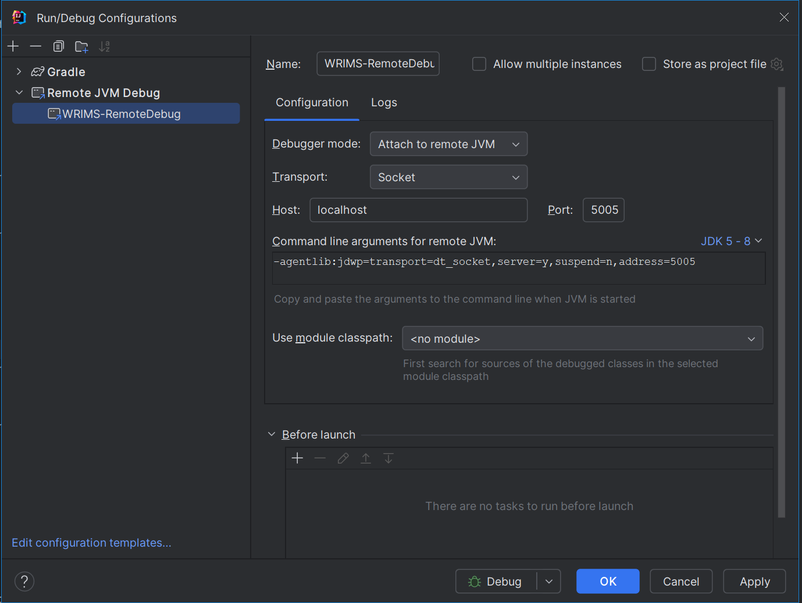

# Building WRIMS v2.x from this repository
The devops migration of WRIMS from native Eclipse to Gradle has allowed the WRIMS application to 
be built headlessly through github and streamlines the configuration of a developer build environment.

## WRIMS 2.2.x Gradle Structure
The Gradle integration involved refactoring the primary modules into the these root folders:
1. wrims-core: Compute Engine source
2. third-party: Collection of all third-party/external jars
3. wrims-ide: WRIMS Plugin source
4. dwr-hecdssvue: HEC-DSSVue Plugin source
5. jdiagram: Schematic View source
6. xtext: xtext processor source
7. xtext-ui: xtext editor source
8. wrims-install: module used to assemble the WRIMS application and Patch installers. 

# WRIMS Developer Build Setup - Using Gradle:
PREREQUISITES:
- Java 8
- Git
- IDE (IntelliJ, Eclipse, etc.)
- \<USER-DIR\>\\.gradle\Gradle.properties configured with token for access to the CentralValleyModeling GitHub repository
```
...
cvmUserId=<userId>
cvmPassword=<userToken>
...
``` 

## 1. Pull Source from GitHub
Clone the repository to your local machine.
Repository Clone URL: https://github.com/CentralValleyModeling/wrims.git
Checkout the "Feature/wrims-devops" branch.

## 2. Build Code with Gradle Actions
IDE's such as IntelliJ should automatically recognize the gradle build files and offer to import the project.
Gradle tasks can either be run through the Gradle actions tab in your IDE or through the terminal/command line.

Run the "Build" task on the root "cvm-wrims" project to build all modules. NOTE: This will not build an installer, only the code.

Terminal / Command line Example from the project root:
```
#LINUX
./gradlew build

#WINDOWS
gradlew.bat build
```

## 3. Build the installer/patch zip files locally
The installer can be built by running the "zipWrimsGui" task in the wrims-install module.

The generated wrims install zip file will be located in the /wrims-install/build/installer
folder. The installer file will be named: wrims_gui_x64_\<version\>.zip

> [!NOTE]
> \<version\> defaults to the branch/tag name but can be overridden in the root build.gradle file.  

### From developer linux terminal:
You can build the installer by running the following linux command from the root of the project:
```
./gradlew :wrims-install:zipWrimsGui
```

### From developer windows command line / terminal:
You can build the installer by running the following command from the root of the project:
```
gradlew.bat :wrims-install:zipWrimsGui
```

> [!WARNING]
> If the zipWrimsGui task fails with a 401 error like this: <br><br>
>   Could not GET 'https://maven.pkg.github.com/CentralValleyModeling/wrims/gov/ca/dwr/run-libs/maven-metadata.xml'. 
>   Received status code 401 from server: Unauthorized <br><br>
> You are likely missing the cvmUserId and cvmPassword prerequisite settings in your Gradle.properties file

## 4. Run the WRIMS GUI Application

Once the installer has been built, the WRIMS GUI application can launched by running one of the following files
from the installer directory (wirms-gui\build\installer\wrims_gui_x64_\<version\>):

- WRIMS2_GUI_Start.bat - This will force a clean and start of the WRIMS GUI application
- WRIMS2_GUI_x64.exe - This will run the application without forcing a clean

## 5. Debug the WRIMS GUI Application

The WRIMS GUI application can be debugged from any IDE that supports remote debugging.

Configure a "Java Remote Debug" configuration in your IDE with the following settings:



Update the /wrims-install/build/installer/wrims_gui_x64_\<version\>/WRIMS2_GUI_Start.bat file to include the remote debug vmargs like this:
```
wriMS2_GUI_x64 -clean -console -consoleLog -debug .options -vmargs -agentlib:jdwp=transport=dt_socket,server=y,suspend=n,address=5005
```

Run the WRIMS2_GUI_Start.bat file to start the WRIMS GUI application in debug mode.

Start the RemoteDebug configuration in your IDE to connect to the WRIMS GUI application.

At this point you can set breakpoints in the WRIMS GUI code from your IDE and debug the application.

## 6. Build the WRIMS Patch Files
The patch can be built by running the "zipWrimsPatch" task in the wrims-install module.

The generated wrims patch zip file will be located in the /wrims-install/build/patch
folder. The patch file will be named: wrims_patch_v2.2.0_basis.zip

> [!NOTE]
> The patch zip version is currently hard-coded to "v2.2.0_basis" in the build.gradle file for
> compatibility with the patch update link used in the WRIMS2_GUI_UPDATE_and_Start.bat file.

### From developer linux terminal:
You can build the patch zip by running the following linux command from the root of the project:
```
./gradlew :wrims-install:zipWrimsPatch
```

### From developer windows command line / terminal:
You can build the patch zip by running the following command from the root of the project:
```
gradlew.bat :wrims-install:zipWrimsPatch
```

## How to build wrims installer From GitHub Releases
The installer and patch zip files are automatically generated when a new "Release" is created from
the GitHub WRIMS site (https://github.com/CentralValleyModeling/wrims).

1. From the github wrims home page (https://github.com/CentralValleyModeling/wrims/) click the "Releases"
   link on the right hand side. Direct link: https://github.com/CentralValleyModeling/wrims/releases

2. From the Releases page, select "Draft a new release" button at the top of the page.
   Direct link: https://github.com/CentralValleyModeling/wrims/releases/new

3. Click the "Choose a tag" drop down and type in a new tag name in the "Find or create new tag" field.
   For an internal release, use a date stamp in the format of "YYYYMMDD" (e.g. 20241224).

4. Click the "Target" branch drop down and select the branch you'd like to build the installer from.

5. Click "Generate release notes" to automatically pull PR change logs into the release notes.

6. Enter a title in the "Release Title" field. Typically, this matches the tag name.

7. (OPTIONAL) Add any additional notes to the Description field

8. If this is a non-production ready release, check the "Set as a pre-release" checkbox.

9. Click "Publish Release"

The installer and patch zip will be automatically generated and added to the new Release.


## Build Version Note
The version number is configured to the last tagged version number with a ".9999" suffix.
If the checked out commit is a tag then only the tag name will be used.

> [!NOTE]
> Any numerical value with up to 4 period-delimited values can be used as the version number.
> It does not need to match any existing tag or branch name.
> (e.g. 20250101, 2.2.0, 2.2.0.1)
 
## TattleTale Report
The JBoss TattleTale Report can be generated with the `./gradlew tattletaleReport` task. 
The report runs a details analysis of jar, package, and class dependencies and can help
identify cyclic, duplicated, or unused class references.