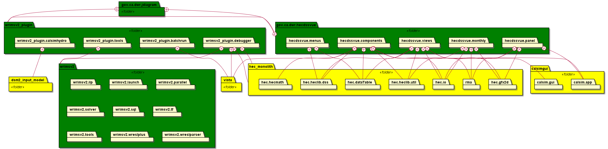

# WRIMS: Water Resource Integrated Modeling System
a generalized water resources modeling system for evaluating operational alternatives of large, complex river basins. WRIMS integrates a simulation language for flexible operational criteria specification, a linear programming solver for efficient water allocation decisions, and graphics capabilities for ease of use. These combined capabilities provide a comprehensive and powerful modeling tool for water resource systems simulation.
- https://water.ca.gov/Library/Modeling-and-Analysis/Modeling-Platforms/Water-Resource-Integrated-Modeling-System

## WRIMS with HEC-DSS version 7 library
We are modernizing WRIMS and its development. This work updates WRIMS dependencies on HEC-DSS, the US Army Corps of 
Engineers data storage system. This allows WRIMS to read and write files using version 7 of the DSS data format. It 
is also a step toward devOps-style development, automating the integration of HEC-DSS libraries from HEC's artifact 
management system, rather than relying on manual updates or building locally from source.

## An evolving build system
The latest Feature/dev-ops WRIMS branch has been updated to use the Gradle build system.
Instructions on how to build WRIMS following the gradle integration (2024) located here: 
[Eclipse build instructions](./README.build-eclipse.md). 
[IntelliJ build instructions](./README.build-gradle.md). 

The mainline WRIMS branch (DSS6) is exclusively built from Eclipse (Luna) and can be built from this 
repository following the procedure described [here](./README.build.md). 

As part of the movement toward devOps development, dependency analyses and proposals for re-organization of the 
build have been added as README files within components of this repository.

## WRIMS GUI dependencies
The WRIMS GUI is a plugin to Eclipse's Equinox RCP (Rich Client Platform). Its components include the packages 
listed below, with indicated dependencies on other packages managed here (i.e. excluding external jars from java, 
eclipse, etc.)

- [dwr-jdiagram](./gov.ca.dwr.jdiagram/README.md)
- [dwr-hecdssvue](./gov.ca.dwr.hecdssvue/README.md)
- [wrims-ide](./wrims_v2/wrimsv2_plugin/README.md)
- [third-party](./third-party/README.md)
- [WRIMSv2](./wrims_v2/wrims_v2/README.md)

## DevOps Migration
The "wrims_v2" directory here contains files and directories from the WRIMS project as it existed before the DevOps revisions were started.
All other files and folders at the root level in this branch and its descendants are structured to support GitHub-style CI/CD builds with Gradle.

Directories here:
-  .github/workflow -- home to the GitHub workflows that build WRIMS components on the GitHub site
-  buildSrc -- Holds build configuration information common to all subprojects. For specifics, see Gradle documentation https://docs.gradle.org/current/userguide/organizing_gradle_projects.html#sec:build_sources
-  gradle -- configurations for the gradle build, most significantly the file "libs.version.toml" which sets the version numbers for the libraries that will be retrieved from Maven Central or other artifact repositories at build time
-  wrims-core -- the gradle sub-project that produces the equivalent of the previous WRIMSv2.jar file
-  third-party -- the gradle sub-project that consolodates all third party jars into a single OSGI module
-  wrims-ide -- the gradle sub-project that builds the refactored wrimsv2_plugin module
-  dwr-hecdssvue -- the gradle sub-project that builds the refactored hecdssvue module
-  eclipse-luna-libs -- contains all the jars for the Luna version of Eclipse
  - This version of eclipse is used by the v2 version WRIMS GUI and is unavailable form Maven Central or other artifact repositories
  - It will be removed once Eclipse is updated to a newer version or an alternative solution for retrieving the jars is identified
-  wrims_v2 -- see above

The remaining files at this level are set up to support a multi-project gradle build as described at https://docs.gradle.org/current/userguide/intro_multi_project_builds.html

Files were moved (rather than copied) from wrims_v2/wrims_v2/src to new locations in wrims-core/src so that their git histories would be preserved. Source files for non-java program components were left in their original folders, and will be moved as the project goes forward. A [README file in wrims_v2/wrims_v2/src](./wrims_v2/wrims_v2/src/README.md) lists the groups of files that were moved and left behind.

The jar that's built from this branch (wrims-core) of the project does not contain the
antler classes. To run wrims using this jar, you'll need to include the antler runtime (v 3.5.2)
in addition to the wrims-core jar to replace the old WRIMSv2.jar.

# Dependabot Configuration
This repository uses Dependabot to keep dependencies up to date. The configuration file is located at `.github/dependabot.yml`.

The current configuration checks for updates to dependencies weekly.

Dependabot will automatically create pull requests for dependency updates, which can then be reviewed and merged by the specified reviewers.
It is currently configured to check for updates to Gradle dependencies and GitHub Actions workflows.

The default reviewers for dependency update pull requests are configured in the `.github/CODEOWNERS` file.

More information about configuring Dependabot can be found in the [Dependabot configuration documentation](https://docs.github.com/en/code-security/dependabot/dependabot-version-updates/configuring-dependabot-version-updates).

## Understanding Dependabot Scheduling and PR Timing

---

### 1. Dependabot schedules are *best-effort*, not precise

* When you set `schedule.interval` and `schedule.time`, that’s treated as “run sometime around this time,” not a strict cron.
* GitHub’s docs note that it may not start exactly at the scheduled time—there’s a job queue that can be earlier or later depending on load.
* Seeing 9:20, 10:20, etc. is pretty normal—it’s the system spreading out runs.

---

### 2. Multiple runs at once

Dependabot sometimes makes multiple attempts in quick succession when:

* It detects multiple ecosystems (npm, gradle, docker, etc.) → one job per ecosystem.
* It encounters errors and retries.
* It had a backlog (maybe your repo was newly enabled) and caught up with several updates in bursts.

---

### 3. PR creation is **delayed from the update check**

Dependabot does two phases:

1. **Update check** (scans for new versions, resolves manifests).
2. **PR creation/update** (opens or rebases PRs).

The scan might happen in the morning, but PR creation often lags until later (sometimes hours).
GitHub queues PR creation separately, and sometimes updates don’t get turned into visible PRs until
the following day (especially for large dependency graphs).

---

### 4. Midnight PRs

That lines up with GitHub’s backend batching → Dependabot may only generate or finalize PRs after
internal processing finishes. You’ll often see the “Dependabot created a PR” timestamp not match when the update job ran.

---
