.. _5-analysis-and-diagnostics:

Analysis and Diagnostics
========================

.. _13-debug-compare-existing-studies:

13. Debug Compare Existing Studies
----------------------------------

**Purpose**

This chapter explains how to compare a running study with one or more existing studies during a debug run.

**Before you start**

- The current study is paused in **Debug** mode.
- You have DV/SV files or study outputs from one or more existing alternatives.

**Procedure**

Pause the model in **Debug** mode at a point of interest, such as **March 31, 1925**.

To compare the current run with an existing study:

1. Open the **Data** menu.
2. Choose **Load DSS or Study**.

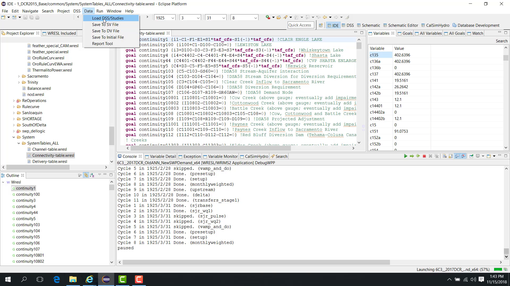

WRIMS 2 GUI allows up to eight alternatives:

- **Alternative 1–4** load DV and SV files from existing studies.
- **Alternative 5–8** load intermediate LP (ILP) files.

This chapter focuses on **Alternative 1–4**.

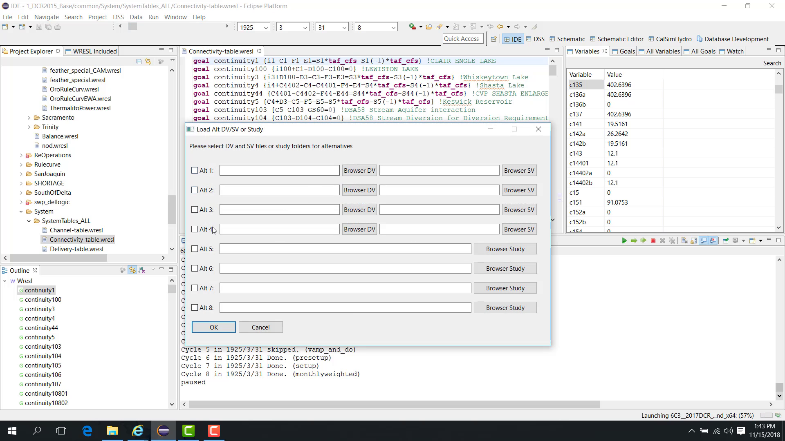

**Load an alternative study**

To load **Alternative 1**, browse to the existing study and select the DV and SV files.

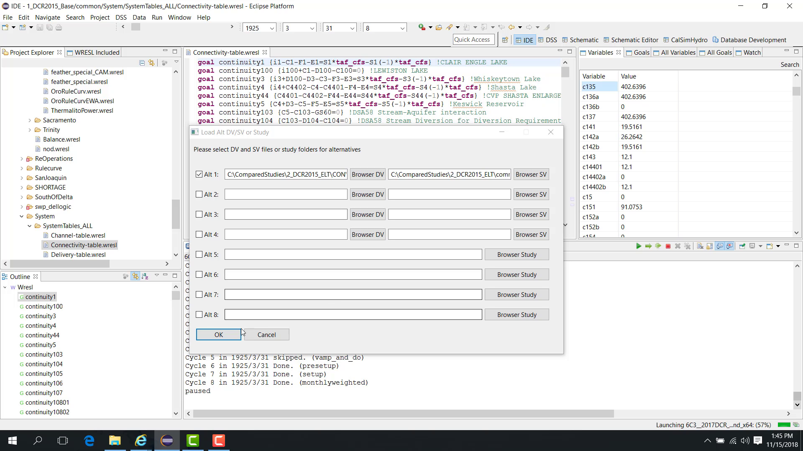

After loading:

- variables show values for the **current run**;
- variables also show values for **Alternative 1**.

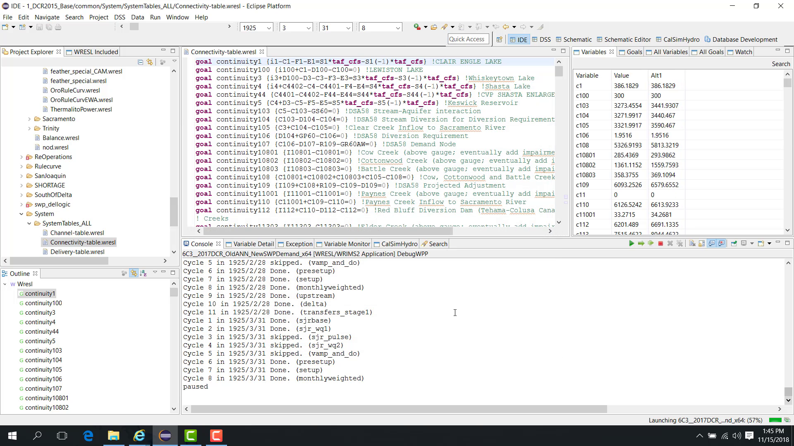

If you click a variable, the **Variable Detail** panel shows both the current-run value and the alternative value.

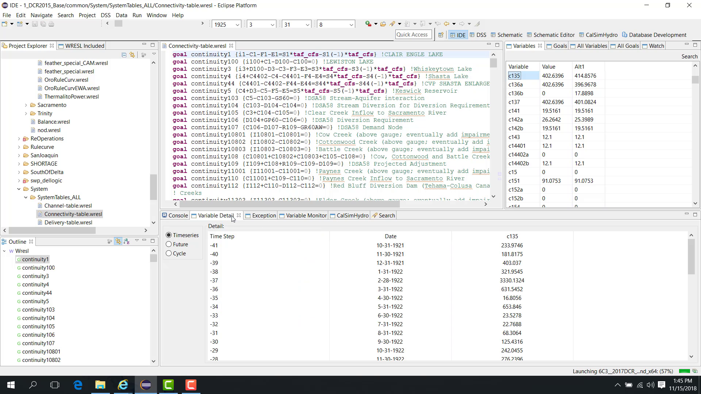

**Compare watched variables**

The **Watch** panel can also be used to compare watched variables between the current run and the alternative.

A watched variable such as ``C8`` or ``C6`` can display both current-run and alternative values through time.

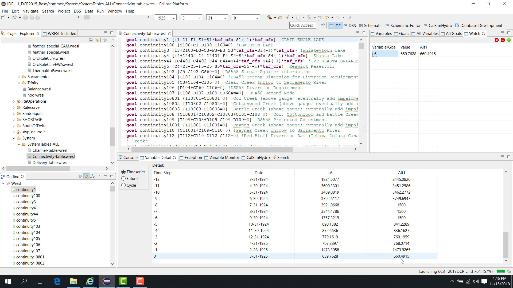

**Continue the run**

When the run resumes and moves to a later time step, the comparison values update accordingly.

**Load another alternative**

Load **Alternative 2** in the same way.

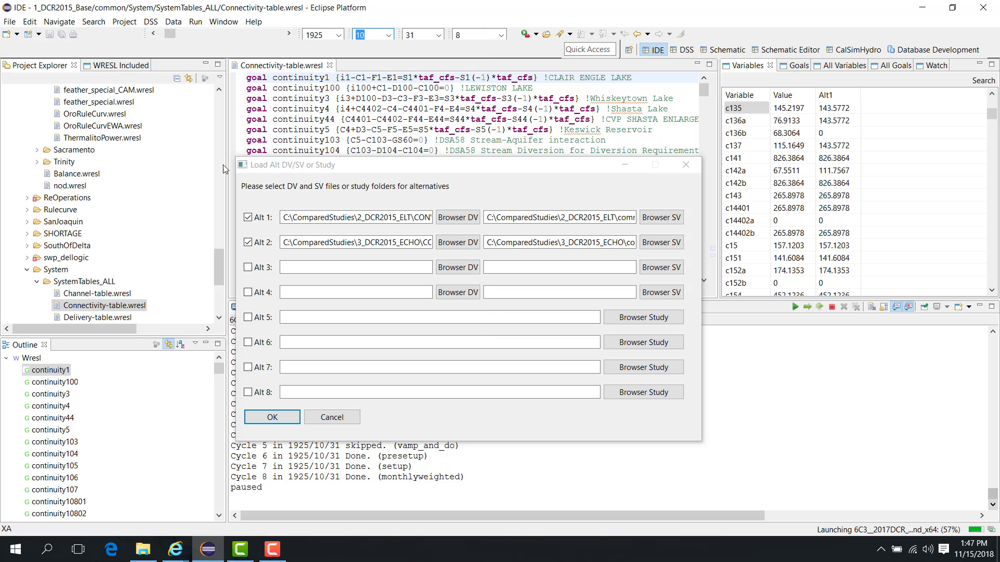

At that point, the interface can compare:

- the current run;
- Alternative 1;
- Alternative 2.

When a variable is selected, the **Variable Detail** panel shows all loaded comparison values.

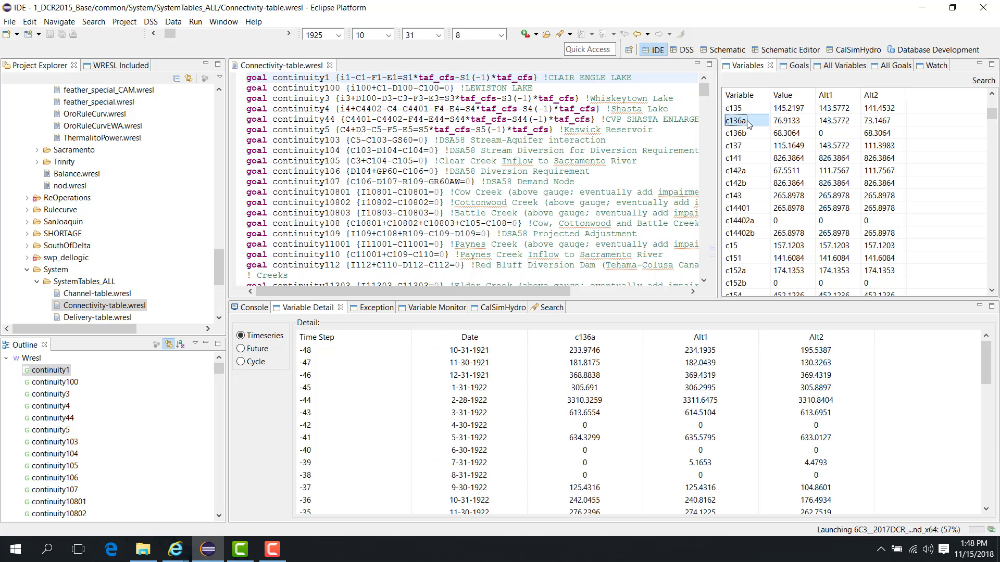

If the study is terminated before completion, the current run is still saved to DSS.

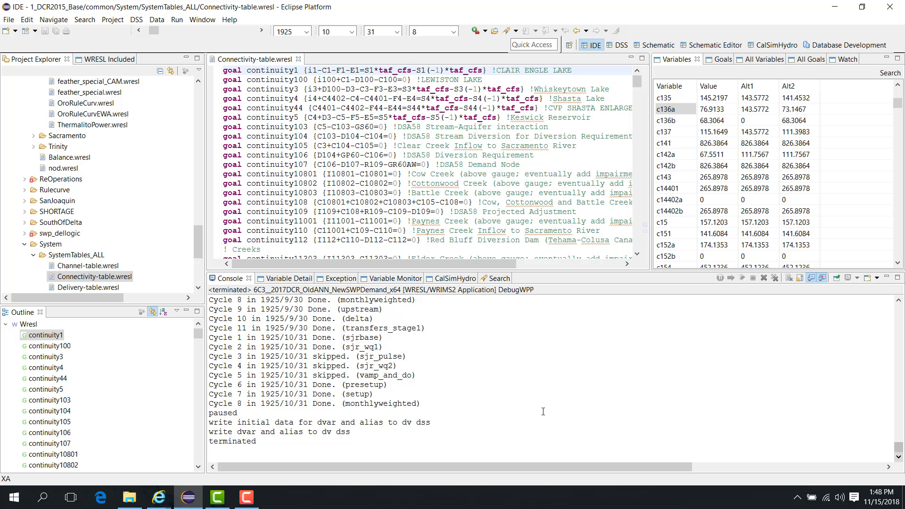

**Notes**

- Alternatives 1–4 are used for existing study DV/SV comparisons.
- This workflow is useful for regression checking, troubleshooting, and understanding why a current run diverges from a known baseline.

**Related sections**

- :ref:`05. Basic Perspectives <05-basic-perspectives>`
- :ref:`23. Advanced Batch Run GUI <23-advanced-batch-run-gui>`
- :ref:`27. DSS Wrims DSS Perspective <27-dss-wrims-dss-perspective>`

.. _21-debug-filter-goals:

21. Debug Filter Goals
----------------------

**Purpose**

This chapter is easier to understand after you are comfortable with paused inspection, watched variables, and goal views. See **09. Debug Pause Variable Goal View** and **12. Debug Watch Variables Goals** as preparation.

This chapter shows how to use a filtering file to evaluate selected goals and determine whether they should be treated as controlling goals.

**Before you start**

- The study is paused in **Debug** mode.
- You have a goal-filter file with goal names, aliases, and optional tolerances.

**Procedure**

For the controlling-goal concept and tolerance behavior, see :ref:`Controlling Goals and Goal Tolerance <controlling-goals-and-goal-tolerance>`.

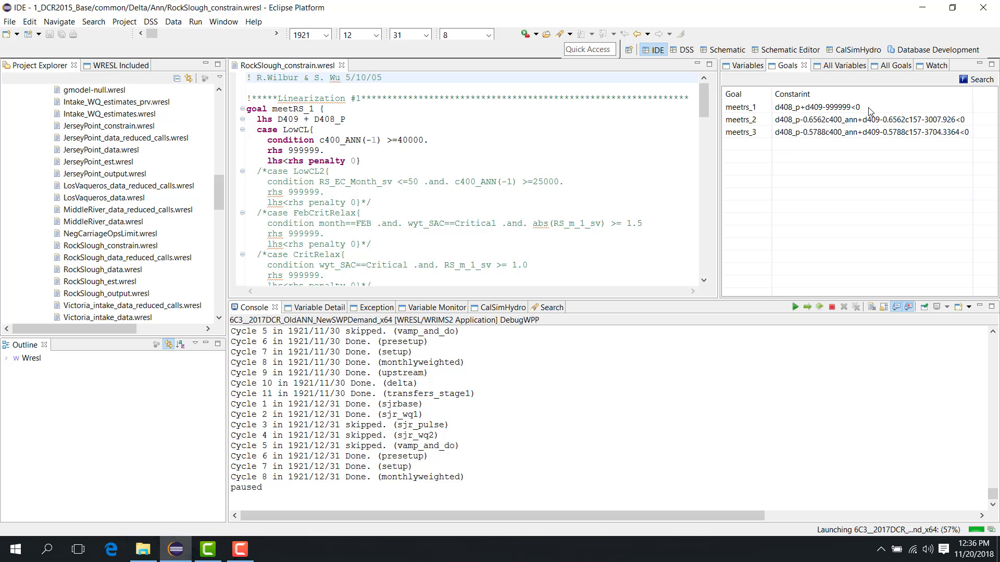

A filtering file provides another way to evaluate controlling goals.

.. image:: diagrams/frames/21_Debug_FilterGoals/21_Debug_FilterGoals_1680.png

A sample filtering file contains:

- the goal name;
- an alias;
- a tolerance.

.. image:: diagrams/frames/21_Debug_FilterGoals/21_Debug_FilterGoals_1800.png

The tolerance rules are described in :ref:`Controlling Goals and Goal Tolerance <controlling-goals-and-goal-tolerance>`.

For example, a tolerance of ``100`` means the goal is treated as controlling if the difference is less than 100.

To use the filter file:

1. Click the **Filter Goals** button.

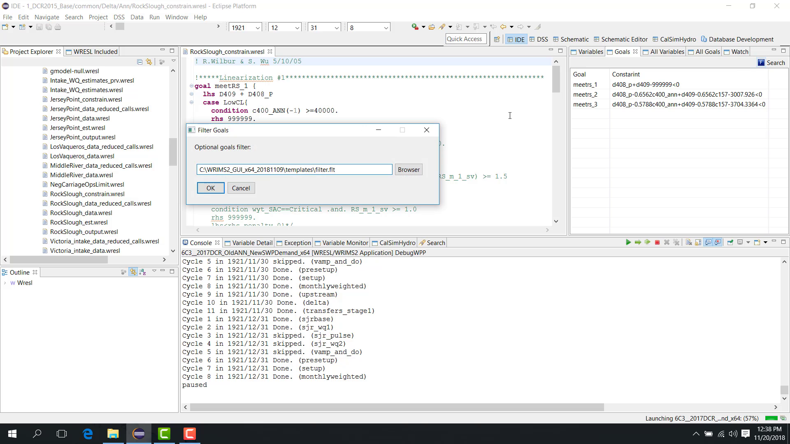

2. Browse to the filter file.

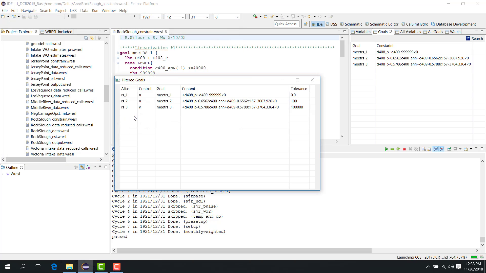

3. Click **OK**.

WRIMS 2 GUI displays a dialog with the filtered goals and indicates which of them are controlling under the specified tolerance.

A very large tolerance may be useful for demonstration, but it is not typical for production analysis.

**Notes**

- A tolerance allows a goal to be treated as controlling even when the left-hand side and right-hand side are not exactly equal.
- Use realistic tolerances for analysis; very large tolerances are usually for demonstration only.

**Related sections**

- :ref:`09. Debug Pause Variable Goal View <09-debug-pause-variable-goal-view>`
- :ref:`12. Debug Watch Variables Goals <12-debug-watch-variables-goals>`
- :ref:`22. Debug Force Variable Resimulation <22-debug-force-variable-resimulation>`

.. _22-debug-force-variable-resimulation:

22. Debug Force Variable Resimulation
-------------------------------------

**Purpose**

This chapter builds on earlier debugging concepts, especially paused execution, goal inspection, and filtered analysis. Review **09. Debug Pause Variable Goal View** and **21. Debug Filter Goals** if needed.

This chapter shows how to force a variable to a specified value and re-simulate the current time step to analyze objective-function impact.

**Before you start**

- The study is paused at the time step and cycle you want to investigate.
- You know the variable and trial value you want to force.

**Procedure**

Pause the model in **Debug** mode at a selected time step and cycle, such as:

- December 1921;
- cycle 10.

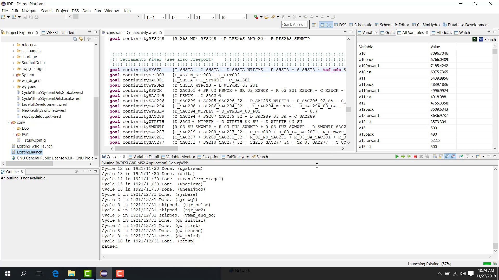

In the example shown here, the current value of ``s_shsta`` is ``3147``.

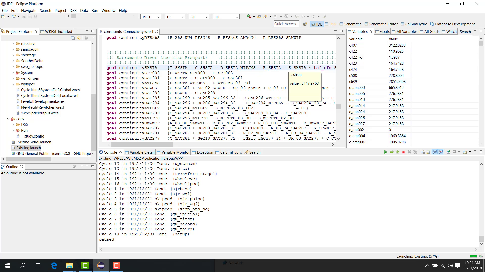

The objective is to test what happens if ``s_shsta`` is forced to ``3000``.

**Step 1: Save the current DV results**

First, save the current results to the DV file.

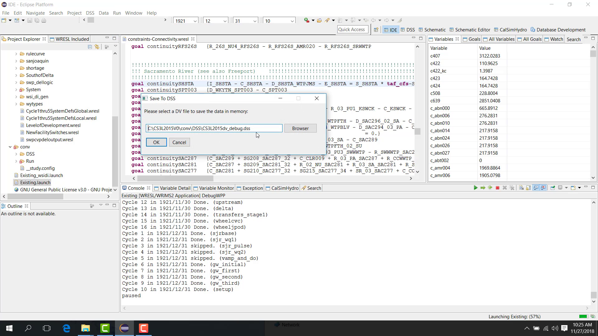

**Step 2: Load the saved DV file as Alternative 1**

Load the saved DV file as **Alternative 1** so that the original value is available for comparison.

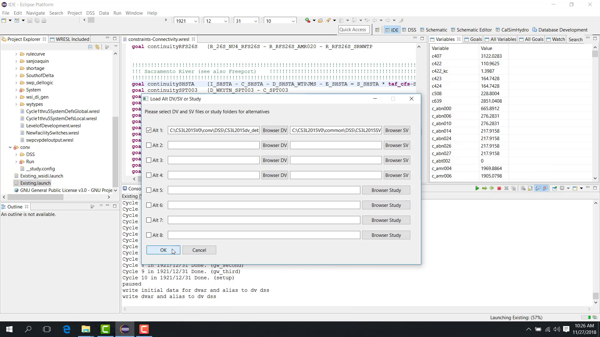

At this point:

- current run = original value;
- Alternative 1 = same original value.

**Step 3: Add a forcing goal**

Add a new goal to the WRESL code, using a unique name so that it does not conflict with any existing goal.

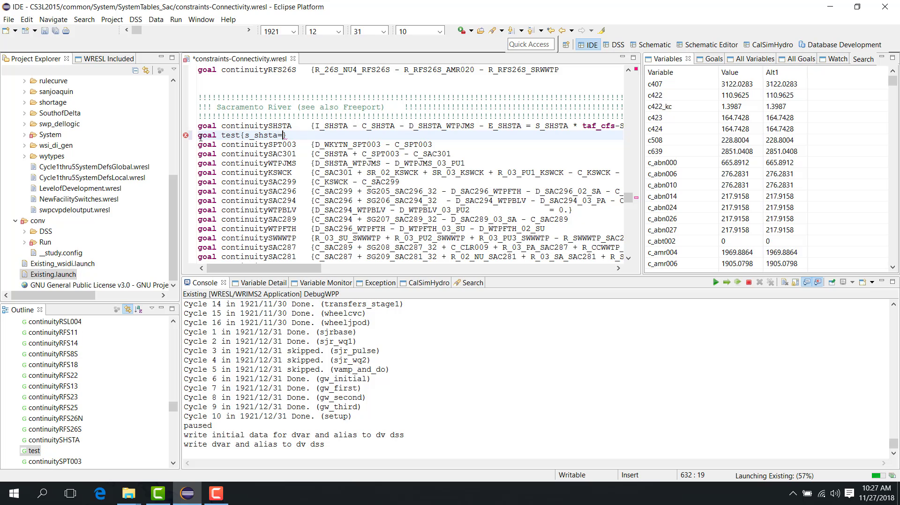

A forcing goal can be written as:

    goal test { s_shsta = 3000 }

Save the file after adding the new goal.

**Step 4: Re-simulate**

To rerun the time step with the new forcing goal:

1. Open **Run > Re-simulate**.
2. Select the current time step.
3. Enable **Re-compile WRESL Code** because the WRESL source has changed.

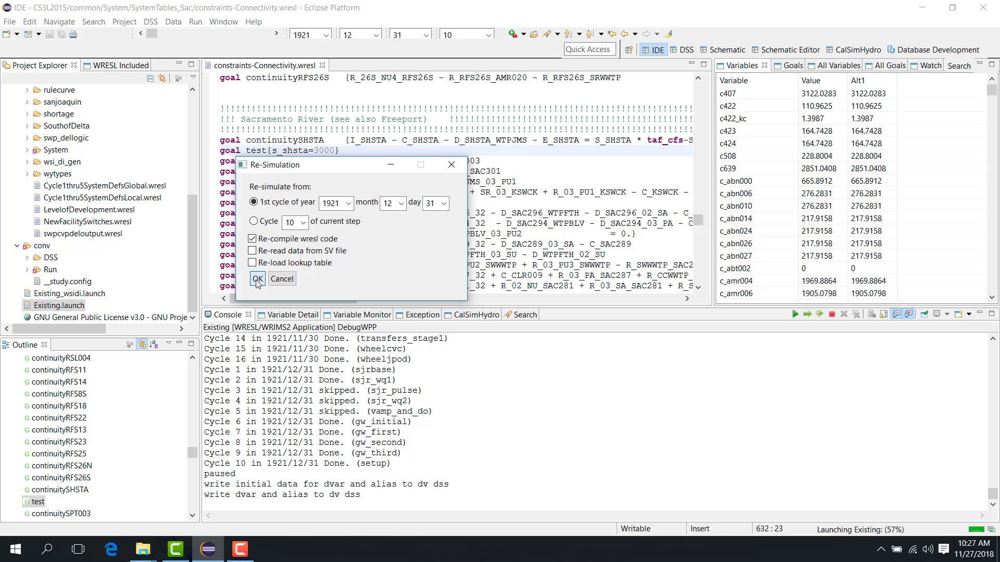

4. Click **OK**.

The time step is rerun using the new goal.

At this point:

- current run = forced value, such as ``3000``;

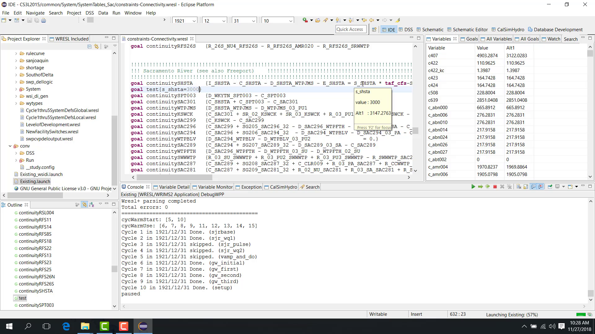

- Alternative 1 = original value, such as ``3147``.

**Step 5: Analyze the objective function**

To analyze the objective-function impact:

1. Open **All Variable**.

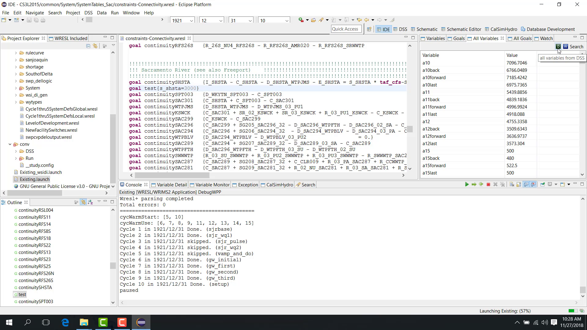

2. Retrieve the alternative data.

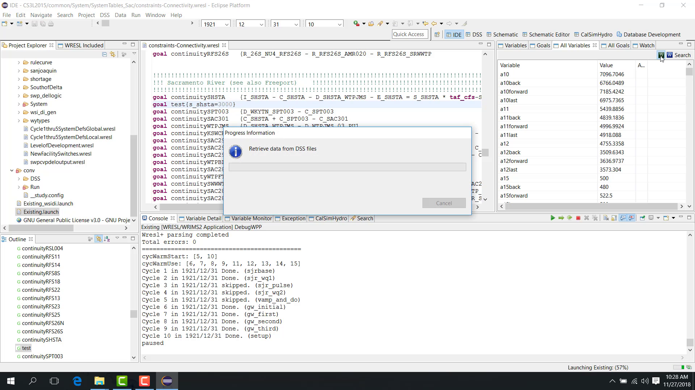

3. Open **Weighted Variable**.

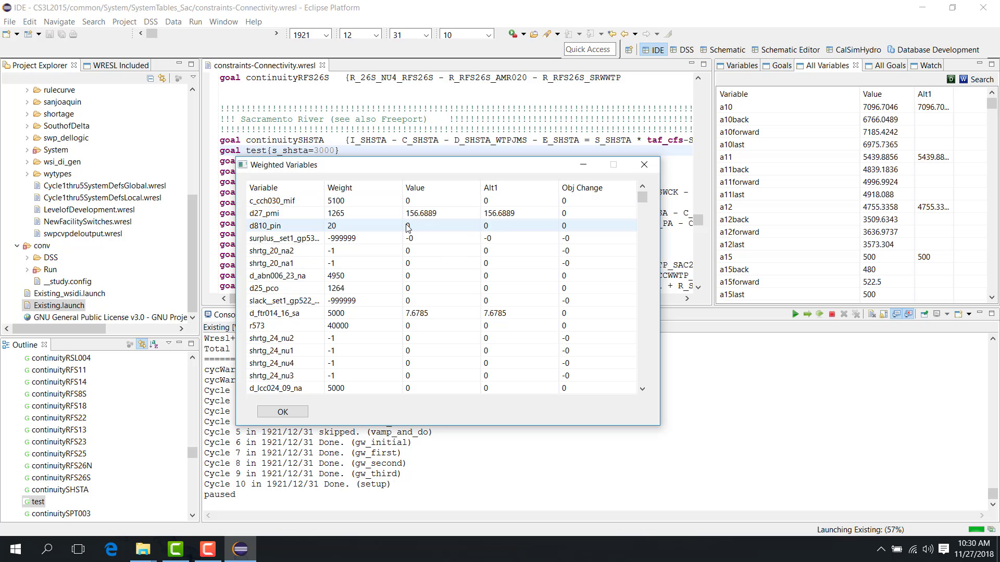

4. Compare the current run and Alternative 1.
5. Sort by objective change.

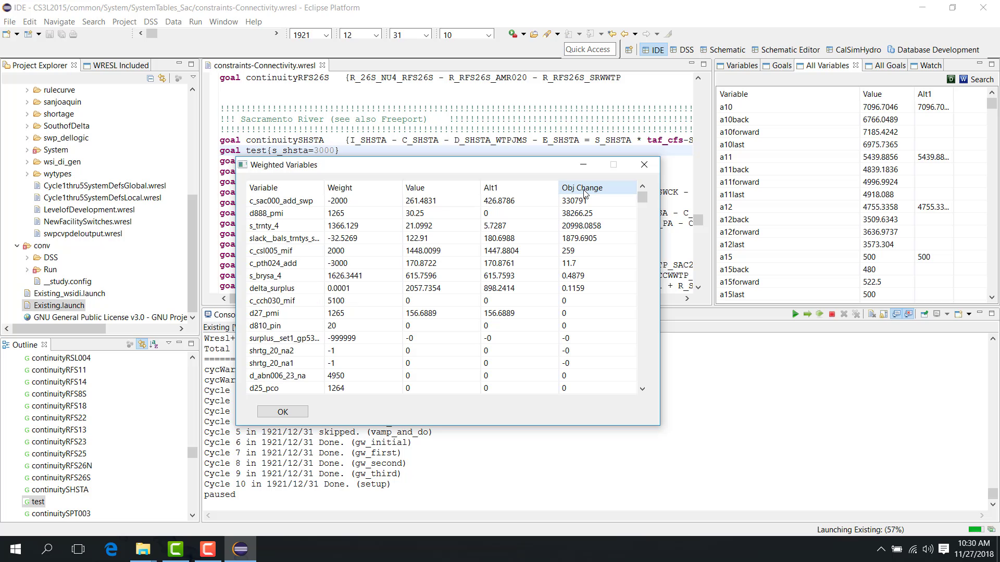

This comparison shows:

- which variables increase the objective;
- which variables decrease the objective;
- which changes contribute most to the overall difference.

**Notes**

- Save the current DV result first so that the forced rerun can be compared against the original case.
- Recompile WRESL code if you changed the WRESL source.

**Related sections**

- :ref:`09. Debug Pause Variable Goal View <09-debug-pause-variable-goal-view>`
- :ref:`21. Debug Filter Goals <21-debug-filter-goals>`
- :ref:`26. Advanced Position Analysis <26-advanced-position-analysis>`
