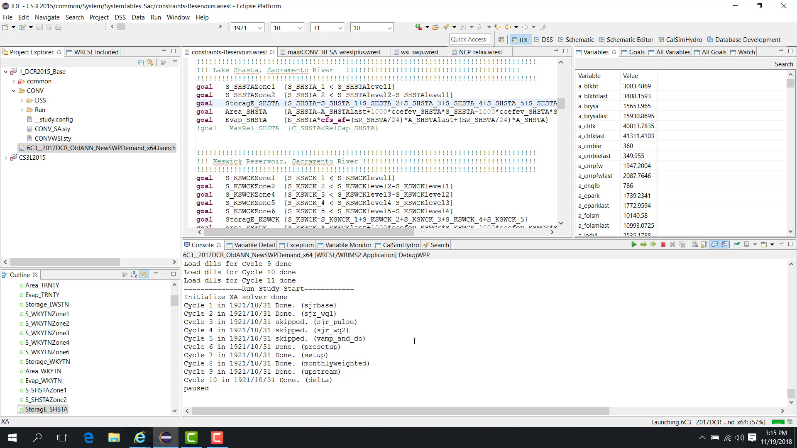
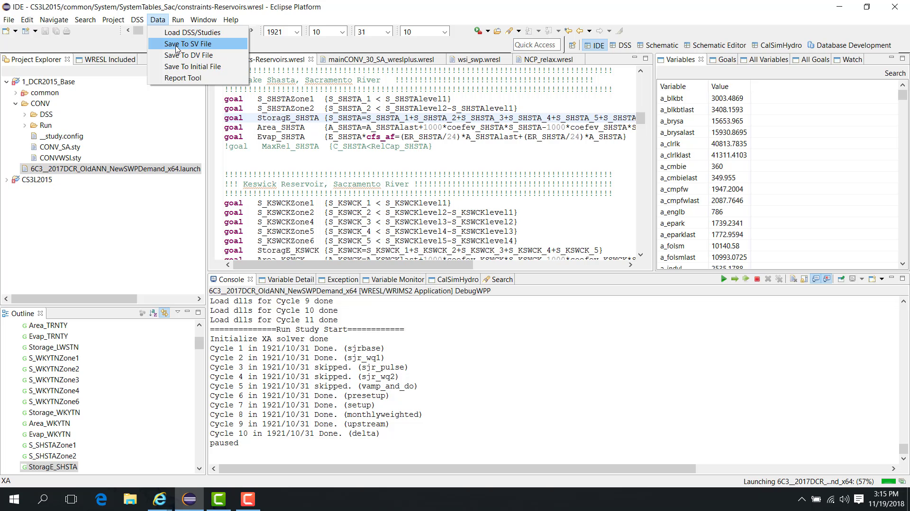
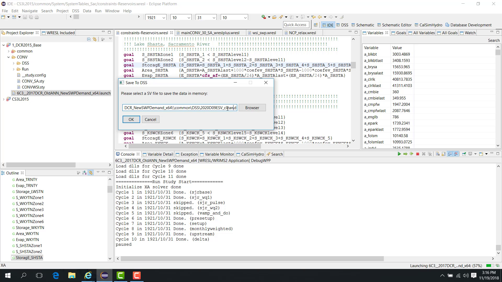
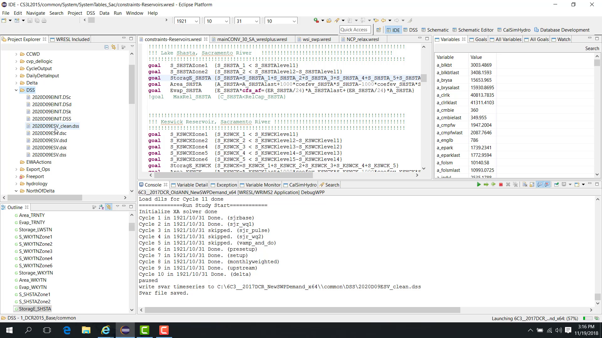
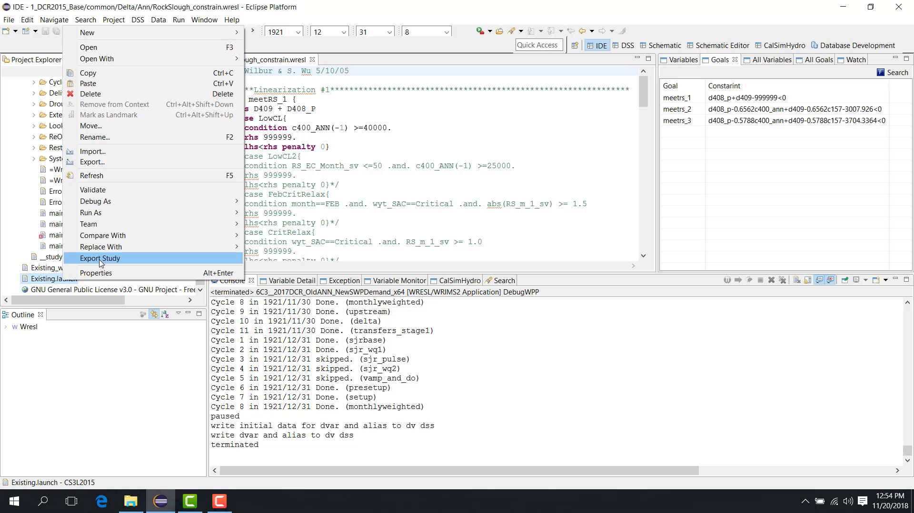
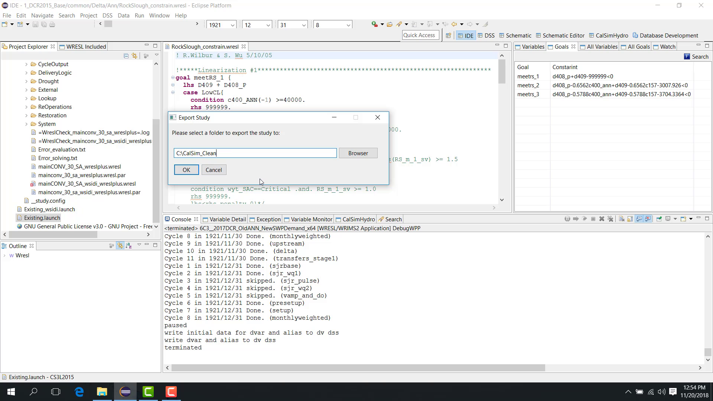
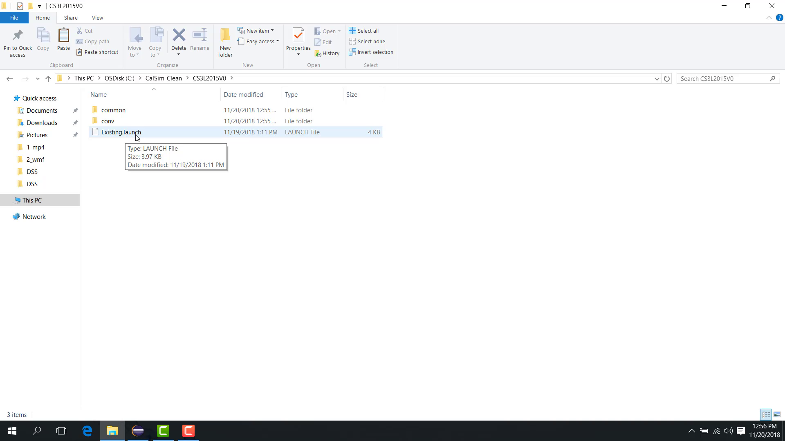
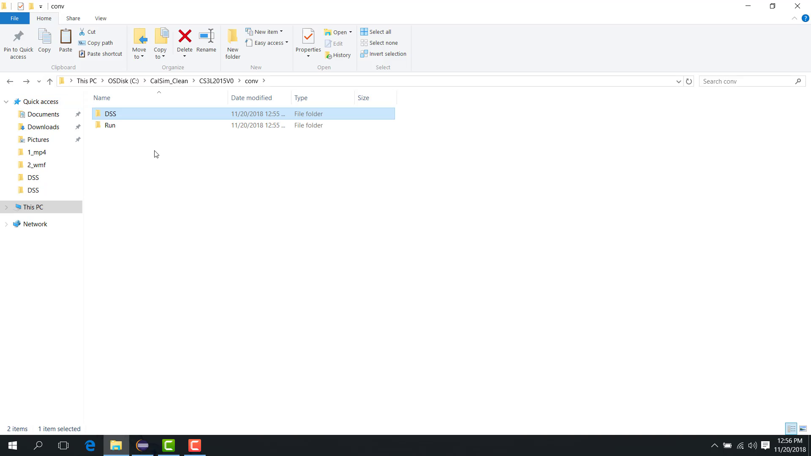
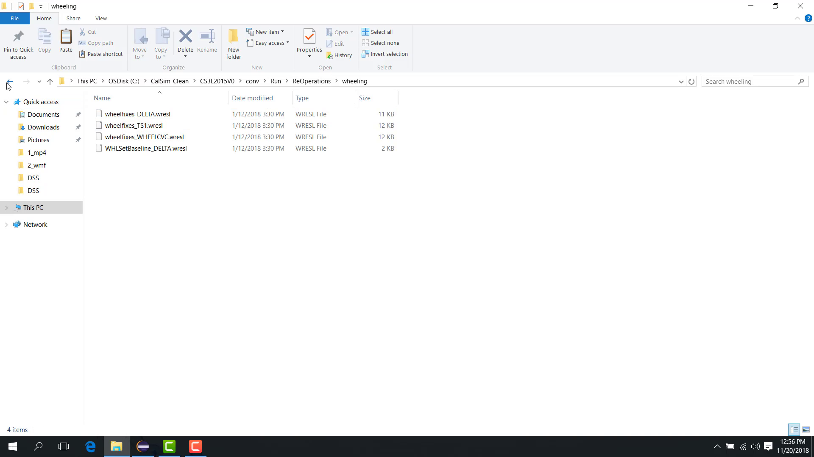
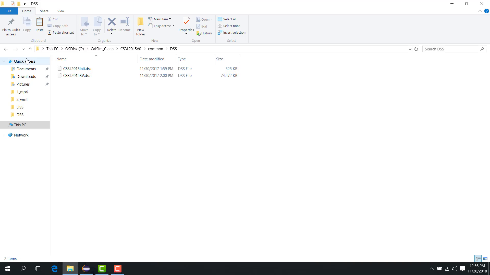

.. _6-study-cleanup-and-packaging:

6. Study Cleanup and Packaging
==============================

.. _61-debug-clean-sv-dss-file:

6.1 Debug Clean SV DSS File
---------------------------

**Purpose**

This chapter explains how to create a clean SV DSS file that includes only the time series and variables used by the model.

**Before you start**

- You have a study or DSS file that contains more SV records than you need.

**Procedure**

Sometimes an SV DSS file contains significantly more data than the model actually uses. You can create a clean SV file containing only the data loaded during the run.

Because the SV DSS file is read at the beginning of the simulation, you can pause the model at any later time step and still save a clean SV file based on what has already been loaded into memory.

To do this:

1. Start the model in **Debug** mode.
2. Let it run.
3. Pause it at any time step.

4. Open **Data > Save to SV File**.

5. Enter a new file name, such as ``SV_clean.dss``.

6. Click **OK**.

Then open the study folder, go to ``common\DSS``, refresh the folder, and confirm that the new file ``SV_clean.dss`` has been created.

The clean file contains only the variables and time series used by the model.

**Notes**

- This workflow is useful when reducing noise in debugging workflows or preparing a lighter study package.

**Related sections**

- :ref:`1.4 Basic Create Launch File <14-basic-create-launch-file>`
- :ref:`6.2 Debug Clean Study <62-debug-clean-study>`
- :ref:`8.1 DSS Wrims DSS Perspective <81-dss-wrims-dss-perspective>`

.. _62-debug-clean-study:

6.2 Debug Clean Study
---------------------

**Purpose**

This chapter explains how to export a clean study package containing only the files used by the selected launch file.

**Before you start**

- You have a working study folder.
- You want to create a smaller or cleaner copy for sharing, archiving, or debugging.

**Procedure**

A clean study package contains only the files required by the selected launch configuration, such as:

- the WRESL files used by the study;
- the DSS files used by the study;
- the SV and DV DSS files;
- lookup tables;
- the launch file itself.

To export a clean study:

1. Right-click the launch file.
2. Choose **Export Study**.

3. Select the folder where the clean study should be exported.

4. Click **OK**.

WRIMS 3 GUI then collects the files actually used by that launch configuration and copies them to the selected folder.

The exported folder contains:

- the launch file;

- the DSS files used by the selected launch configuration;

- the WRESL files used by the study;

- the SV file and initial file required by the study.

**Notes**

- This workflow is valuable when handing a study to another user or preparing a minimal bug-reproduction case.

**Related sections**

- :ref:`6.1 Debug Clean SV DSS File <61-debug-clean-sv-dss-file>`
- :ref:`7.1 Special Batch Run GUI <71-special-batch-run-gui>`
- :ref:`8.1 DSS Wrims DSS Perspective <81-dss-wrims-dss-perspective>`
