.. _2-concepts-and-interface:

2. Concepts and Interface
=========================

.. _21-existing-studies-and-new-studies:

2.1 Existing Studies and New Studies
------------------------------------

In **WRIMS 3 GUI**, a study is typically represented as a project in **Project Explorer**.

- An **existing study** is a study folder that has already been imported into WRIMS 3 and contains a ``.project`` file in its main folder.
- A **new study** is a study folder that has not yet been imported into WRIMS 3 GUI and therefore does not contain a ``.project`` file.

In practice, a study without a ``.project`` file is treated as a new study. After it has been loaded once, WRIMS 3 GUI creates a ``.project`` file and the study is then treated as an existing study from the GUI perspective.

The examples below illustrate the distinction.

- An **existing study** folder

  .. image:: diagrams/frames/01_Basic_LoadExistingStudy/01_Basic_LoadExistingStudy_2040.png

- A **new study** folder

  .. image:: diagrams/frames/02_Basic_NewStudy/02_Basic_NewStudy_600.png

.. _22-launch-files-and-run-modes:

2.2 Launch Files and Run Modes
------------------------------

A **launch file** stores the configuration used to run or debug a study.

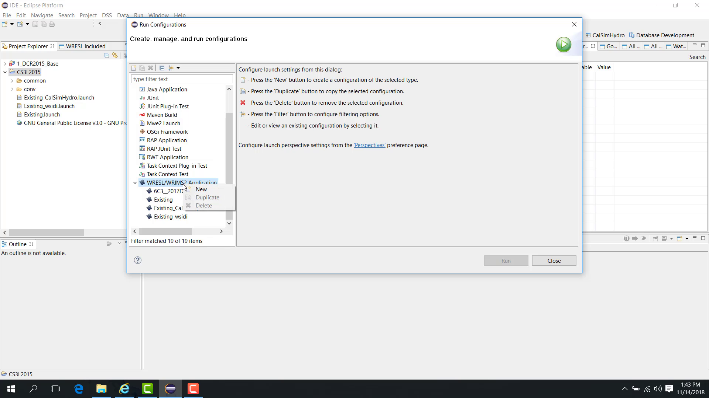

For portability, launch files are easier to manage when they are saved with the study as a **Shared File** and when referenced files use relative paths instead of absolute paths.

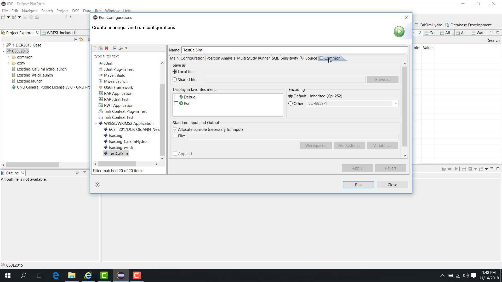

The following images show the launch-configuration context and the storage and path choices that matter most.

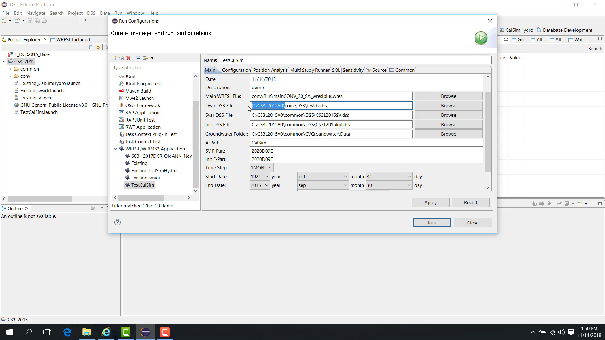

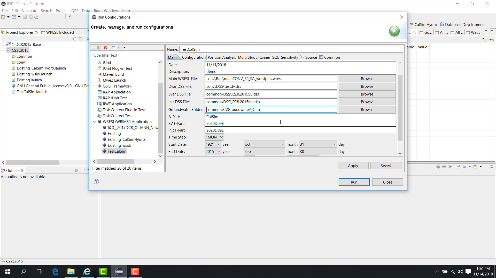

**Run vs Debug**

The same launch configuration can be used in either **Run** mode or **Debug** mode.
As described in the previous chapter, you can open launch settings from either:

- **Debug As > Debug Configuration**
- **Run As > Run Configuration**

Selecting **Debug** starts the model in **Debug** mode.

Once the model is running, you can pause it during a cycle and inspect variable values from the file currently open in the editor.

- **Run** executes the study continuously at normal speed.
- **Debug** allows the study to be paused so that variables, goals, and model behavior can be inspected during execution.

.. _23-variable-and-goal-views:

2.3 Variable and Goal Views
---------------------------

When a study is paused in **Debug** mode, WRIMS 3 GUI provides both file-specific views and model-wide views.

- **Variables** and **Goal View** depend on the file currently open in the editor.
- **All Variables** and **All Goals** show the full model at the current time step and cycle.

This distinction is important when interpreting paused results, because a file can be open in the editor even when it is not active in the current cycle.

The following images illustrate the main views used during paused inspection.

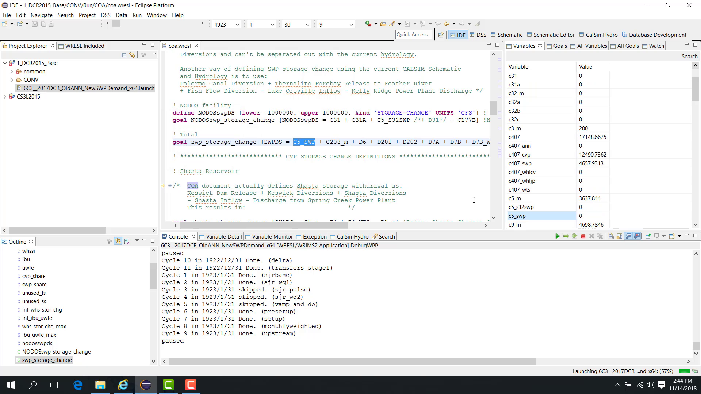

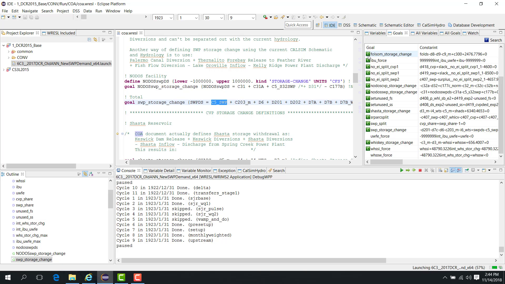

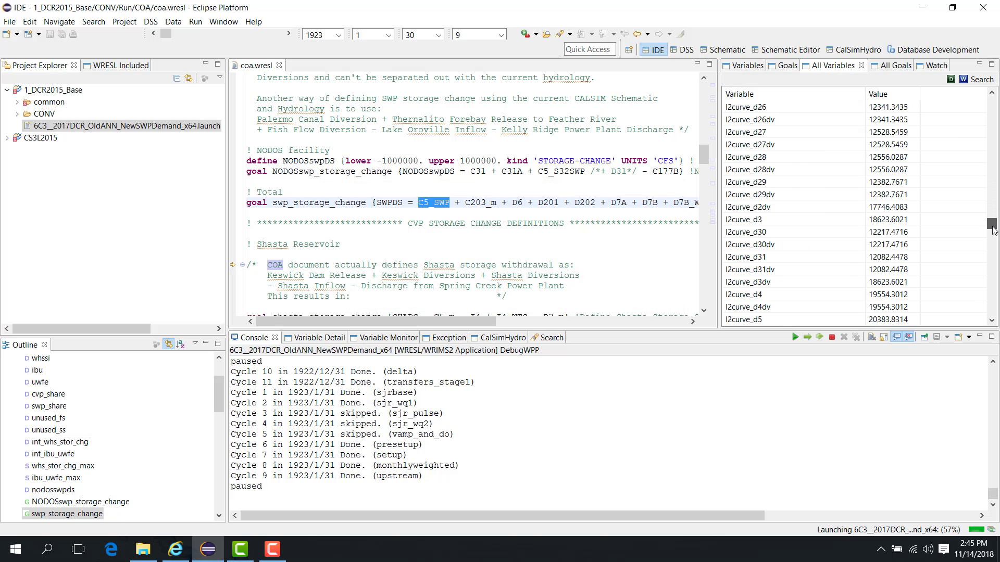

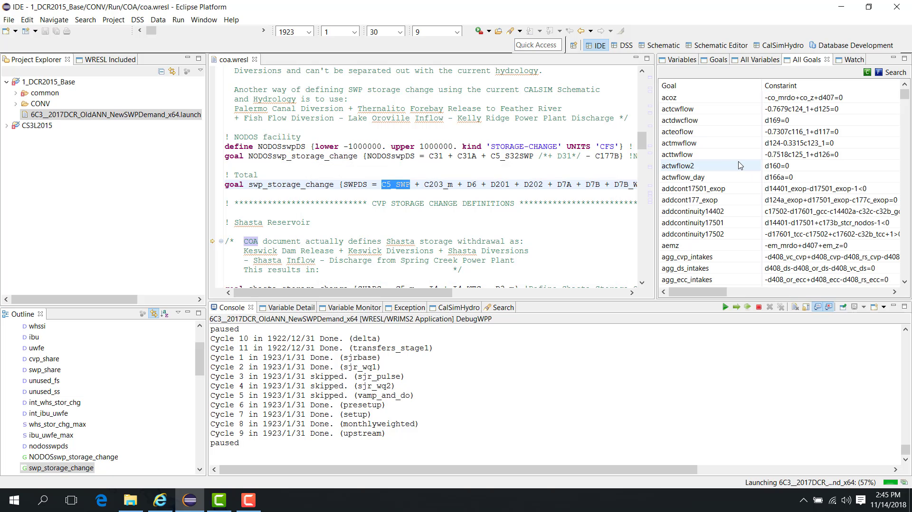

.. _24-controlling-goals-and-goal-tolerance:

2.4 Controlling Goals and Goal Tolerance
----------------------------------------

In the **Goal View** panel, a goal is marked as controlling when the left-hand side is equal to the right-hand side. A filtering file provides another way to evaluate controlling goals by allowing optional tolerances.

- If no tolerance is provided, the goal is treated as controlling only when both sides are exactly equal.
- If a tolerance is provided, the goal can still be treated as controlling when the difference is within the specified tolerance.

This concept is used later in the goal-filter workflow.

The images below show both the visual controlling-goal indicator and the filtering-file approach.

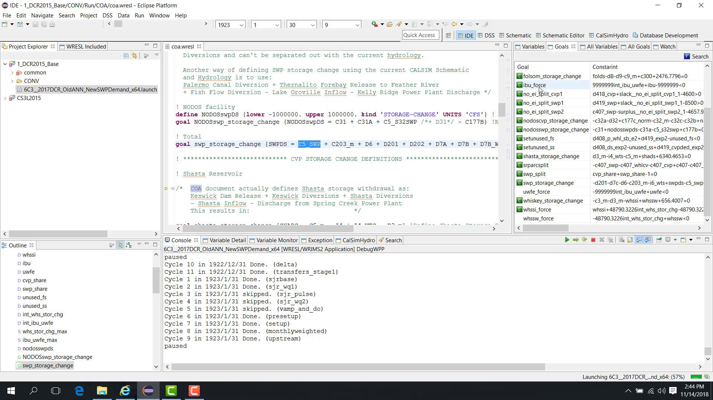

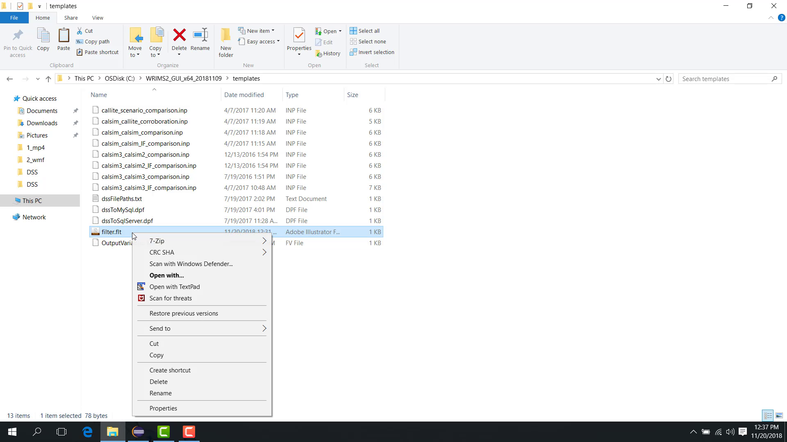

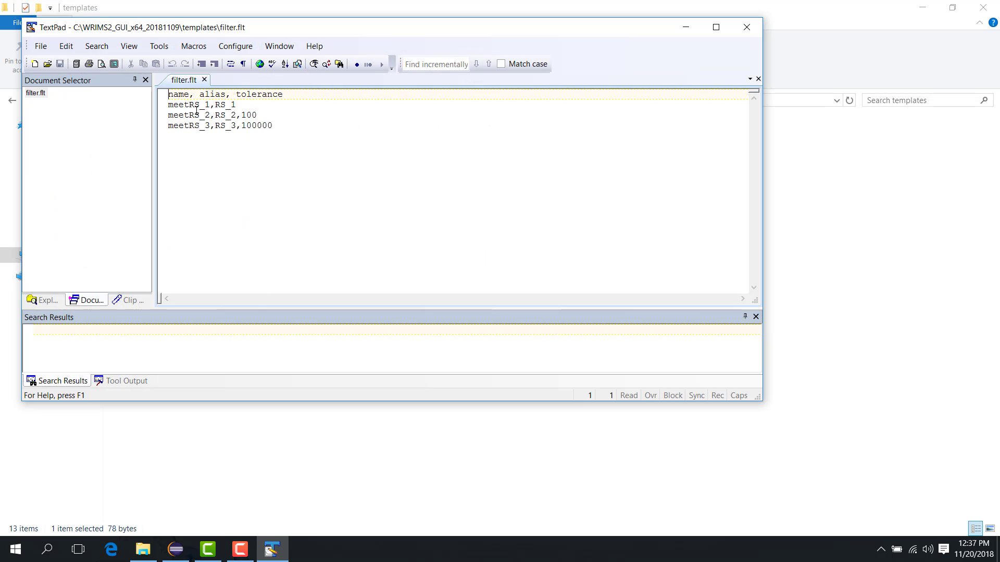

.. _25-basic-perspectives:

2.5 Basic Perspectives
----------------------

**Purpose**

This chapter introduces the different perspectives available in **WRIMS 3 GUI**.

**Before you start**

- **WRIMS 3 GUI** is open.
- You want to understand which perspective to use for editing, debugging, plotting, schematic navigation, or DSS analysis.

**Procedure**

**WRIMS 3 GUI** includes several perspectives. A **perspective** is a task-oriented arrangement of views and tools designed for a particular type of work.

The perspectives shown in this chapter include:

- **IDE Perspective**
- **DSS Perspective**
- **Schematic**
- **Schematic Editor**
- **CalSim Hydro**
- **Database Development**

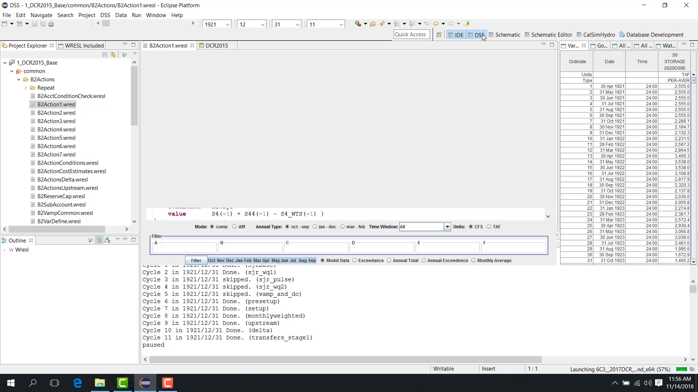

**IDE Perspective**

Use the **IDE Perspective** to:

- edit WRESL code;
- debug the model;
- run the model;
- launch the study;
- view runtime data during execution.

**DSS Perspective**

Use the **DSS Perspective** to display DSS data.

Because one of the outputs of WRIMS 3 is **HEC-DSS**, this perspective is used to visualize DSS time series in:

- tables;
- charts.

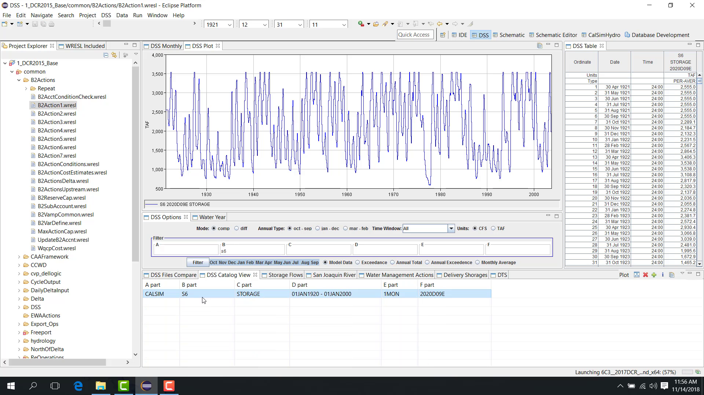

**Schematic**

Use the **Schematic** perspective to display the WRIMS network graphically and navigate between the full system and a local area of interest. This perspective is intended for **display and navigation**, not for editing the schematic definition.

For the complete workflow for loading the schematic definition, opening the full network display, and navigating through the main canvas and overview pane, see :ref:`9.1 Schematic View Workflow <91-schematic-view-workflow>`.

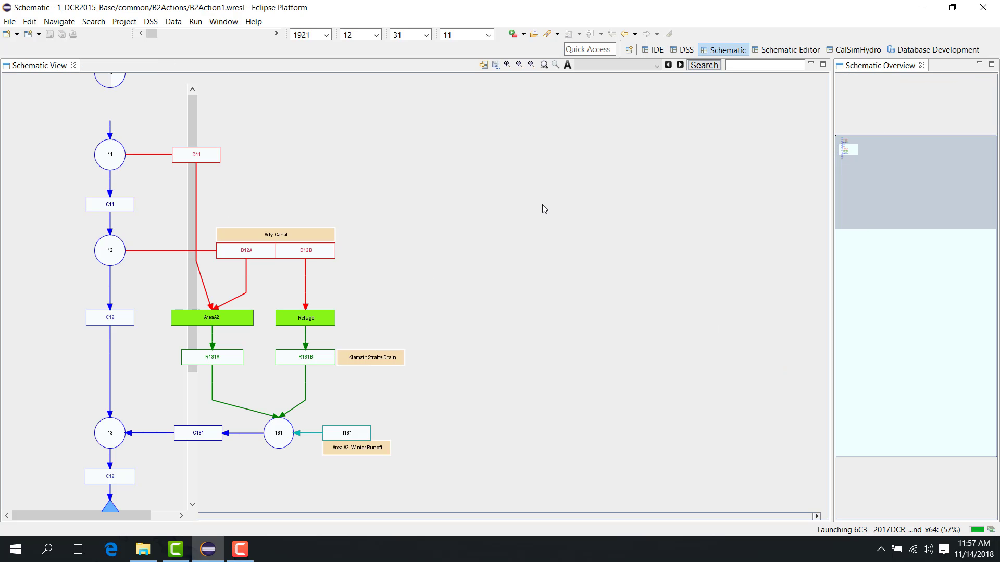

**Schematic Editor**

Use the **Schematic Editor** to edit schematic diagrams and save the updated schematic as an XML file. This perspective is intended for **editing and XML updates**, not for full-network inspection.

For the full workflow, including editor setup, file selection, canvas editing, object alignment, and saving, see :ref:`9.2 Schematic Editor Workflow <92-schematic-editor-workflow>`.

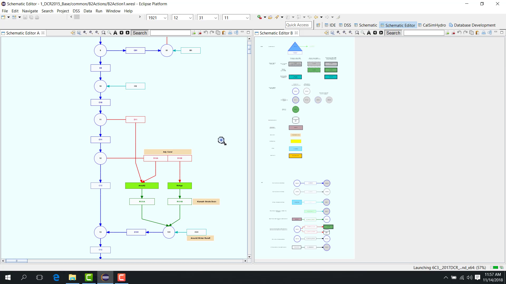

**CalSim Hydro**

In the **CalSim Hydro** perspective, a default CalSim Hydro study is included with the package so that users can work with CalSim Hydro directly from the GUI.

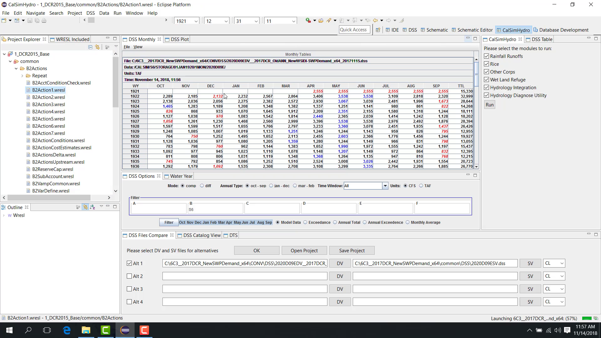

**Database Development**

Use the **Database Development** perspective to connect to databases such as:

- SQL Server;
- MySQL.

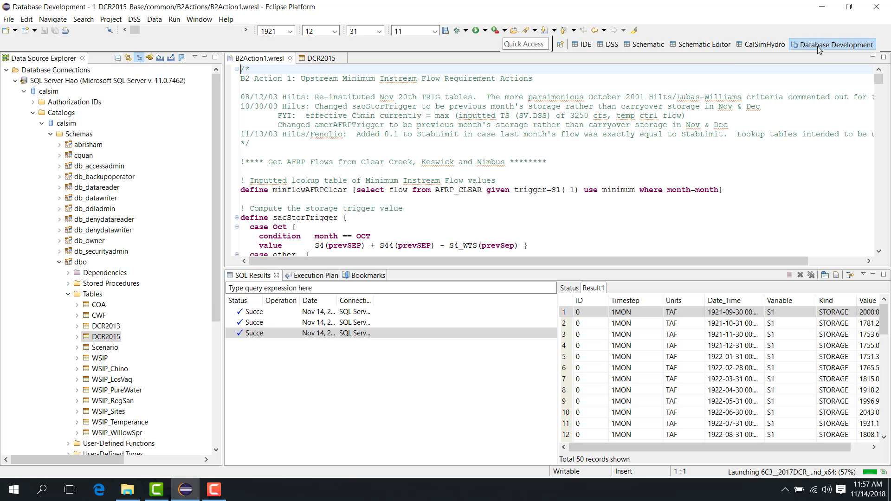

This perspective is used to:

- visualize data;
- manage data;
- connect to databases;
- work with outputs written to a SQL database.

**Notes**

- A perspective is a task-oriented arrangement of views and tools.
- The **IDE Perspective** is mainly used for code editing, running, and debugging.
- The **DSS Perspective** is mainly used for time-series inspection and comparison.
- The **Schematic** perspective is used for graphical display and navigation.
- The **Schematic Editor** is used for diagram editing and XML-based schematic updates.

**Related sections**

- :ref:`9.1 Schematic View Workflow <91-schematic-view-workflow>`
- :ref:`9.2 Schematic Editor Workflow <92-schematic-editor-workflow>`
- :ref:`7.1 Special Batch Run GUI <71-special-batch-run-gui>`
- :ref:`8.1 DSS Wrims DSS Perspective <81-dss-wrims-dss-perspective>`

.. _26-basic-outline-panel-for-the-wresl-file:

2.6 Basic Outline Panel for the WRESL File
------------------------------------------

**Purpose**

This chapter explains the **Outline** panel for the WRESL File.

**Before you start**

- A WRESL file is open in the editor.

**Procedure**

The **Outline** panel lists all variables and goals in the WRESL file currently open in the editor.

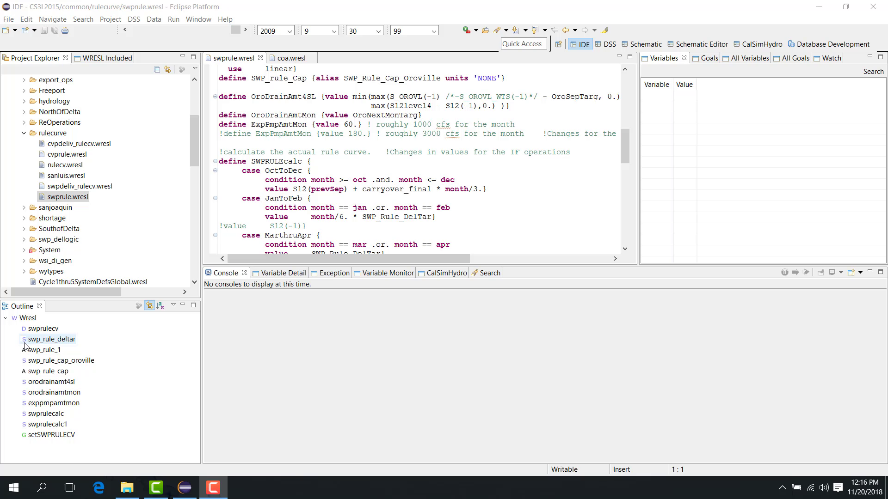

When a file is open, the **Outline** panel can show:

- decision variables;
- state variables;
- aliases;
- goals.

The symbols mean:

- **D** = decision variable
- **S** = state variable
- **A** = alias
- **G** = goal

Selecting an item in the **Outline** panel moves the editor to the definition of that variable, alias, or goal.

This allows you to navigate directly to:

- a selected goal;
- an alias definition.

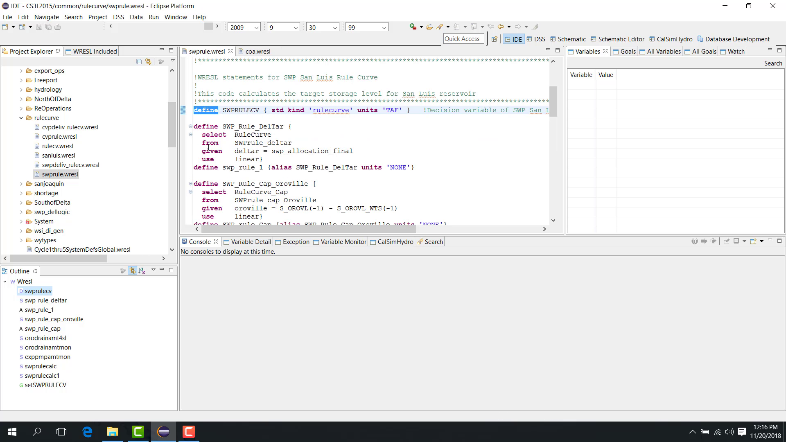

If you open another file, the **Outline** panel updates automatically to match the file currently open in the editor.

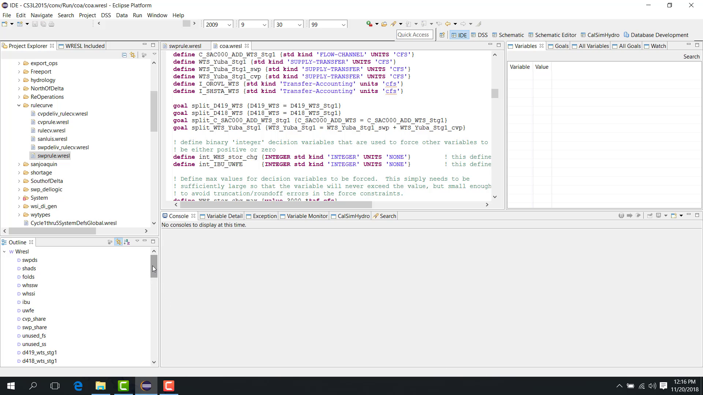

**Notes**

- The **Outline** panel is especially useful when a WRESL file is too long to navigate efficiently by scrolling.

**Related sections**

- :ref:`3.1 Basic WRESL Plus <31-basic-wresl-plus>`
- :ref:`3.2 Debug Find Reference <32-debug-find-reference>`
- :ref:`3.3 Debug Study Cycle WRESL <33-debug-study-cycle-wresl>`
