.. _4-core-debugging-workflow:

4. Core Debugging Workflow
==========================

.. _41-debug-pause-variable-goal-view:

4.1 Debug Pause Variable Goal View
----------------------------------

**Purpose**

This chapter shows how to debug a study, pause the model during execution, and inspect variables and goals.

**Before you start**

- A study can be started in **Debug** mode.
- You know where to set or use a breakpoint, or you are prepared to pause manually.

**Procedure**

Start the model in **Debug** mode by right-clicking a launch file and selecting **Debug As**.

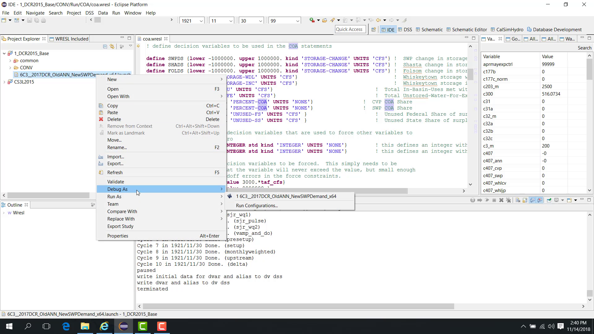

Once the model is running, one of the primary debugging functions is the ability to pause the model during execution and inspect the run state before completion.

**Pause the model**

You can pause the model in either of the following ways:

- open the **Run** menu and click **Pause**

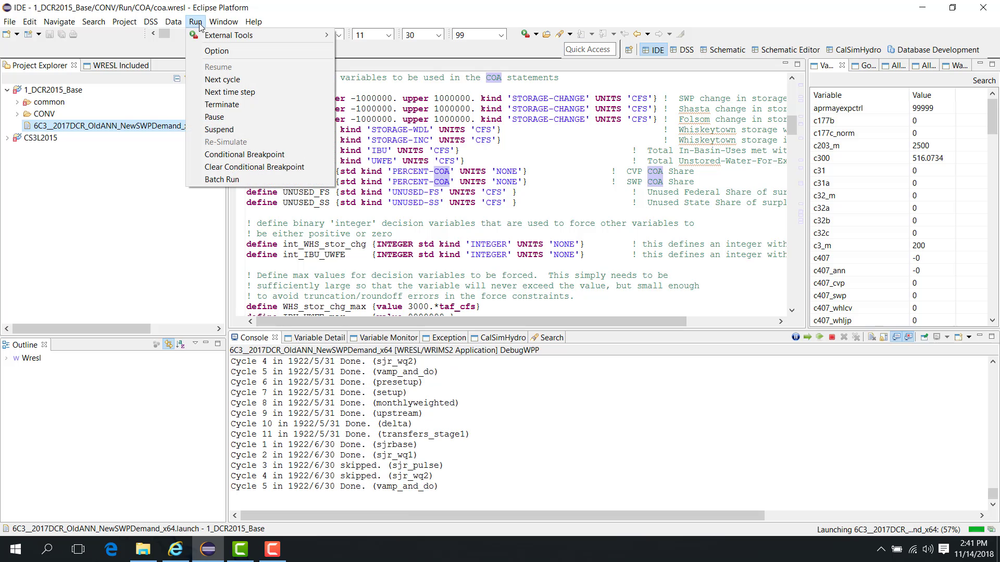

- click the **Pause** button on the toolbar

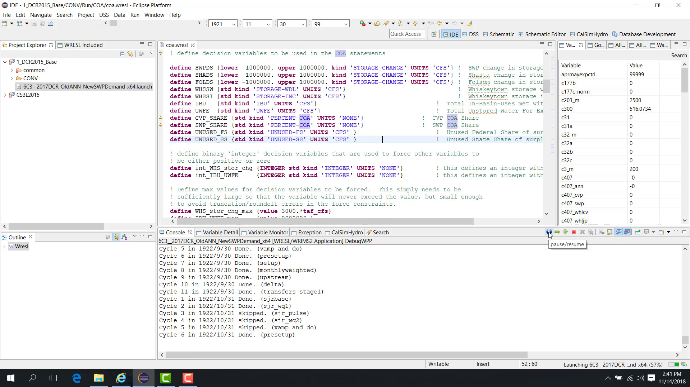

**Pause at a selected month, year, and cycle**

You can also configure the run to pause at a selected time step and cycle.

Select the target month, year, and cycle, such as **November 1922, cycle 8** or **December 1922, cycle 8**.

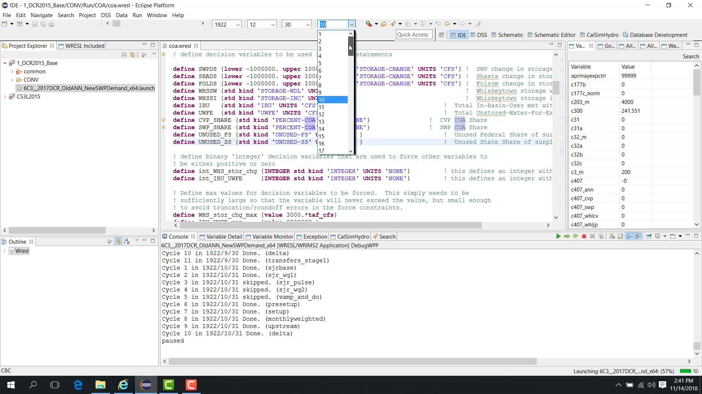

Resume the run.

When the model reaches the selected month, year, and cycle, it pauses automatically.

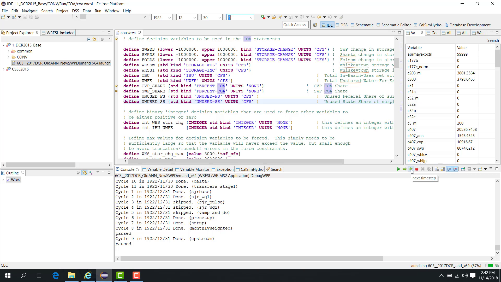

**Resume the model**

Resume execution by using either:

- the **Resume** button;
- **Run > Resume**.

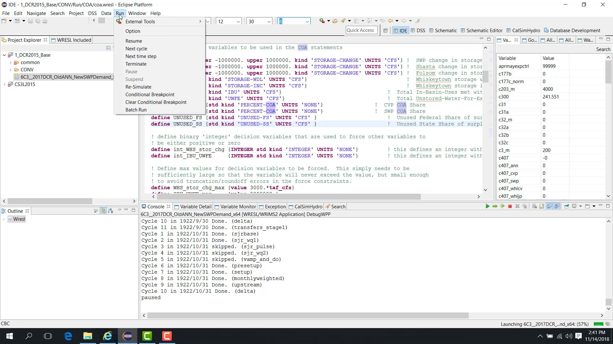

**Move to the next cycle**

When paused, you can use **Next Cycle** to move from one cycle to the next.

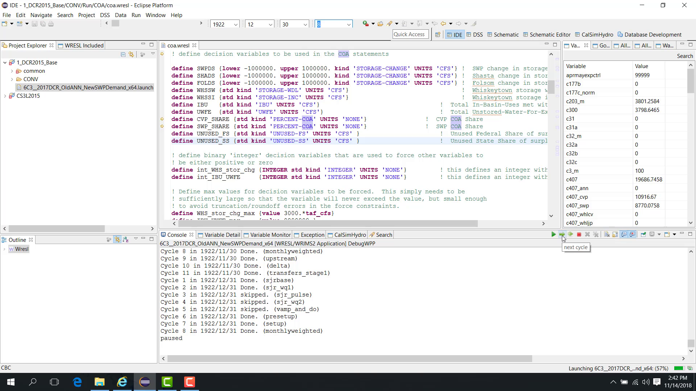

If the model is paused at cycle 8, for example, **Next Cycle** advances it to cycle 9 and pauses again.

**Move to the next time step**

You can also use **Next Time Step** to advance to the next time step.

This may move the run from a cycle in **December 1922** to the next time step in **January 1923**.

**Inspect variable values in the editor**

While the model is paused, you can move the mouse over a variable in the WRESL editor to view its value for the current time step and cycle.

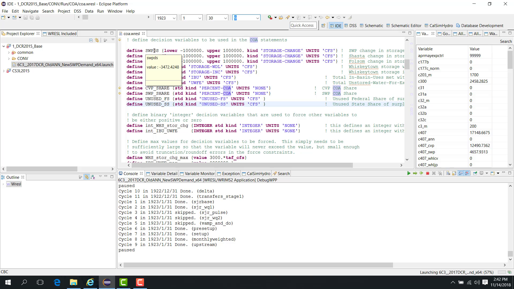

**Inspect goal statements**

You can also select a goal statement in the editor to display the corresponding goal or constraint expression.

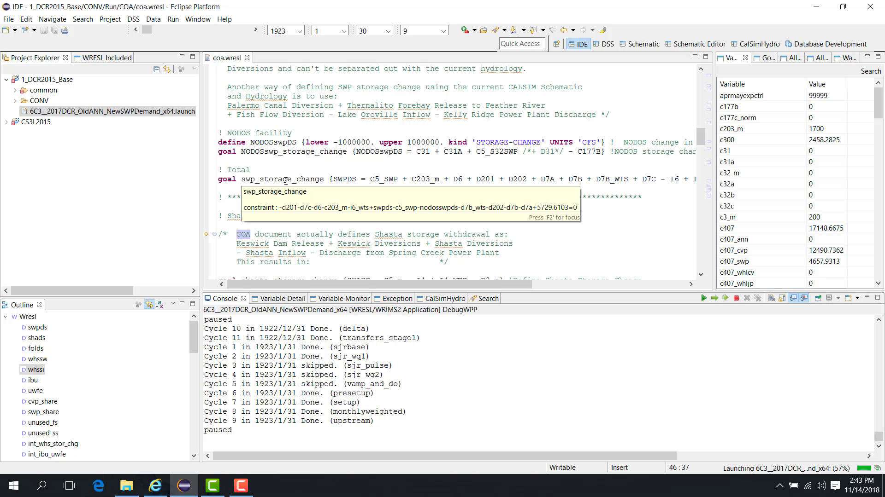

**Variables panel**

The **Variables** panel on the right side shows the variables in the file currently open in the editor.

You can search for a variable such as ``C5_SWP`` in this panel.

.. image:: diagrams/frames/09_Debug_PauseVariableGoalView/09_Debug_PauseVariableGoalView_6600.png

**Goal View panel**

The **Goal View** panel shows the goals in the file currently open in the editor.

.. image:: diagrams/frames/09_Debug_PauseVariableGoalView/09_Debug_PauseVariableGoalView_7440.png

A green square **C** indicates that a goal is a **controlling goal**, meaning the left-hand side is equal to the right-hand side.

If no green **C** appears, the goal is not currently controlling.

A goal such as ``IBU_force`` may appear as a controlling goal.

.. image:: diagrams/frames/09_Debug_PauseVariableGoalView/09_Debug_PauseVariableGoalView_7680.png

**All Variables and All Goals**

The **All Variables** panel shows all variables in the model for the current time step and cycle.

.. image:: diagrams/frames/09_Debug_PauseVariableGoalView/09_Debug_PauseVariableGoalView_8400.png

The **All Goals** panel shows all goals in the model for the current time step and cycle.

.. image:: diagrams/frames/09_Debug_PauseVariableGoalView/09_Debug_PauseVariableGoalView_8760.png

If you click the **C** button, WRIMS 3 GUI shows the controlling goals for that time step and cycle.

**File-specific vs model-wide views**

For this distinction, see :ref:`2.3 Variable and Goal Views <23-variable-and-goal-views>`.

**Open a different file**

Open a different file, such as ``B2action2``, to see how the file-specific panels update.

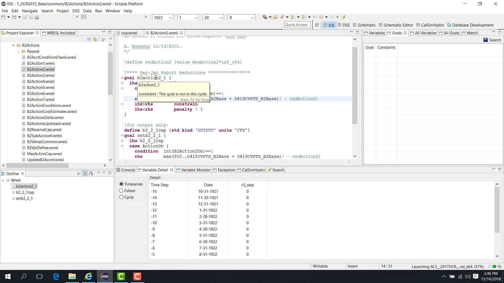

When a different file is opened:

- the **Variables** panel updates to show variables in that file;
- the **Goal View** panel updates to show goals in that file.

However, if the file is not used in the current cycle, its goals may not appear as active at the current paused point.

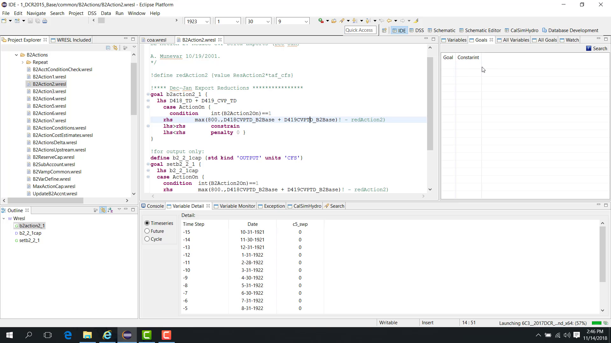

Open another file, such as ``ann_core_mrdo``, to see a case where the file is active in the current cycle. In that case, the goals from that file appear in the **Goal View** panel.

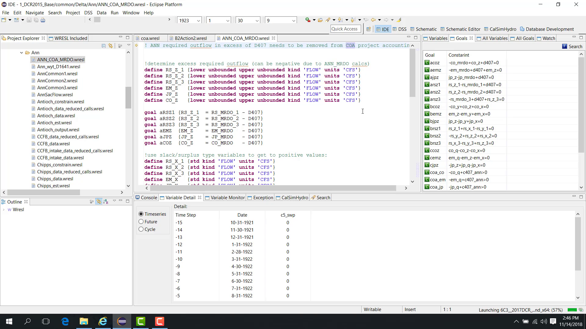

**Notes**

- This chapter provides the foundation for later debug panels such as **Variable Monitor**, **Variable Detail**, and **Watch**.

**Related sections**

- :ref:`4.2 Debug Variable Monitor <42-debug-variable-monitor>`
- :ref:`4.4 Debug Watch Variables Goals <44-debug-watch-variables-goals>`
- :ref:`4.6 Debug Error Source Code Link <46-debug-error-source-code-link>`

.. _42-debug-variable-monitor:

4.2 Debug Variable Monitor
--------------------------

**Purpose**

This chapter assumes the study is already running in **Debug** mode and paused at an appropriate point. For the basic pause workflow, see **09. Debug Pause Variable Goal View**.

This chapter shows how to use the **Variable Monitor** panel.

**Before you start**

- The study is already paused in a debug session.
- You have one or more variables to inspect.

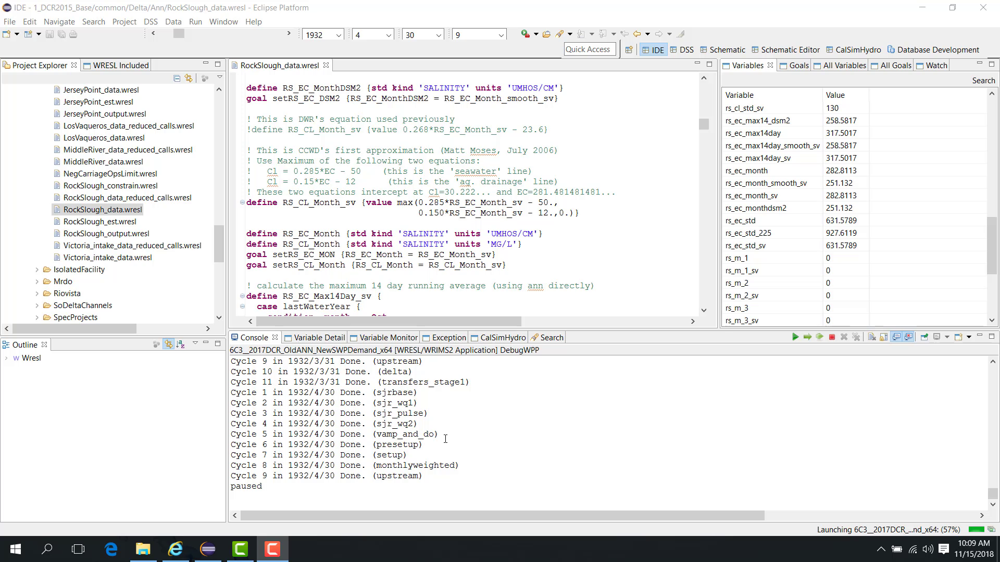

**Procedure**

Open the **Variable Monitor** panel during a debug session. It can be repositioned within the interface as needed.

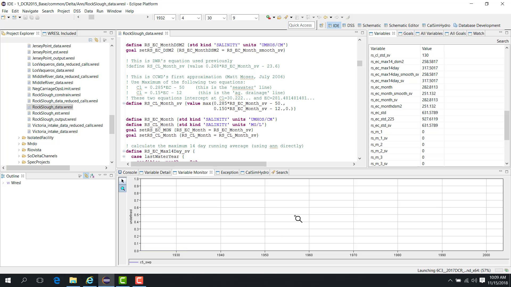

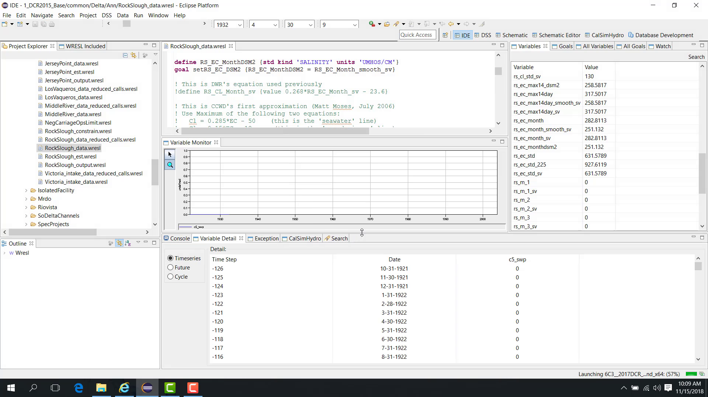

With the model paused at a selected cycle and year, choose one or more variables to display, such as:

- ``rs_EC_month``
- ``rs_ec_std``

The **Variable Monitor** panel displays a plot of the selected variables.

When the model resumes:

- the plot continues updating;
- pausing the model stops the plot updates;
- resuming the model restarts the updates.

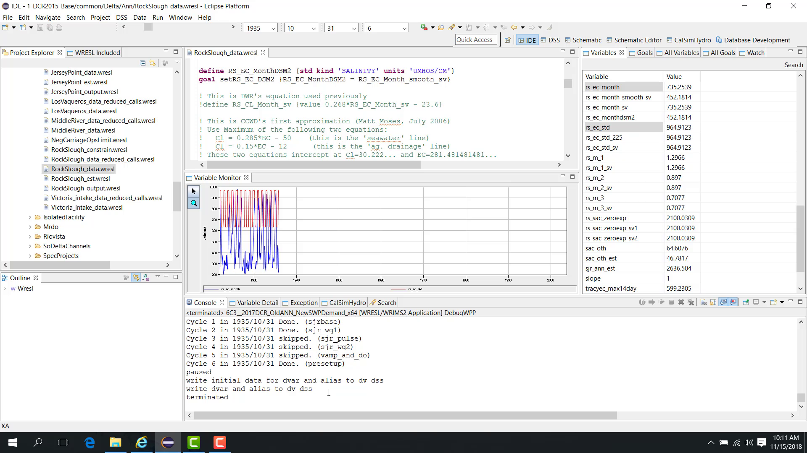

If the study is terminated before completion, WRIMS 3 GUI may still save the current results to the output DSS file.

**Notes**

- The plot updates only while the model is running.
- Even if the run is terminated early, WRIMS 3 GUI may still save output to the DV DSS file.

**Related sections**

- :ref:`4.1 Debug Pause Variable Goal View <41-debug-pause-variable-goal-view>`
- :ref:`4.3 Debug Variable Detail <43-debug-variable-detail>`
- :ref:`4.4 Debug Watch Variables Goals <44-debug-watch-variables-goals>`

.. _43-debug-variable-detail:

4.3 Debug Variable Detail
-------------------------

**Purpose**

This chapter is most useful after pausing execution in **Debug** mode. For the pause workflow and initial inspection views, see **09. Debug Pause Variable Goal View** and **10. Debug Variable Monitor**.

This chapter shows how to use the **Variable Detail** panel.

**Before you start**

- The model is paused in **Debug** mode.
- A variable is selected in the debug interface.

**Procedure**

Pause the model at a specific year, month, and cycle, such as:

- year 1923;
- month January;
- cycle 12.

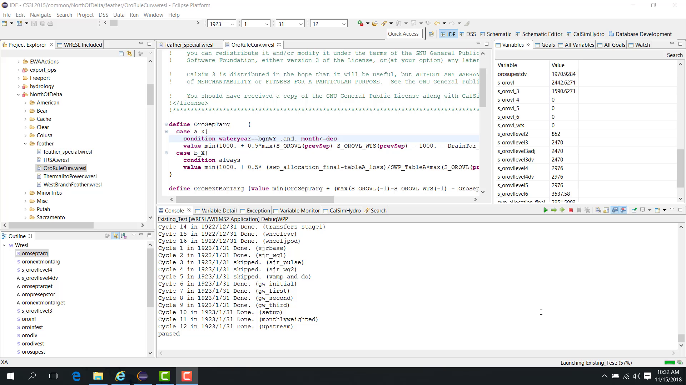

When a variable is selected in the **Variable View**, the **Variable Detail** panel appears.

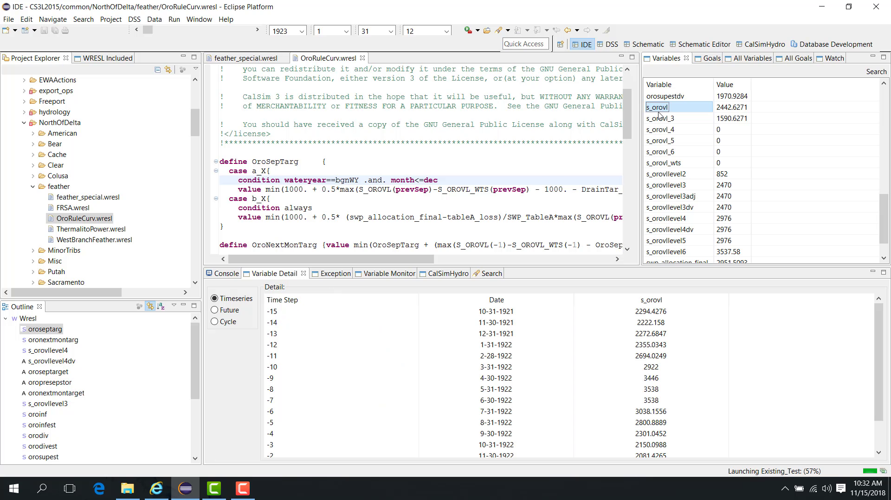

The panel includes several sections.

**Time Series**

The **Time Series** section shows values for different time steps:

- **time step 0** = the current time step;
- **-1** = the previous time step;
- earlier negative values = earlier time steps.

The list may extend back to the beginning of the model run.

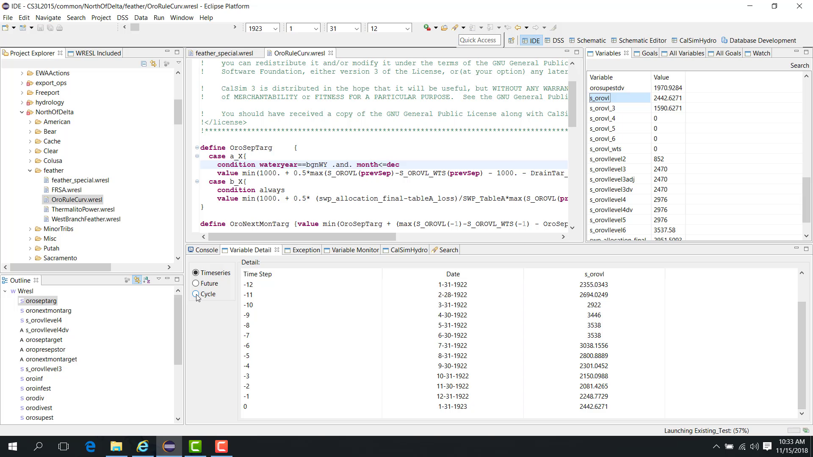

**Cycle**

The **Cycle** section shows values from previous cycles for the selected variable.

If the current cycle is cycle 12, for example, the panel may show values from earlier cycles such as cycle 6, cycle 10, and cycle 11.

If the run advances one cycle, the **Cycle** section updates accordingly.

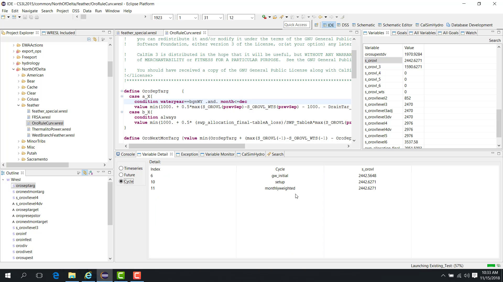

**Future**

The **Future** section displays future time-step values of a variable for workflows that involve **multi-step optimization**.

Since multi-step optimization may also be included in a regular study, the availability of this section depends on the study configuration rather than on whether the study is considered “regular” or not.

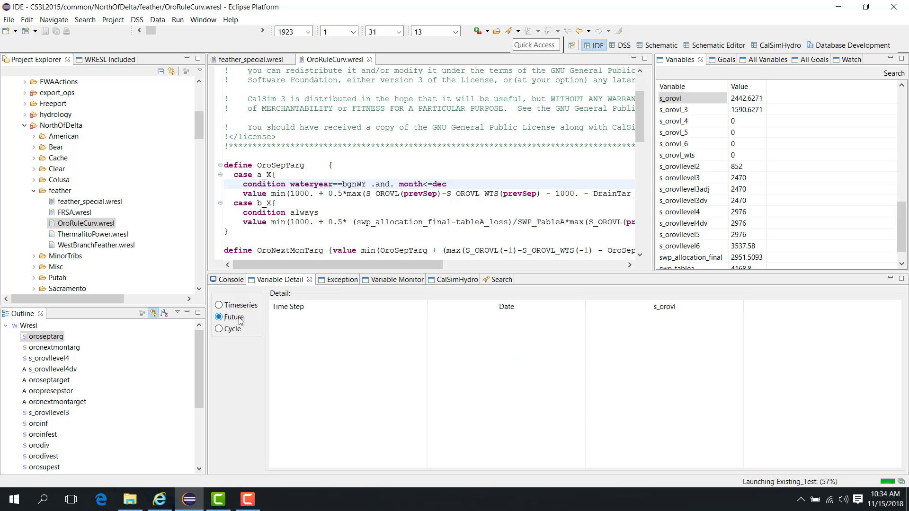

**Known input variables**

Select another variable, such as ``i_orowl``.

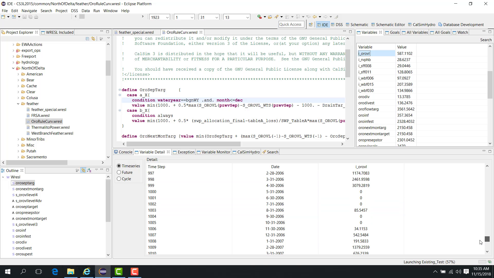

For a known input variable loaded from DSS, the **Variable Detail** panel may show values across the study period because the values come from the DSS input file.

**Notes**

- **Time Series** focuses on time-step history.
- **Cycle** focuses on values from earlier cycles.
- **Future** is especially relevant for multi-step optimization workflows.

**Related sections**

- :ref:`4.1 Debug Pause Variable Goal View <41-debug-pause-variable-goal-view>`
- :ref:`4.2 Debug Variable Monitor <42-debug-variable-monitor>`
- :ref:`3.2 Debug Find Reference <32-debug-find-reference>`

.. _44-debug-watch-variables-goals:

4.4 Debug Watch Variables Goals
-------------------------------

**Purpose**

This chapter builds on a paused debug session. If you have not yet paused execution or opened the relevant views, see **09. Debug Pause Variable Goal View** first.

This chapter shows how to use the **Watch** panel to collect variables and goals from different files and track them during debugging.

**Before you start**

- The study is running in **Debug** mode or is paused at a point of interest.

**Procedure**

The **Watch** panel allows you to collect variables and goals from different files so that you can track them during a debug run.

To add an item from the editor:

1. Select a variable or goal in the WRESL editor.
2. Right-click it.
3. Choose **Watch**.

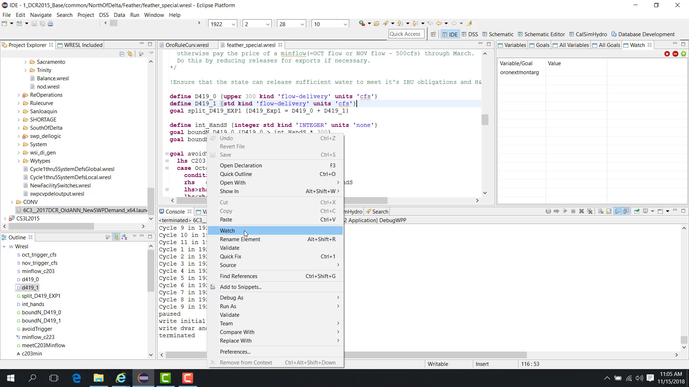

The selected item is added to the **Watch** panel.

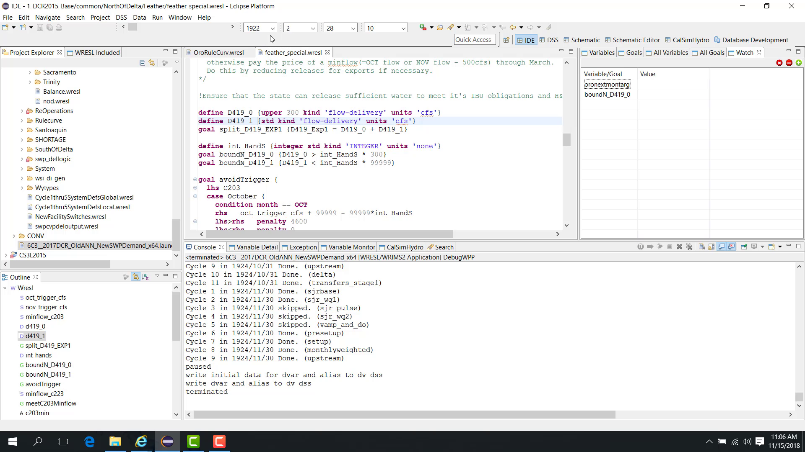

You can add both variables and goals in this way.

**Pause at a selected time**

Set a breakpoint at a selected time step and cycle, such as:

- February 1922;
- cycle 10.

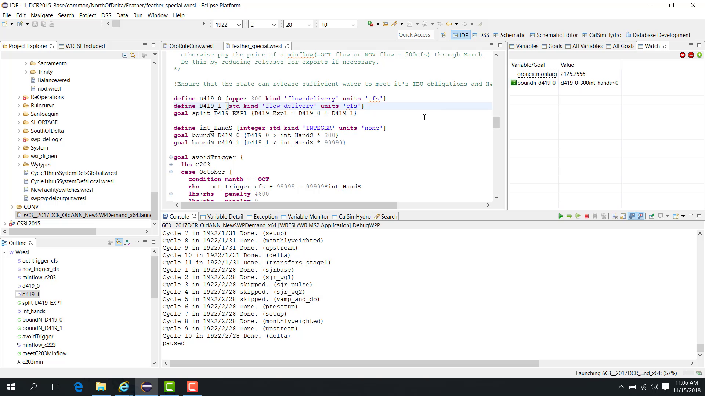

When the model reaches that point, it pauses and the **Watch** panel shows the values for the watched variables and goals.

**Add items during debugging**

You can also add items while the model is paused.

To add a variable using the plus button:

1. Click the **plus** button in the **Watch** panel.

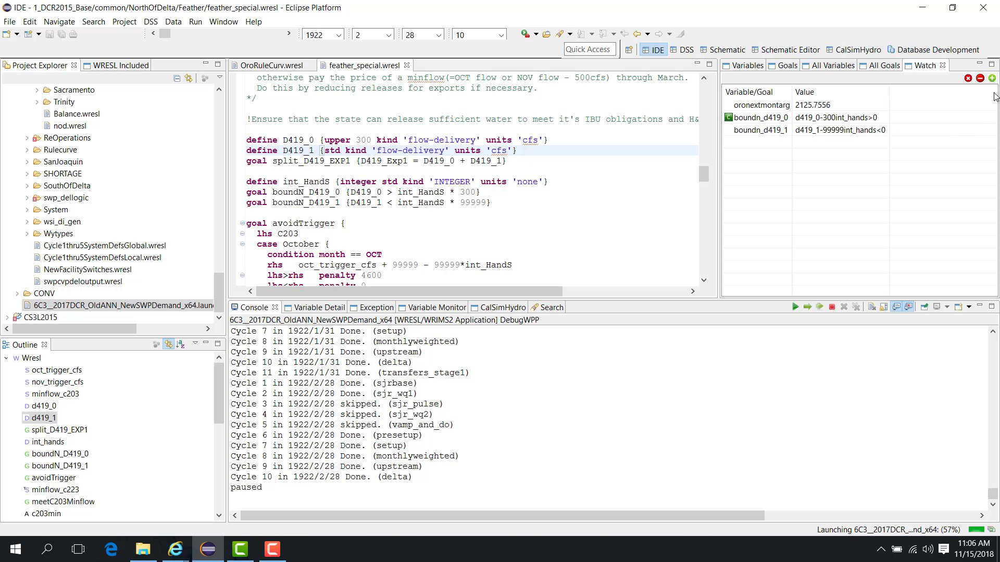

2. Enter the variable name, such as ``C100``.

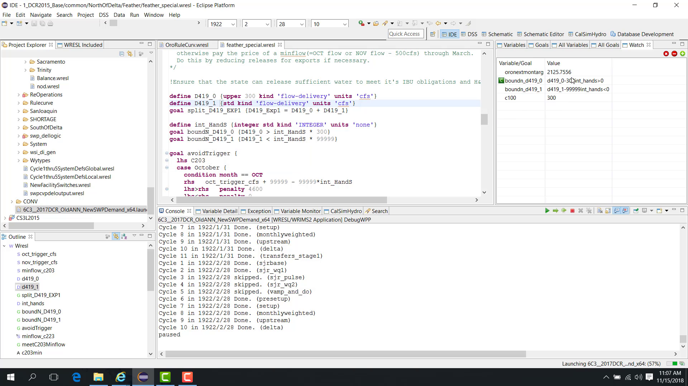

3. Click **OK**.

The variable is added to the watch list and its value is displayed.

**Remove watched items**

To remove one item:

1. Select the item in the **Watch** panel.
2. Click the **minus** button.

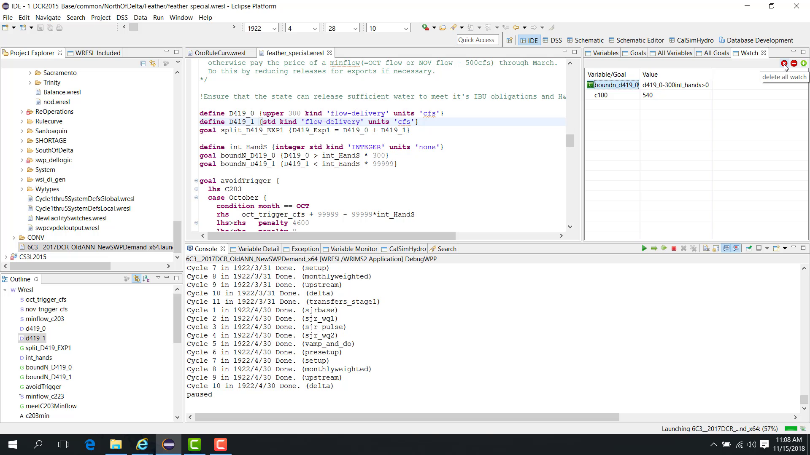

To remove all watched items:

1. Click the **cross** button.

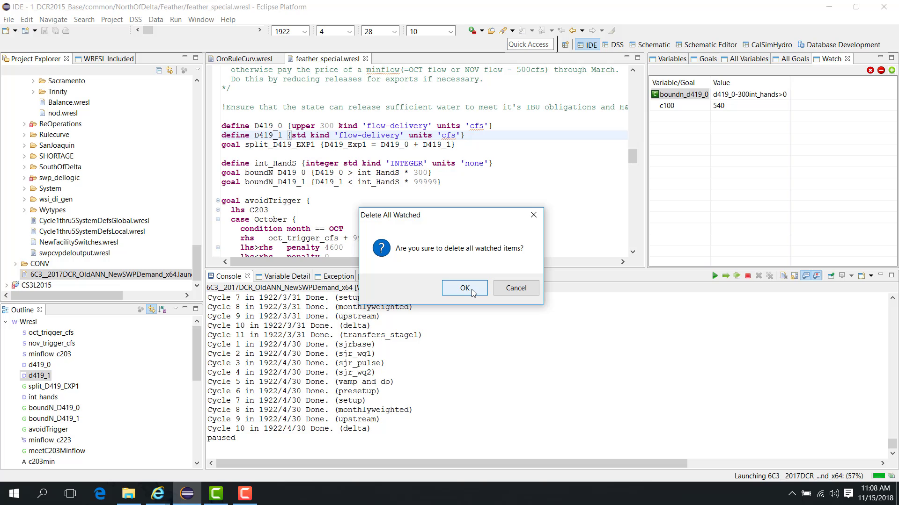

**Update values during the run**

When the run advances to the next time step, the values in the **Watch** panel update automatically.

**Notes**

- The **Watch** panel is useful for tracking the same items across pauses, time steps, and cycles.
- You can add items from the editor or directly in the panel.

**Related sections**

- :ref:`4.1 Debug Pause Variable Goal View <41-debug-pause-variable-goal-view>`
- :ref:`4.2 Debug Variable Monitor <42-debug-variable-monitor>`
- :ref:`5.2 Debug Filter Goals <52-debug-filter-goals>`

.. _45-debug-solver-and-option:

4.5 Debug Solver And Option
---------------------------

**Purpose**

This chapter explains how to change the solver and runtime options.

**Before you start**

- The study is loaded and can be run.
- You want to change solver selection or runtime options.

**Procedure**

WRIMS 3 provides two solvers:

- **XA**
- **CBC**

To change the solver:

1. Open the **Run** menu.
2. Choose **Option**.

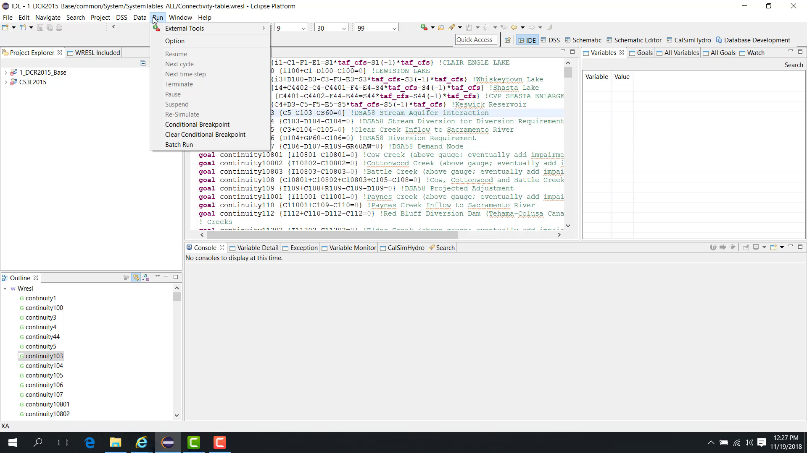

3. Select either **CBC** or **XA**.

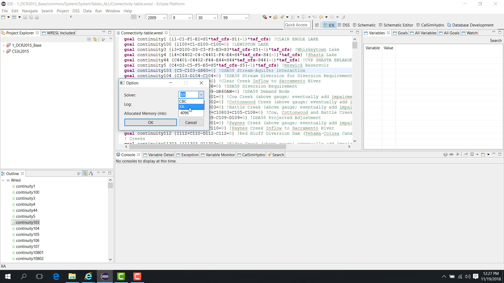

4. Click **OK**.

Use the **Console** panel to verify which solver is currently active.

**Log file**

The options dialog also allows you to enable a **log file**. This can provide intermediate information useful for:

- reviewing the model;
- debugging infeasibility;
- examining solver behavior.

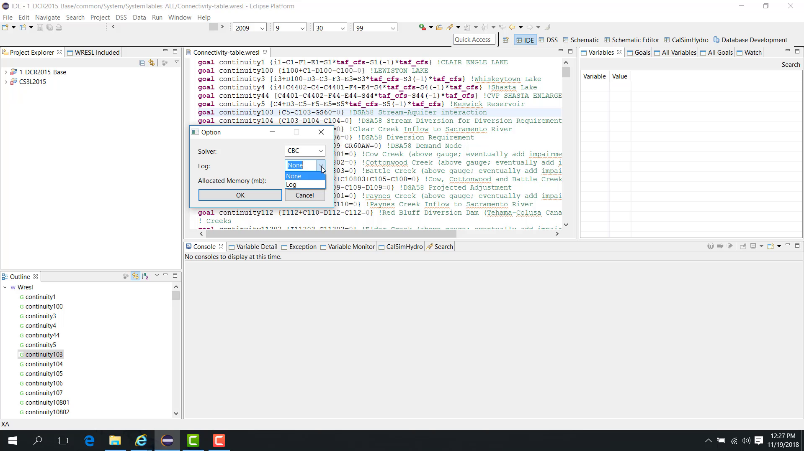

**Allocated memory**

The options dialog also allows you to change the allocated memory.

Key points:

- the default is typically **4 GB**;
- you can increase it, for example to **8 GB**;
- the value should remain below the total memory available on the PC.

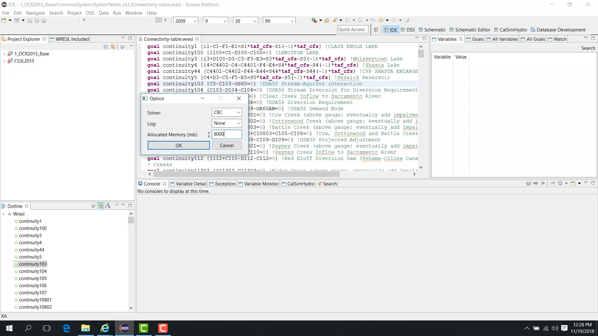

**Change the solver during runtime**

The solver can also be changed during a debug run:

1. Start the model in **Debug** mode.
2. Pause it during execution.

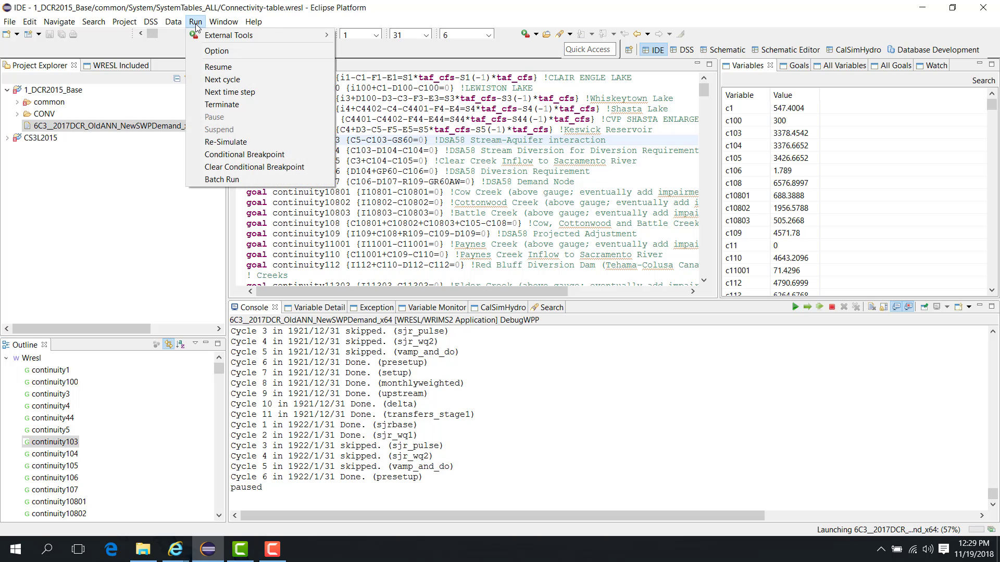

3. Open **Run > Option**.
4. Change the solver.

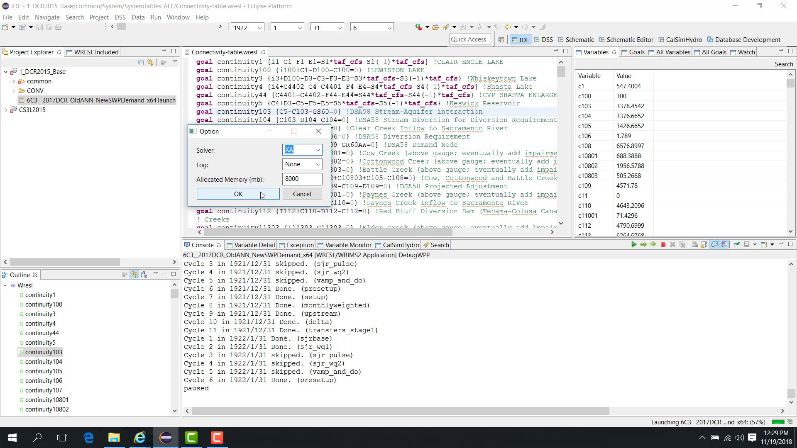

5. Click **OK**.
6. Resume the model.

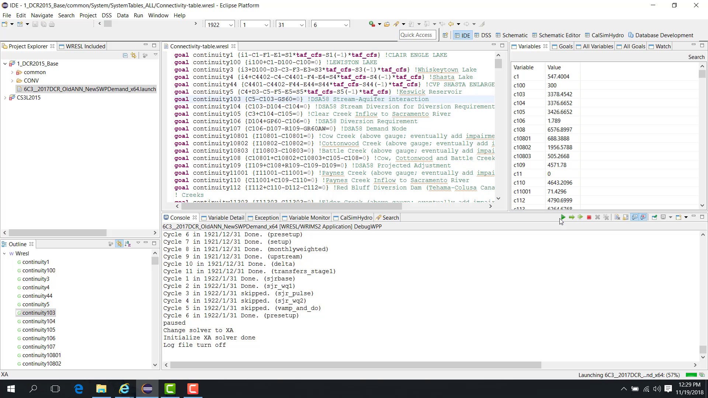

The **Console** confirms the solver change, and the model continues with the newly selected solver.

**Re-simulate a time step with a different solver**

You can also re-simulate a selected time step with another solver:

1. Pause the run at the selected time step.
2. Open **Run > Option** and select another solver.

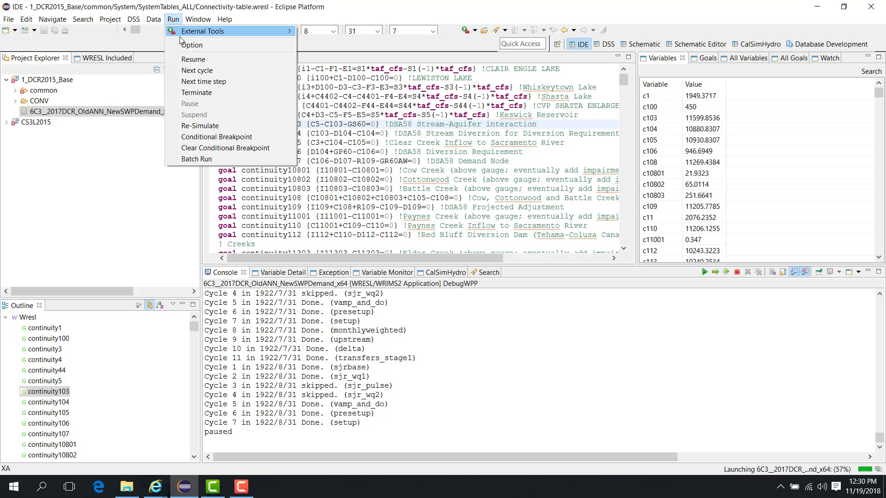

3. Click **OK**.
4. Open **Run > Re-simulate**.

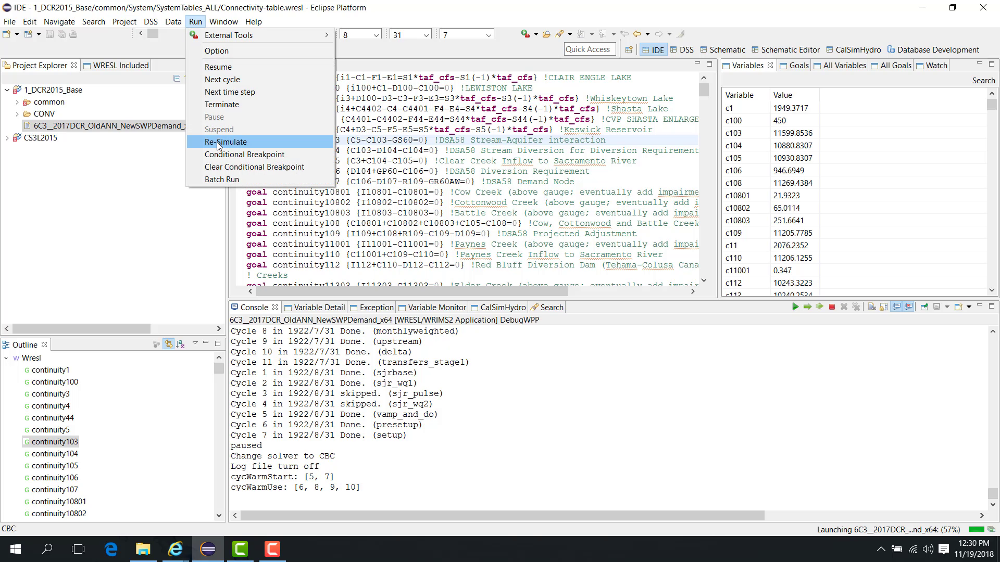

5. Select the time step to rerun.

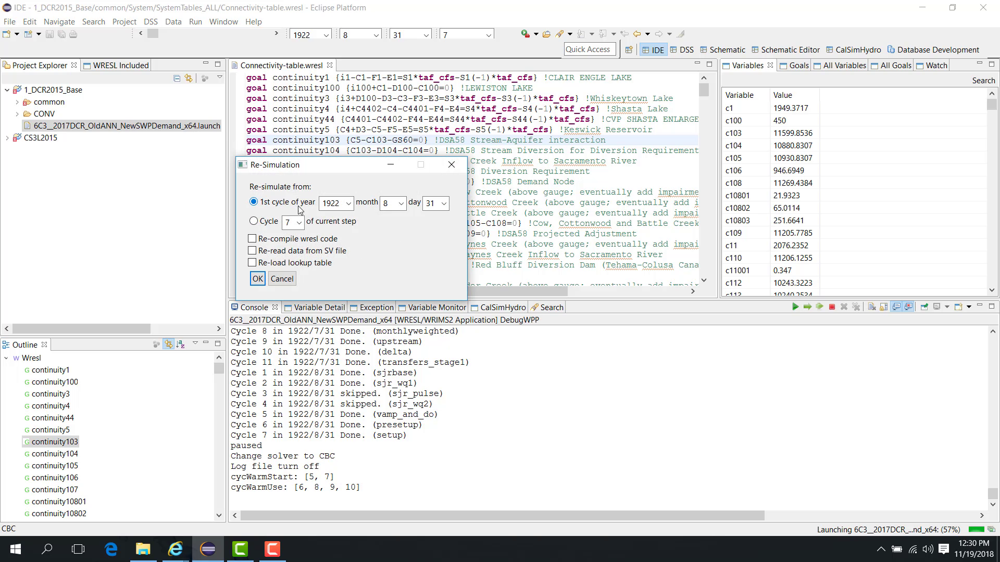

6. Click **OK**.

That time step is then re-simulated with the selected solver.

The allocated-memory setting is stored as a user preference and reused the next time WRIMS 3 GUI is opened.

**Notes**

- Use the **Console** to verify the active solver.
- Increase memory carefully and stay below available system memory.

**Related sections**

- :ref:`1.4 Basic Create Launch File <14-basic-create-launch-file>`
- :ref:`1.5 Basic Modify Launch File <15-basic-modify-launch-file>`
- :ref:`4.1 Debug Pause Variable Goal View <41-debug-pause-variable-goal-view>`

.. _46-debug-error-source-code-link:

4.6 Debug Error Source Code Link
--------------------------------

**Purpose**

This chapter is typically used after a run fails or stops at an error in **Debug** mode. It pairs closely with **09. Debug Pause Variable Goal View** and **17. Debug Find Reference**.

This chapter shows how to link an error message to the corresponding source-code location.

**Before you start**

- A study produces a clickable runtime error message.

**Procedure**

This workflow works in either:

- **Debug** mode;
- **Run** mode.

Run the study until an error occurs. In the example shown here, the error message indicates a problem with a variable definition that uses a lookup table.

To locate the error:

1. Click the clickable link at the beginning of the error message.

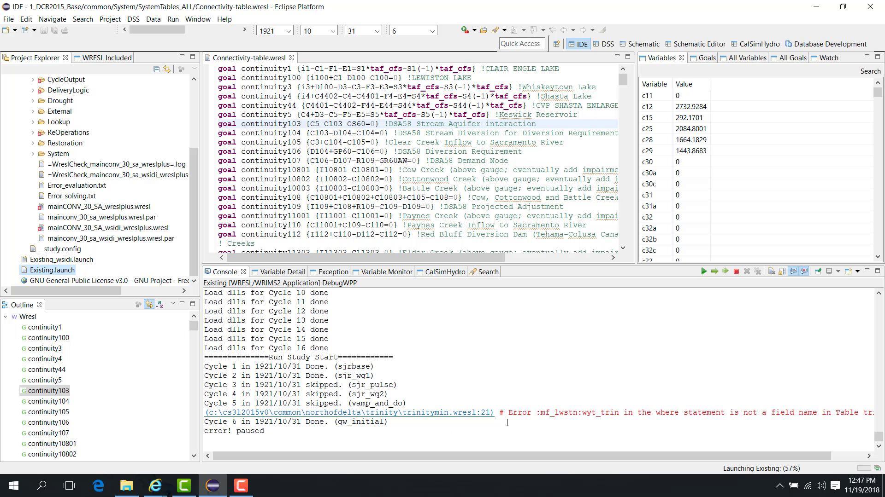

WRIMS 3 GUI opens the relevant WRESL file and moves to the corresponding source location.

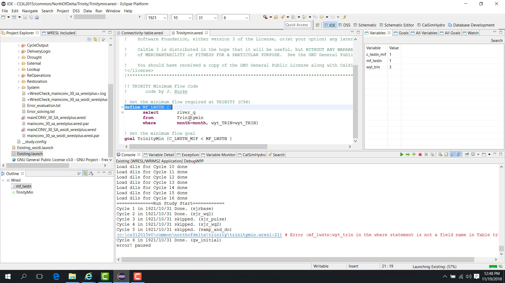

In the example shown here, a field name in a lookup table reference is incorrect. After identifying the incorrect field name, correct the source and save the file.

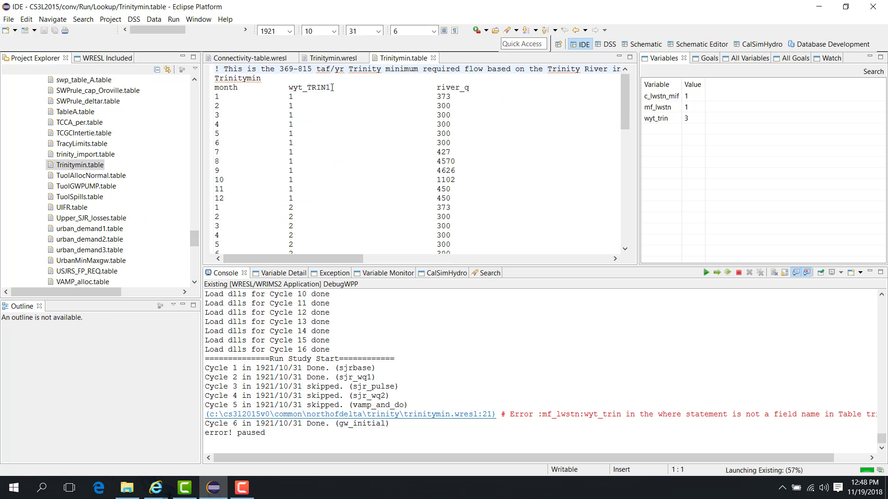

After saving the correction, re-simulate the current time step:

1. Open **Run > Re-simulate**.
2. Select the current time step and cycle.
3. Check **Reload Lookup Table** because the lookup table source was changed.

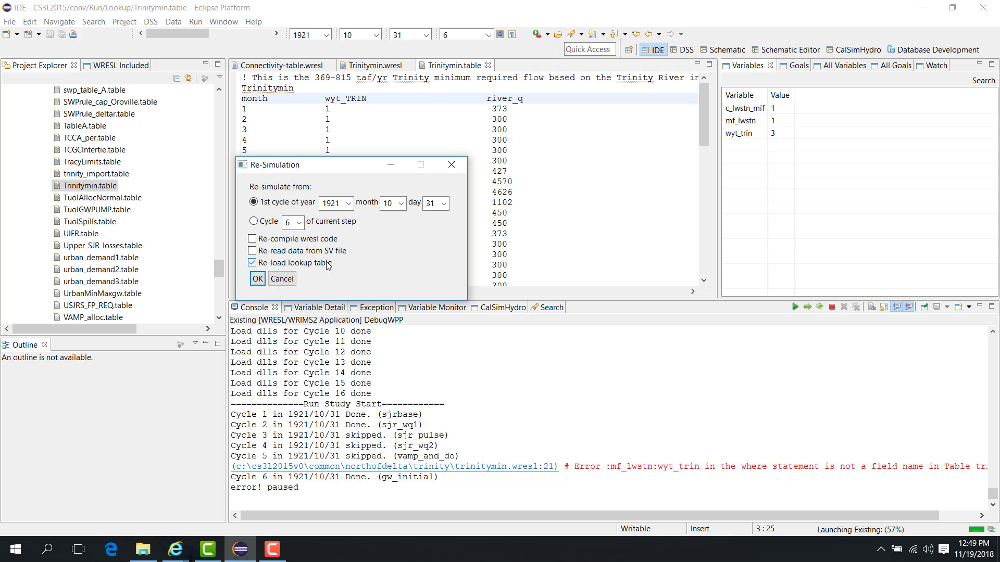

4. Click **OK**.

The time step is rerun and the error no longer appears.

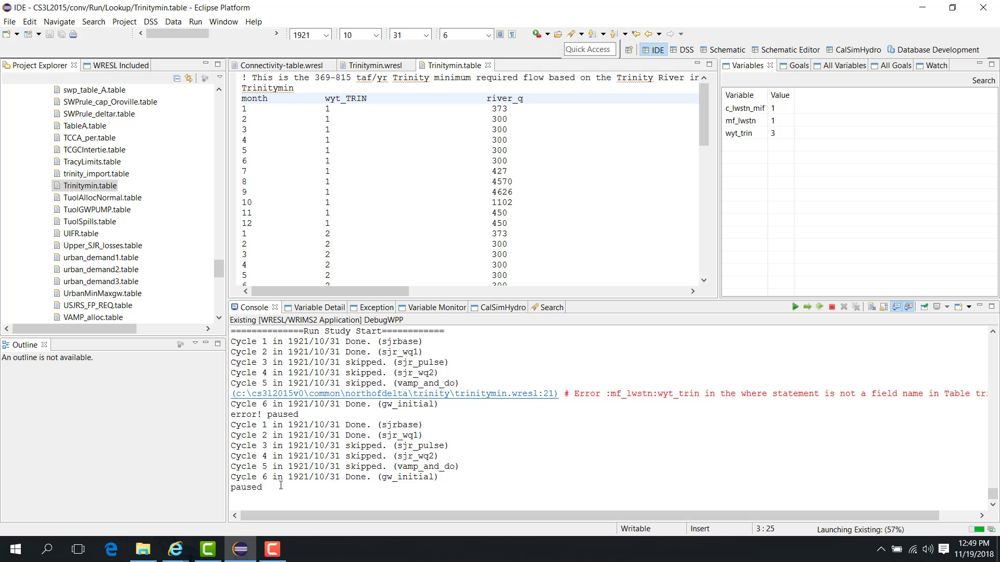

**Notes**

- After correcting source content, re-simulate the current time step with the appropriate reload or recompile options.

**Related sections**

- :ref:`4.1 Debug Pause Variable Goal View <41-debug-pause-variable-goal-view>`
- :ref:`3.2 Debug Find Reference <32-debug-find-reference>`
- :ref:`3.3 Debug Study Cycle WRESL <33-debug-study-cycle-wresl>`

.. _47-debug-conditional-breakpoint:

4.7 Debug Conditional Breakpoint
--------------------------------

**Purpose**

This chapter extends the basic debugging workflow. Create or open a launch configuration first, then enter **Debug** mode and use the pause workflow described in **09. Debug Pause Variable Goal View**.

This chapter shows how to use **Conditional Breakpoint**.

**Before you start**

- The study is paused in **Debug** mode.
- You know a variable-based condition that should trigger a stop.

**Procedure**

While the model is paused in **Debug** mode, open:

- **Run > Conditional Breakpoint**

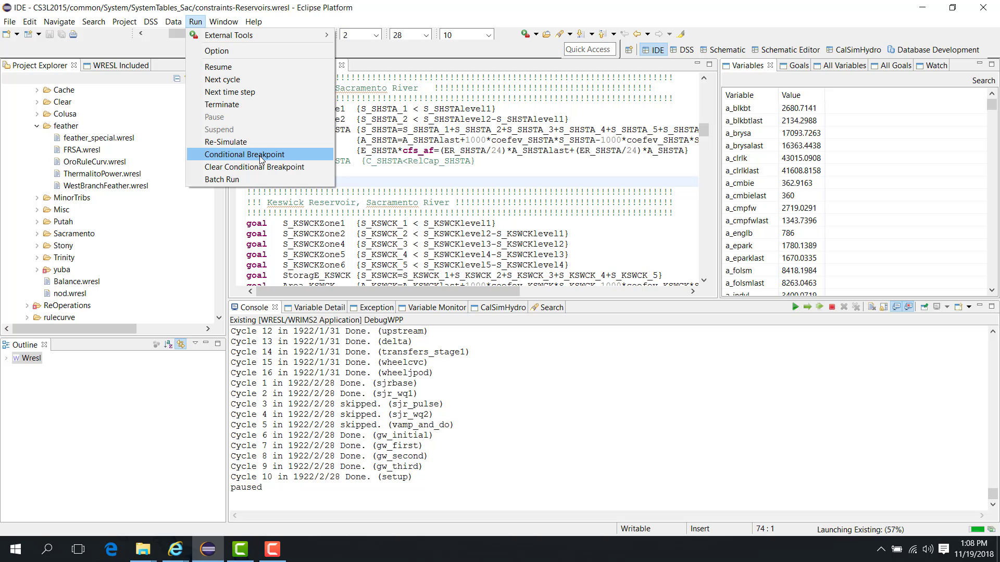

Enter a condition, such as:

`` s_shsta > 1000 ``

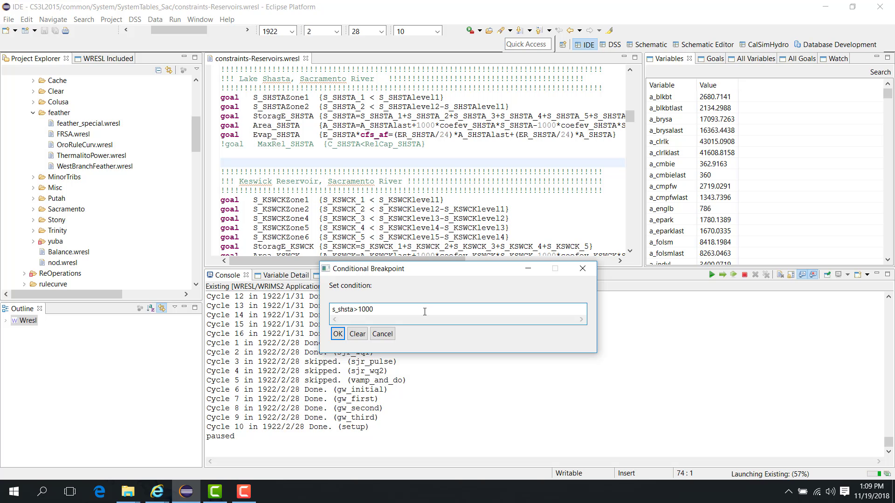

When the model resumes, WRIMS 3 GUI continues running until the condition becomes true. At that point, the model pauses automatically.

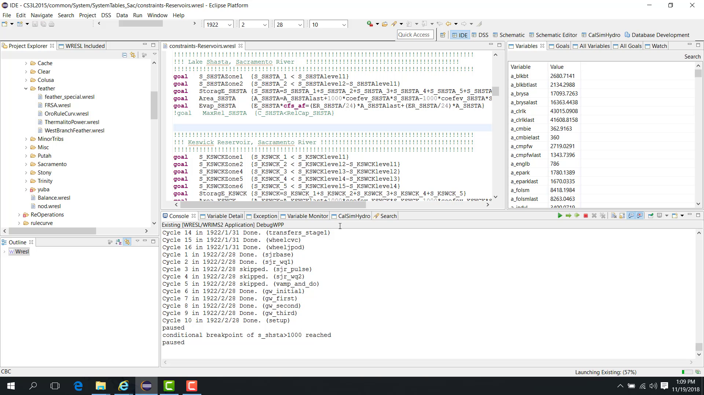

You can then check the variable value and confirm that the condition has been satisfied.

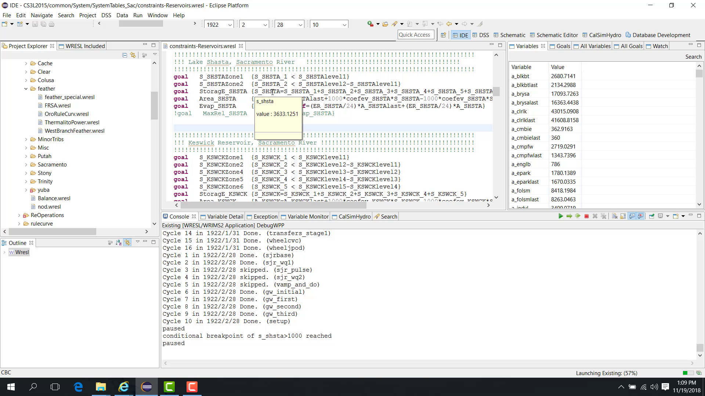

The condition can also be modified during the run. For example, the threshold can be changed from ``1000`` to ``5000``.

If the condition is not satisfied, the model continues running.

To clear the condition:

- open **Run > Clear Conditional Breakpoint**.

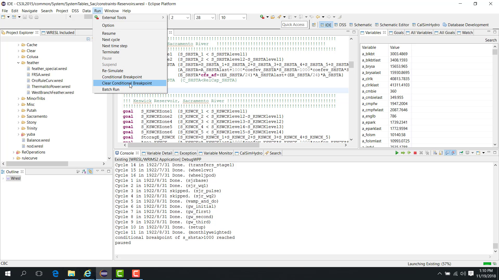

Once the conditional breakpoint is cleared, the model continues without stopping on that condition.

**Notes**

- This feature is especially useful when an issue appears only after a variable crosses a threshold.
- Clear the conditional breakpoint when you no longer want automatic stopping.

**Related sections**

- :ref:`4.1 Debug Pause Variable Goal View <41-debug-pause-variable-goal-view>`
- :ref:`4.2 Debug Variable Monitor <42-debug-variable-monitor>`
- :ref:`4.4 Debug Watch Variables Goals <44-debug-watch-variables-goals>`
