.. _1-getting-started:

Getting Started
===============

.. _01-basic-load-existing-study:

01. Basic Load Existing Study
-----------------------------

**Purpose**

This chapter explains how to import an existing study into the current **WRIMS 2 GUI** workspace.

**Before you start**

Before beginning, make sure that:

- **WRIMS 2 GUI** is installed and can be launched from the ``WRIMS2_GUI_x64`` package.
- You have access to a study folder that already contains a ``.project`` file.
- The study is not currently listed in **Project Explorer**.

**Procedure**

To launch **WRIMS 2 GUI**, open the ``WRIMS2_GUI_x64`` package folder and double-click ``WRIMS2_GUI_x64``.

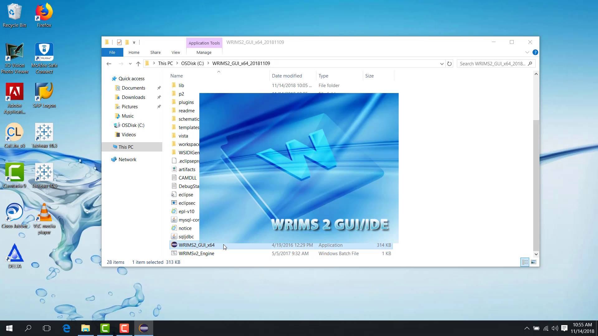

If no study is listed in **Project Explorer**, import the study into the workspace before working with it.

For the distinction between an **existing study** and a **new study**, see :ref:`Existing Studies and New Studies <existing-studies-and-new-studies>`.

The following example shows a study folder that contains a ``.project`` file.

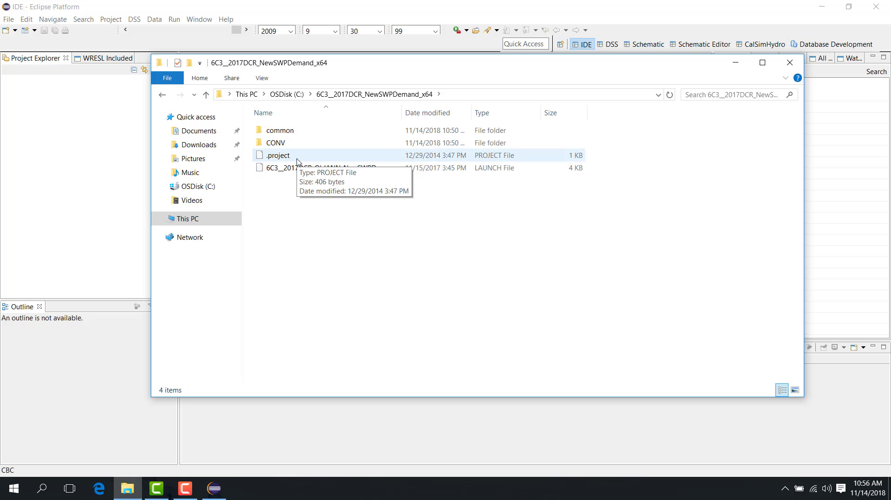

To import an existing study:

1. In **Project Explorer**, right-click and select **Import**.

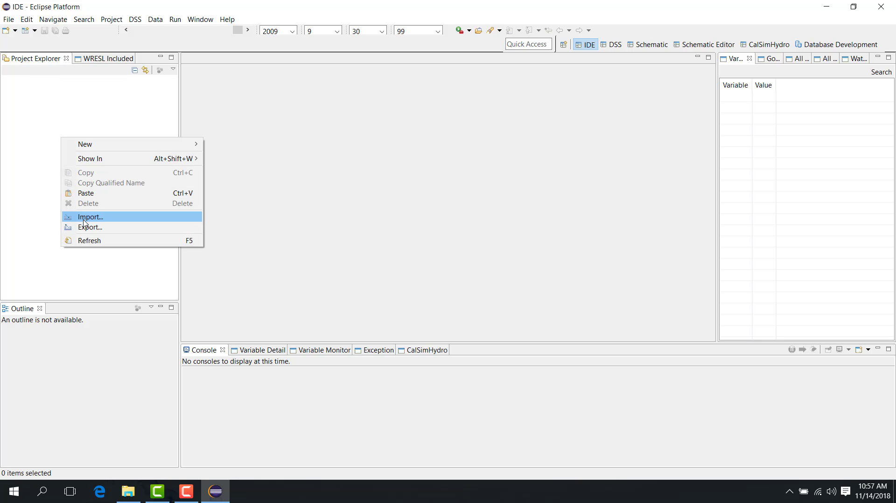

You can also open the **File** menu and select **Import**.

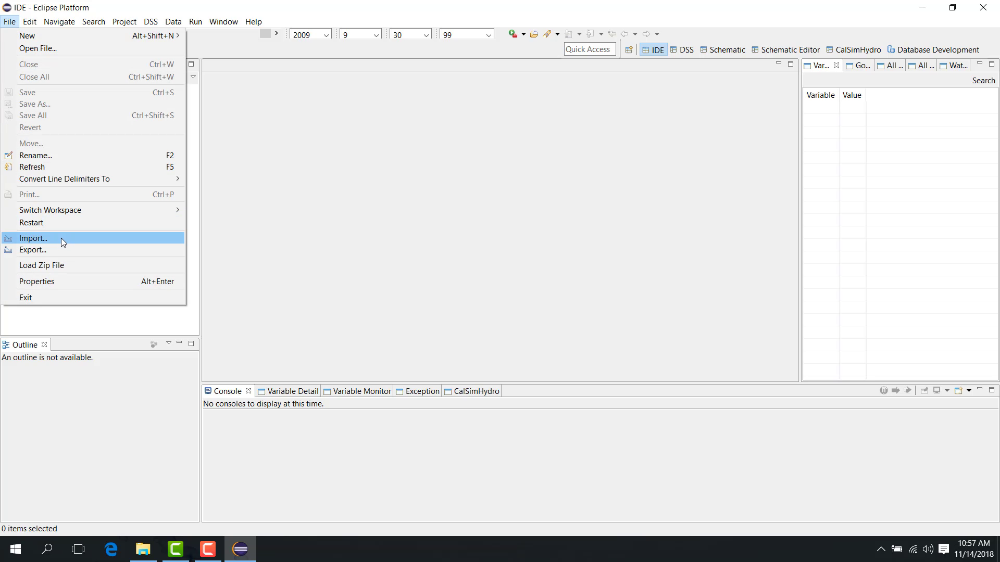

2. In the **Import** dialog, expand **General**.
3. Select **Existing Project into Workspace**.

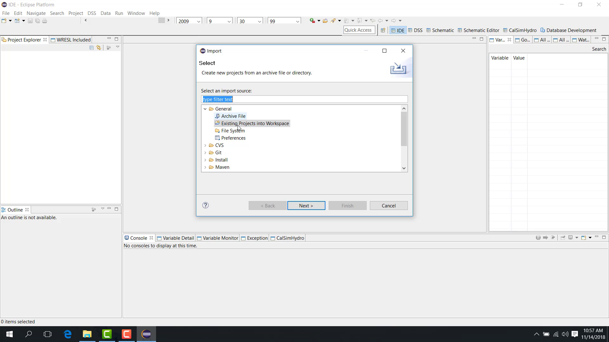

4. Click **Next**.
5. Browse to the main folder of the study you want to import.

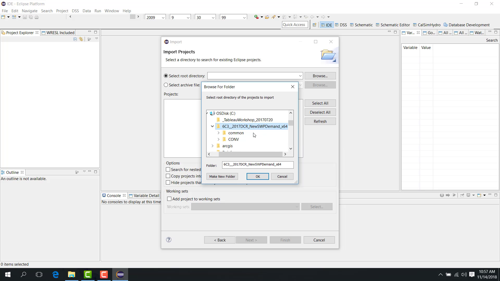

6. Click **OK** to confirm the selected folder.
7. Verify that the project appears in the import list and is selected.
8. Click **Finish** to import the study into the workspace.

After the import is complete, the study appears in **Project Explorer** and is ready to use in **WRIMS 2 GUI**.

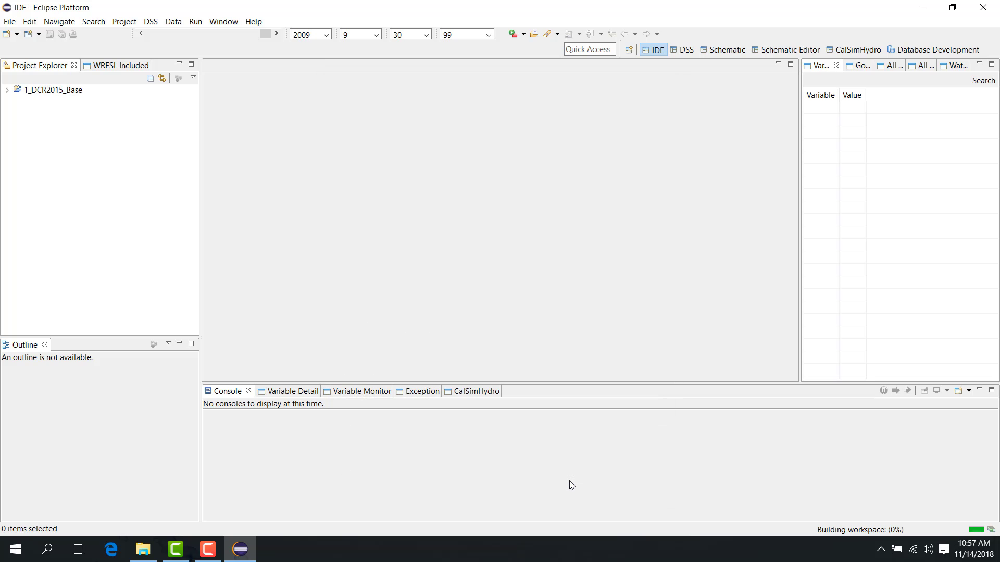

**Notes**

- A study can only be imported as an **existing study** if its main folder contains a ``.project`` file.
- In **WRIMS 2 GUI**, each study is generally managed as a separate project in **Project Explorer**.
- If the expected project does not appear after import, verify that you selected the correct study folder.

**Related sections**

- :ref:`02. Basic New Study <02-basic-new-study>`
- :ref:`03. Basic Create Launch File <03-basic-create-launch-file>`
- :ref:`07. Basic Load Zip File <07-basic-load-zip-file>`

.. _02-basic-new-study:

02. Basic New Study
-------------------

**Purpose**

This chapter explains how to create a project entry in **WRIMS 2 GUI** for a study that has not been loaded before.

**Before you start**

- **WRIMS 2 GUI** is installed and can be launched.
- You have a study folder that does **not** yet contain a ``.project`` file.

**Procedure**

For the distinction between an **existing study** and a **new study**, see :ref:`Existing Studies and New Studies <existing-studies-and-new-studies>`.

In practice:

- A DCR study that already contains a ``.project`` file is treated as an existing study.
- A CALSIM3 study without a ``.project`` file is treated as a new study.

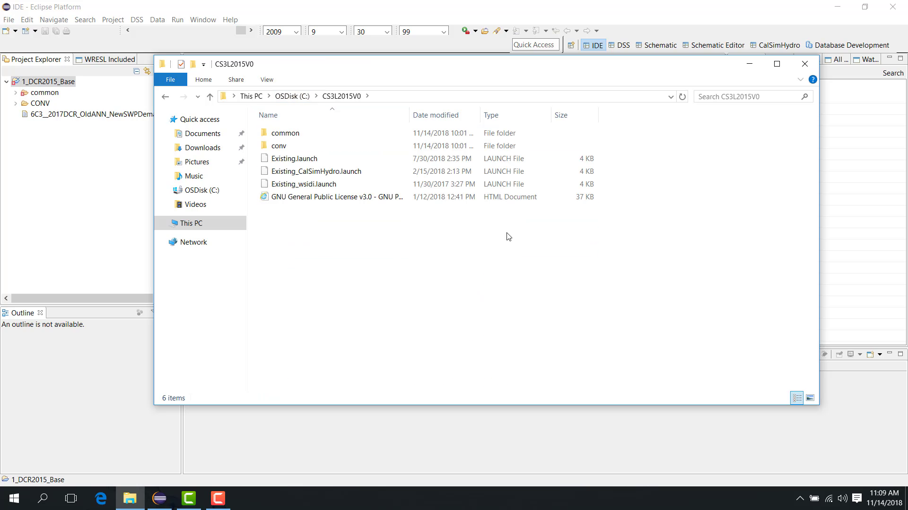

To load a new study:

1. In **Project Explorer**, right-click and choose **New**.

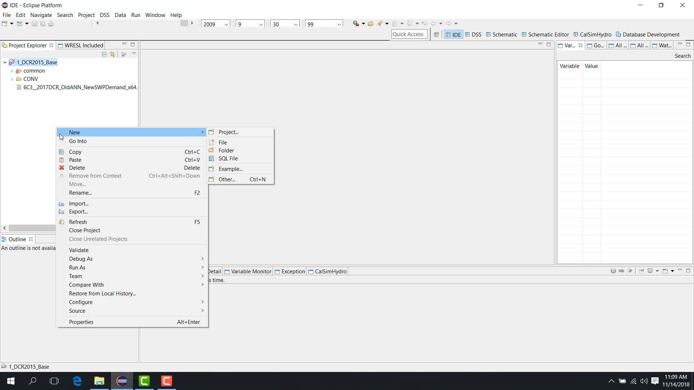

You can also open **File > New Project**.

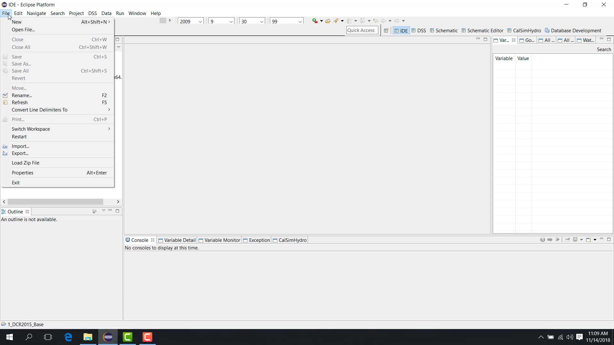

2. In the wizard, go to **General > Project**.

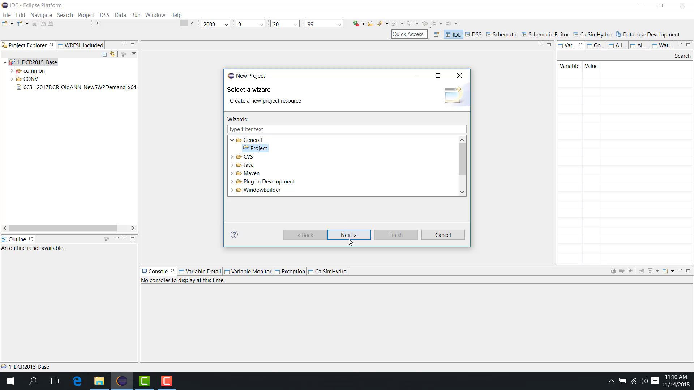

3. Click **Next**.
4. Enter a project name. For a CALSIM3 study, for example, you might enter ``cs3_2015``.

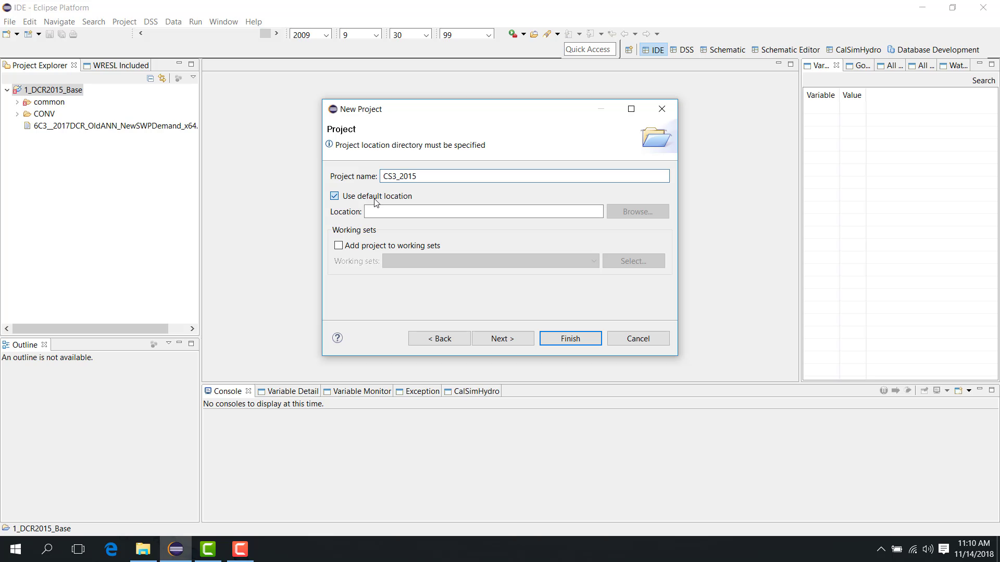

5. Clear the default location option.
6. Browse to the location of the study folder.

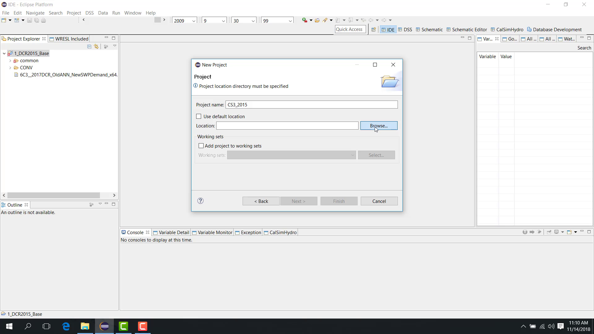

7. Click **OK**.
8. Click **Finish**.

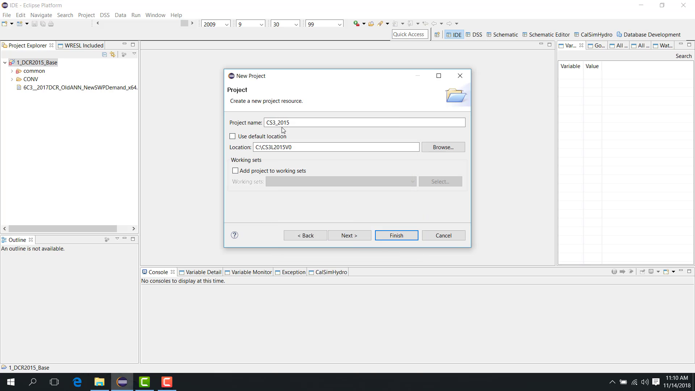

The study is now loaded into **WRIMS 2 GUI**.

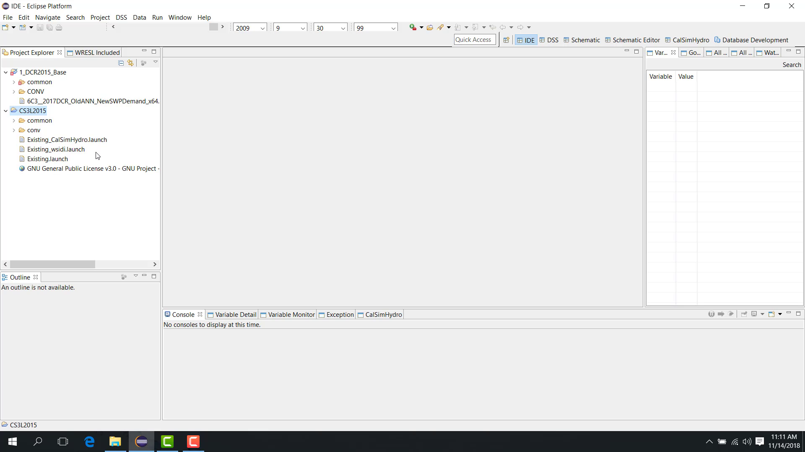

When the study is loaded, **WRIMS 2 GUI** creates a ``.project`` file in the study folder. From that point forward, the study is treated as an **existing study** from the WRIMS 2 GUI perspective.

**Notes**

- A study without a ``.project`` file is treated as a **new study**.
- After it has been loaded once, that same study is treated as an **existing study** by the GUI.

**Related sections**

- :ref:`01. Basic Load Existing Study <01-basic-load-existing-study>`
- :ref:`03. Basic Create Launch File <03-basic-create-launch-file>`
- :ref:`07. Basic Load Zip File <07-basic-load-zip-file>`

.. _07-basic-load-zip-file:

07. Basic Load Zip File
-----------------------

**Purpose**

This chapter shows how to load a study directly from a zip file.

**Before you start**

- You have a study packaged as a ``.zip`` file.
- **WRIMS 2 GUI** is open.

**Procedure**

Studies are often shared as zip files. **WRIMS 2 GUI** includes a function that can:

- unzip the file
- load the study directly into the workspace.

To do this:

1. Open **WRIMS 2 GUI**.
2. Open the **File** menu.
3. Choose **Load Zip File**.

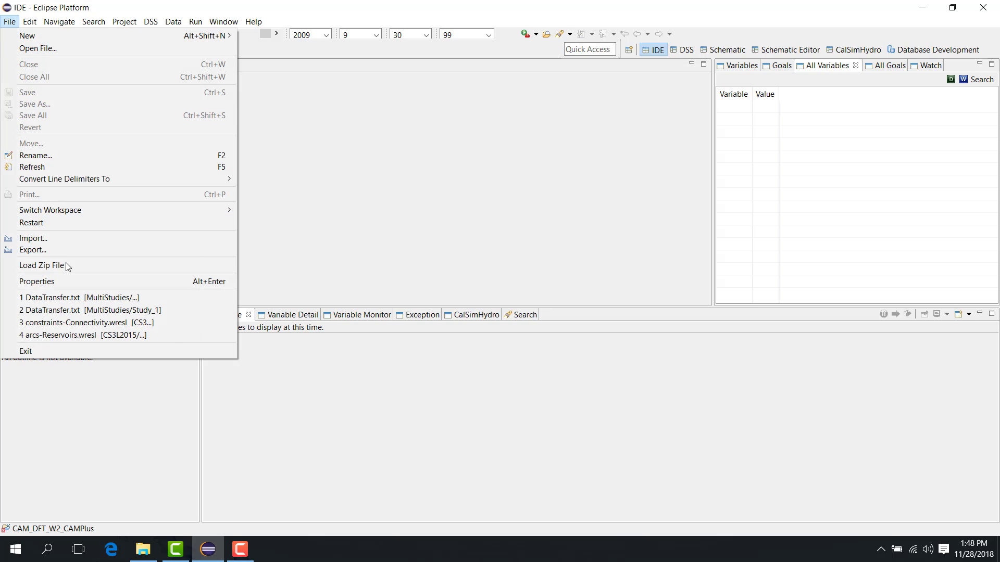

4. Browse to the zip file.
5. Select the zip file.

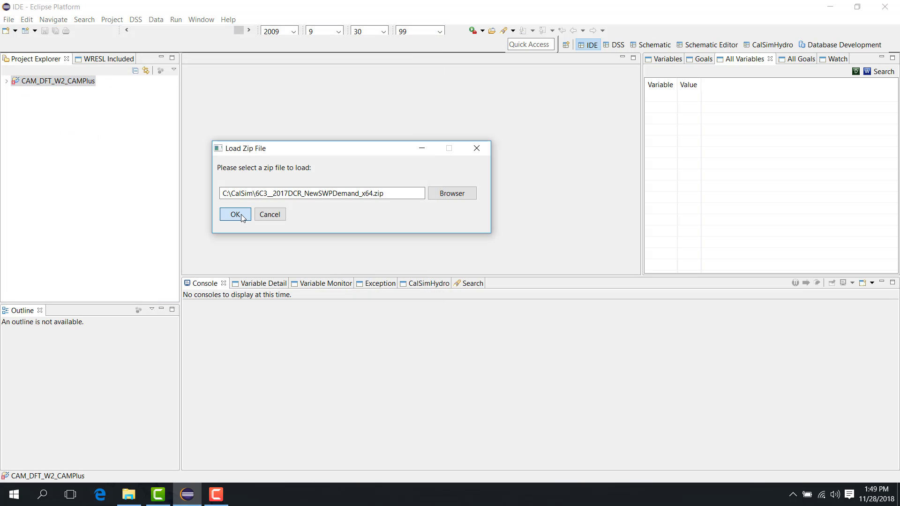

6. Click **Open**.
7. Click **OK**.

WRIMS 2 GUI then:

- unzips the study;
- creates a folder next to the zip file;
- loads the study into the GUI.

If a launch file is included in the package, it is also available after the study is loaded.

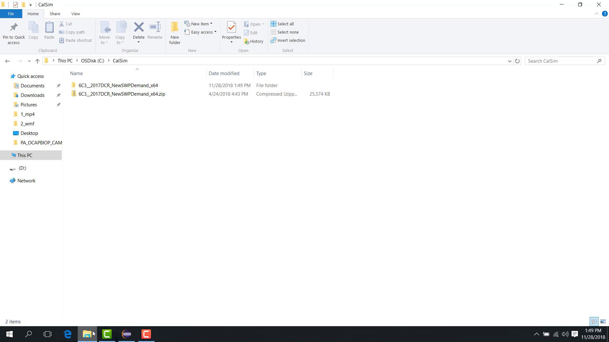

**Notes**

- Confirm where the zip file will be extracted before finishing the load operation.
- After extraction, verify that the expected study structure appears in **Project Explorer**.

**Related sections**

- :ref:`01. Basic Load Existing Study <01-basic-load-existing-study>`
- :ref:`02. Basic New Study <02-basic-new-study>`
- :ref:`03. Basic Create Launch File <03-basic-create-launch-file>`

.. _03-basic-create-launch-file:

03. Basic Create Launch File
----------------------------

**Purpose**

This chapter explains how to create a launch configuration for running or debugging a study.

**Before you start**

- The study is already loaded in **Project Explorer**.
- You know the locations of the main WRESL file, DSS files, and any groundwater folder used by the study.
- You know the start date, end date, and whether the study is monthly or daily.

**Procedure**

For the role of a **launch file** and the distinction between **Run** and **Debug**, see :ref:`Launch Files and Run Modes <launch-files-and-run-modes>`.

A study may already contain multiple launch files. To create a new one, use either:

- **Debug As > Debug Configuration**
- **Run As > Run Configuration**

This chapter uses **Run Configuration**.

1. Right-click the study and choose **Run As > Run Configuration**.

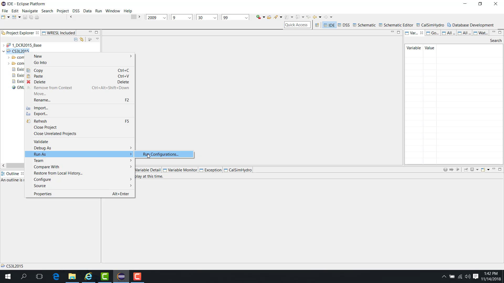

2. In the configuration window, locate **WRESL/WRIMS2 Application**.
3. Right-click **WRESL/WRIMS2 Application** and choose **New**.

.. image:: diagrams/frames/03_Basic_CreateLaunchFile/03_Basic_CreateLaunchFile_3360.png

4. Enter a name for the launch file, such as ``testCalSim``.
5. Fill in the study information, including:
   - study name
   - author
   - date
   - description

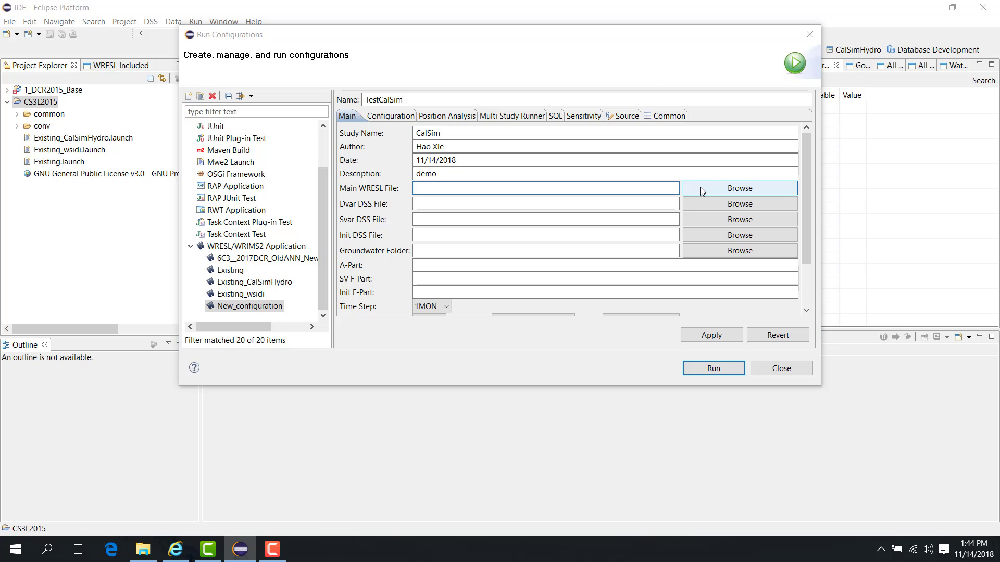

Enter a description that clearly identifies the launch configuration.

Next, browse to the main WRESL file.

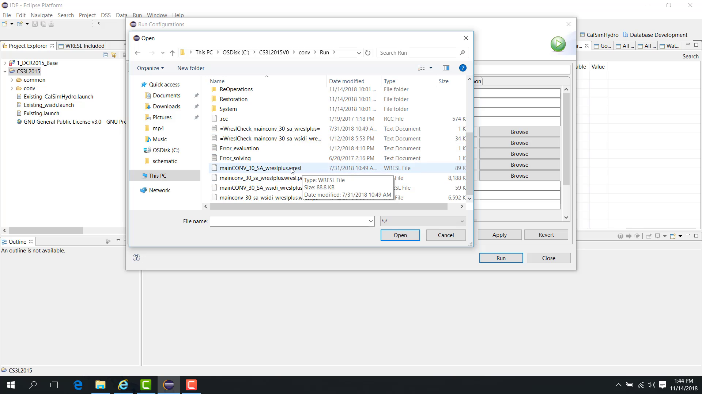

6. Browse to the study folder.
7. Open the ``run`` folder.
8. Select the main WRESL file.

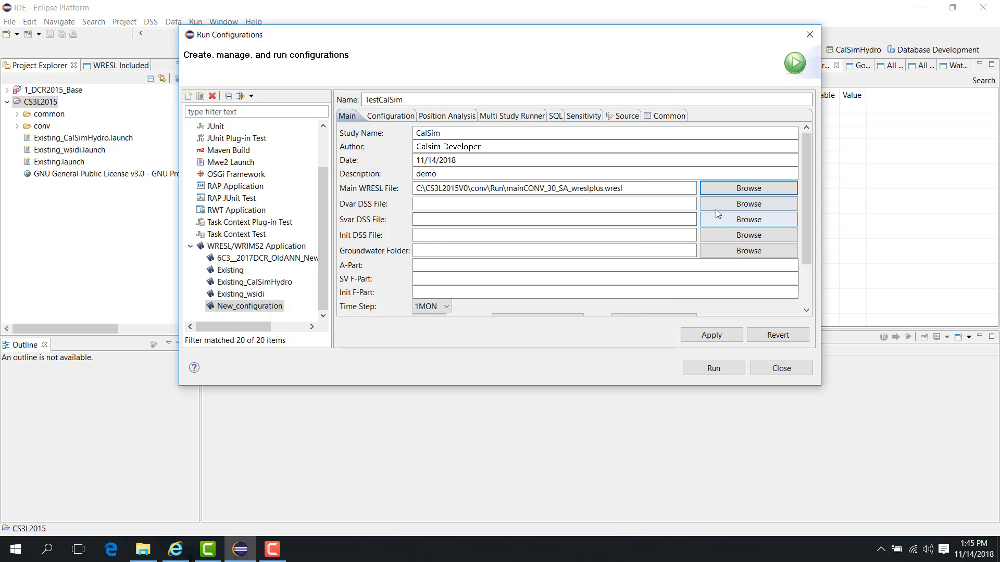

Then specify the DSS and related file paths:

9. Browse to the decision-variable DSS file, typically under ``run\DSS``, such as ``testDV.dss``.
10. Specify the SV DSS file, usually under ``common\DSS``.
11. Specify the initial DSS file.

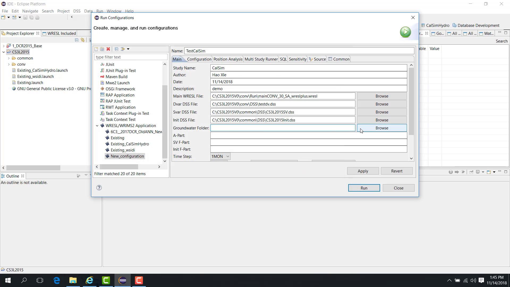

12. If applicable, specify the groundwater folder.

In CalSim 3, for example, a groundwater folder may be located under a path such as ``CVgroundwater\data``.

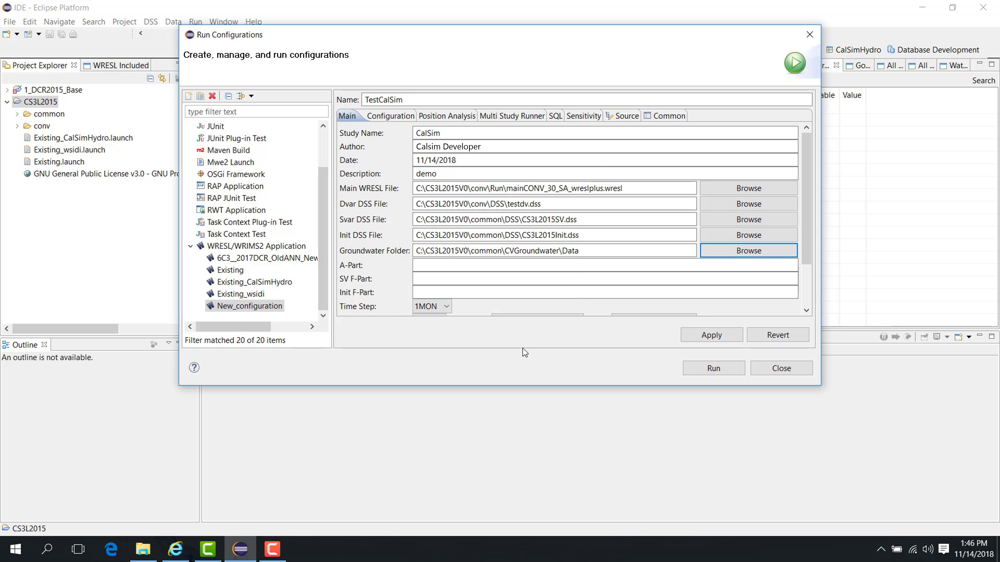

The HEC-DSS fields are used as follows:

- The **DVar DSS** file is the output;
- The **SVar DSS** file is an input;
- The **Initial DSS** file is also an input.

You must also provide **Part A** and **Part F** values for these DSS files.

- The three files may share the same **Part A**.
- The **Part F** values may be the same or different.

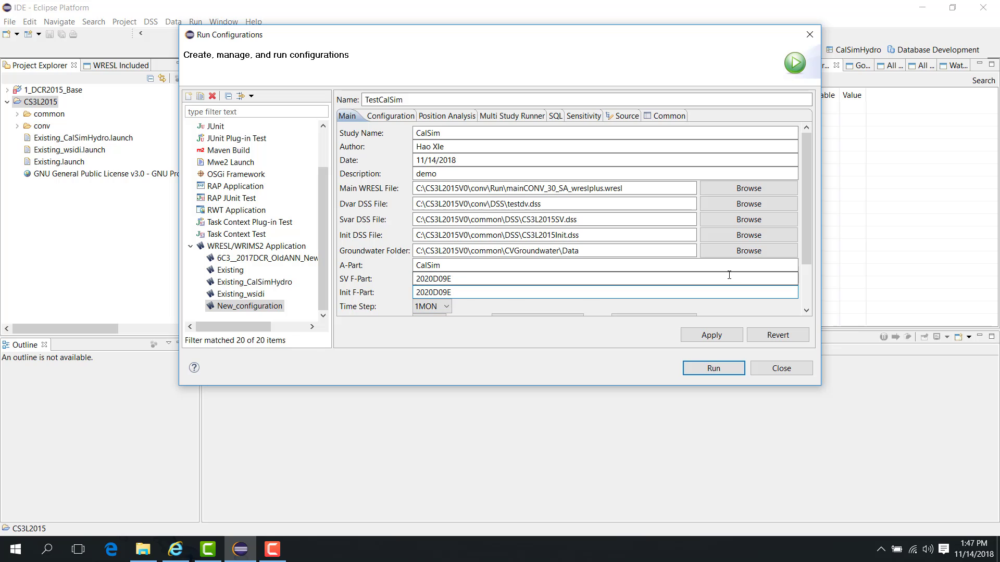

Then configure the time settings:

13. Choose whether the model is **monthly** or **daily**.
14. Set the starting and ending dates.

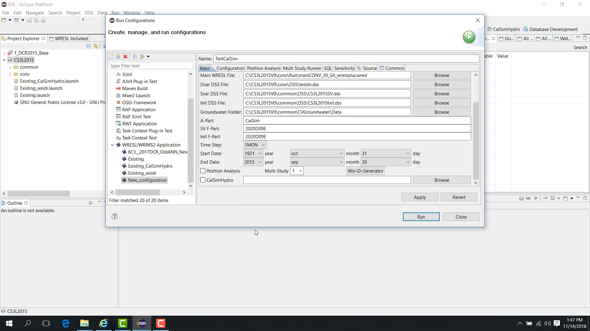

For a regular study that does not use position analysis or multi-study run, the main launch setup is complete at this point.

15. Click **Apply**.

**Save the launch file into the study**

After you click **Apply**, the launch file is created, but by default it may be saved in the WRIMS 2 package location.

To store the launch file with the study:

1. Change the storage option from **Local File** to **Shared File**.

.. image:: diagrams/frames/03_Basic_CreateLaunchFile/03_Basic_CreateLaunchFile_10920.png

2. Browse to the study folder.
3. Select the study folder.

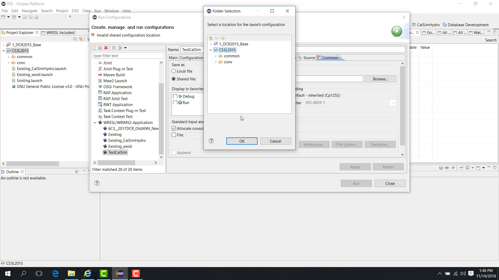

4. Click **OK**.
5. Click **Apply** again.

The launch file is now saved inside the study.

**Use relative paths instead of absolute paths**

Relative paths are preferred.

If the launch file uses absolute paths, another user may need to update all file references when the study is stored in a different location on a different computer.

To improve portability:

1. Replace absolute paths with relative paths.

.. image:: diagrams/frames/03_Basic_CreateLaunchFile/03_Basic_CreateLaunchFile_14520.png

.. image:: diagrams/frames/03_Basic_CreateLaunchFile/03_Basic_CreateLaunchFile_15240.png

2. Make each path relative to the launch file location.
3. Click **Apply** again.

The main file, DV DSS file, SV file, initial file, and groundwater folder can all be converted to relative paths.

**Run or debug the launch file**

After the launch file is created, you can either:

- click **Run** directly from the configuration window;

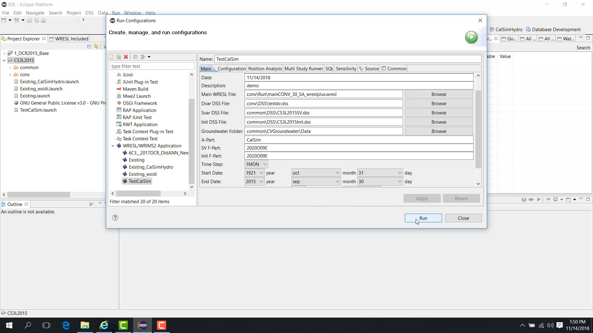

- or close the configuration window, right-click the launch file, and choose **Run As** or **Debug As**.

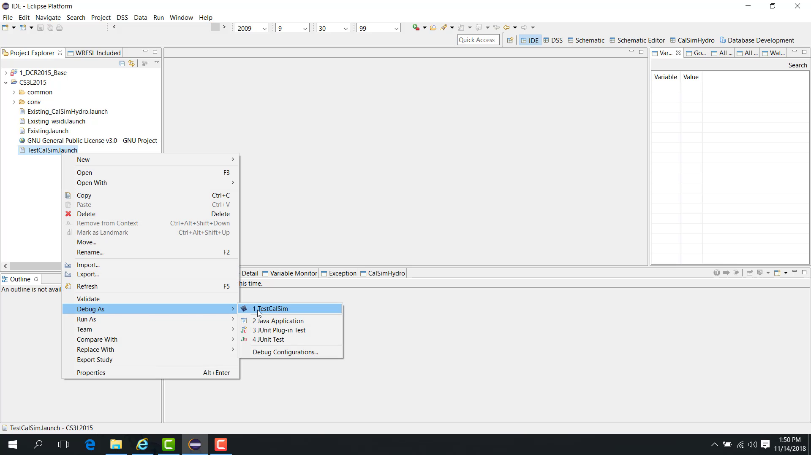

**Notes**

- Use **Shared File** so the launch file is stored with the study instead of the WRIMS package area.
- Use relative paths whenever possible so the study is easier to move or share.
- **Run** and **Debug** use the same launch configuration, but **Debug** allows pausing and inspection.

**Related sections**

- :ref:`04. Basic Modify Launch File <04-basic-modify-launch-file>`
- :ref:`09. Debug Pause Variable Goal View <09-debug-pause-variable-goal-view>`
- :ref:`14. Debug Solver And Option <14-debug-solver-and-option>`

.. _04-basic-modify-launch-file:

04. Basic Modify Launch File
----------------------------

**Purpose**

This chapter explains how to create a new launch file by duplicating and modifying an existing one.

**Before you start**

- The study already contains at least one working launch file.
- You want a similar launch file with only a few fields changed.

**Procedure**

A new launch file can also be created by modifying an existing one.

As described in the previous chapter, you can open launch settings from either:

- **Debug As > Debug Configuration**
- **Run As > Run Configuration**

The earlier workflow created a launch file from scratch. This workflow creates a launch file by duplicating an existing one.

To create a new launch file from an existing one:

1. Open **Debug Configuration**.

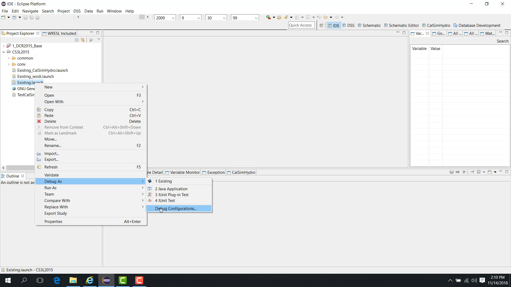

2. Under **WRESL/WRIMS2 Application**, locate the existing launch file.
3. Right-click the existing launch file.
4. Choose **Duplicate**.

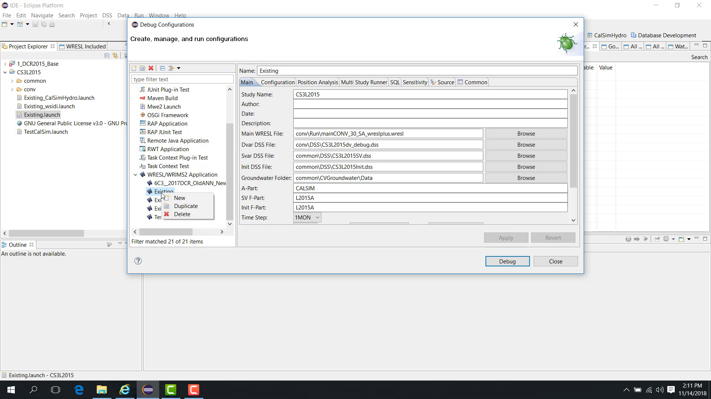

5. Rename the duplicated launch file.
6. Click **Apply**.

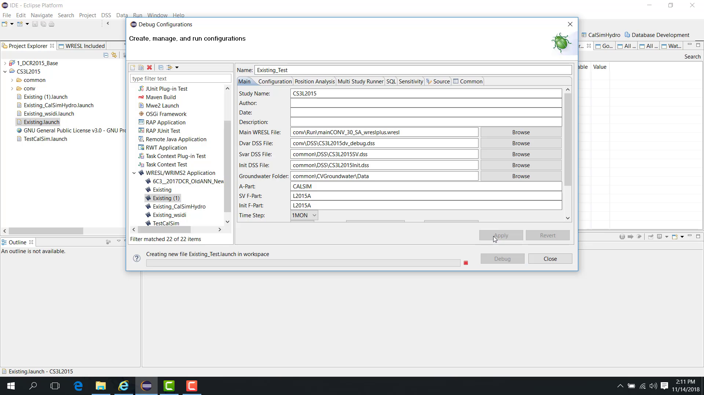

A new launch file is now available based on the existing configuration.

To update the decision-variable DSS file:

1. Browse to the decision-variable DSS file field.
2. Go to the study’s ``run\DSS`` folder.
3. Select a DSS file, such as ``testDV.dss``.
4. Click **Open**.

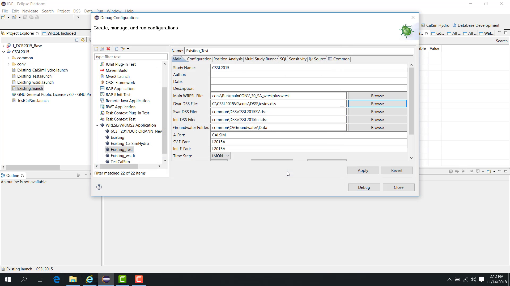

If the path appears as an absolute path, convert it to a relative path.

5. Replace the absolute path with a relative path.

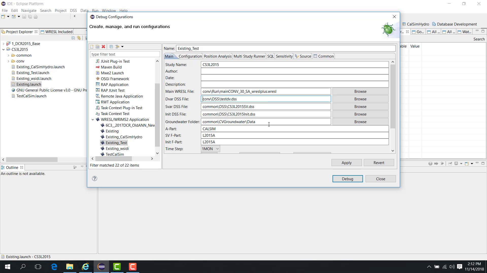

6. Click **Apply**.

**Run vs Debug**

For the distinction between **Run** and **Debug**, see :ref:`Launch Files and Run Modes <launch-files-and-run-modes>`.

Selecting **Debug** starts the model in **Debug** mode.

Once the model is running, you can pause it during a cycle and inspect variable values from the file currently open in the editor.

**Notes**

- Duplicating an existing launch file reduces setup effort and lowers the chance of configuration errors.
- After duplication, review file paths and convert absolute paths to relative paths if needed.

**Related sections**

- :ref:`03. Basic Create Launch File <03-basic-create-launch-file>`
- :ref:`09. Debug Pause Variable Goal View <09-debug-pause-variable-goal-view>`
- :ref:`14. Debug Solver And Option <14-debug-solver-and-option>`
