.. _9-schematic-workflows:

9. Schematic Workflows
======================

.. _91-schematic-view-workflow:

9.1 Schematic View Workflow
---------------------------

**Purpose**

This chapter explains how to use **Schematic View** to move from the WRIMS study and file context into a graphical network display, load the schematic definition, and navigate between the full system and a local area of interest.

**Before you start**

Before using **Schematic View**, make sure that:

- the study is already open in WRIMS;
- the relevant DSS, alternative, or result data are available if required for the display;
- a schematic XML or other schematic definition is available for the study;
- the study data needed for display have already been generated or loaded.

**Interface layout**

The workflow shown in this chapter uses the following interface elements:

- **Project Explorer** or the study tree, used to access study content and related files;
- **file selection dialogs**, used to choose the study, result, or schematic files to display;
- the **main schematic canvas**, which displays the current working view of the network;
- the **schematic overview pane**, which shows the entire network and the current viewing extent;
- the **toolbar**, which provides zoom and navigation controls;
- the **time selector**, which allows the display context to be changed for the current view.

The **main canvas** and the **overview pane** work together. The main canvas shows the detailed local area, while the overview pane preserves the full network context.

**Procedure**

**1. Open the study and prepare the display context**

Open the WRIMS study and navigate to the file or result context used for the schematic display.

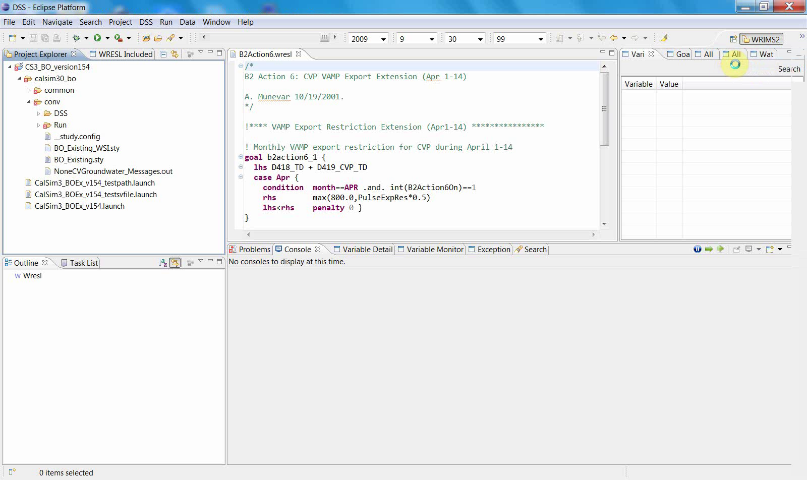

At this stage, the interface shows the study tree and the file-based workspace from which the schematic workflow begins.

**2. Select the required study or result file**

Open the file selection dialog and choose the relevant study file, DV and SV files for an alternative, or another result file needed to build the schematic display.

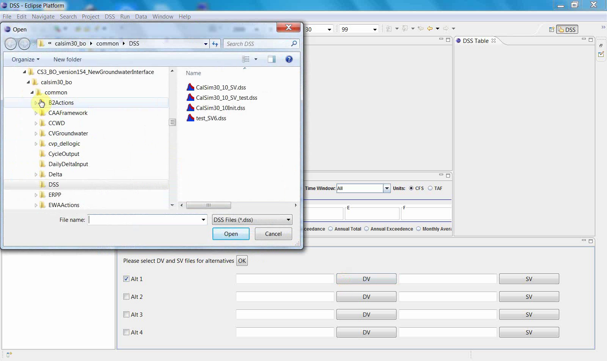

A second selection step may follow if an additional supporting file is required.

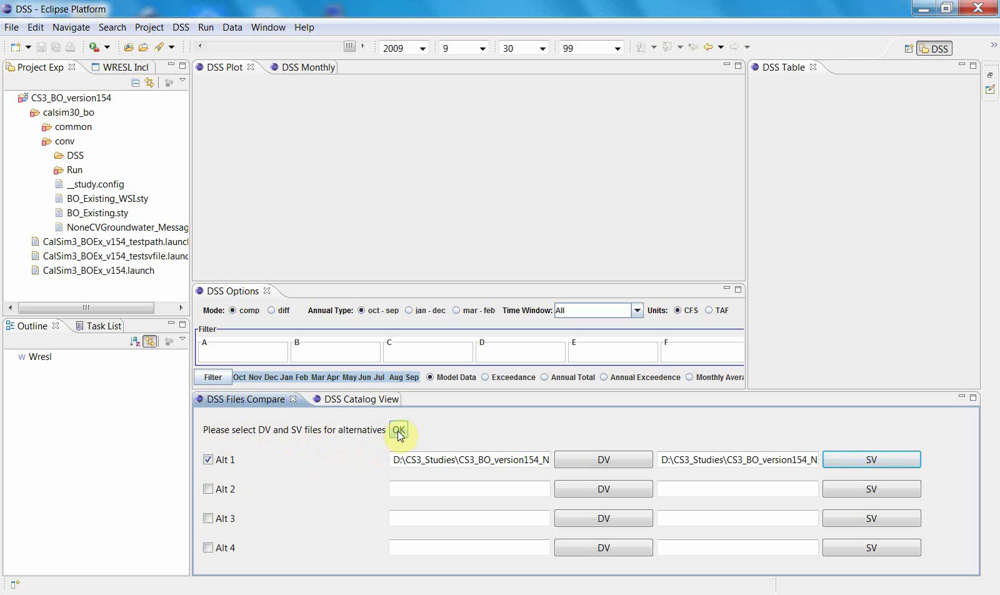

These steps establish the data context that the schematic display will use.

**3. Open the schematic display**

After the input files are selected, open the **Schematic** display from the WRIMS interface.

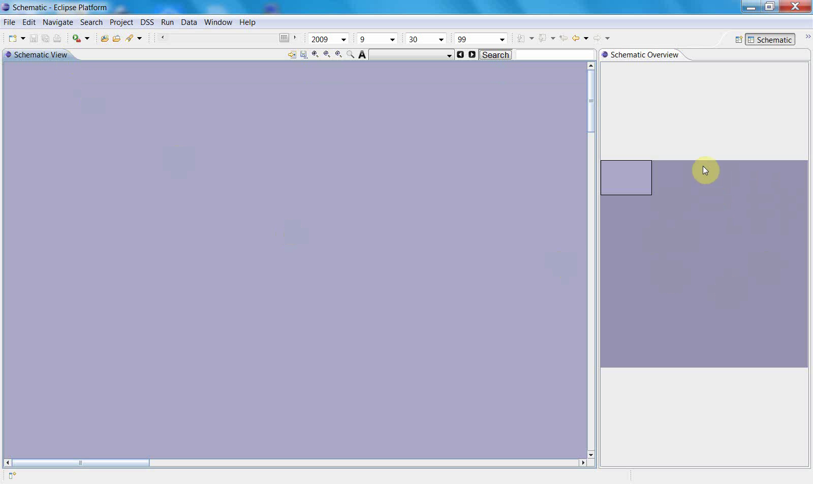

At first, the canvas may appear empty or may show only a broad background until the schematic content is fully loaded.

**4. Select the schematic definition file**

Open the schematic selection dialog and choose the XML or other schematic definition file associated with the study.

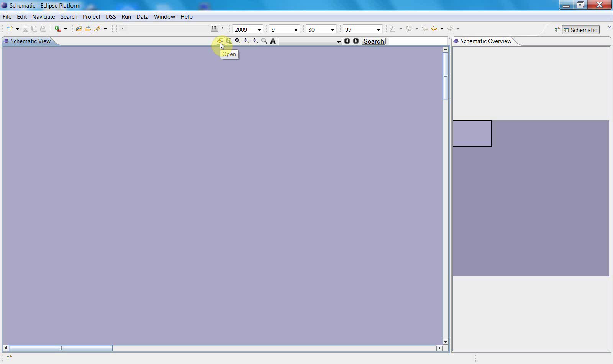

Then select the appropriate schematic file.

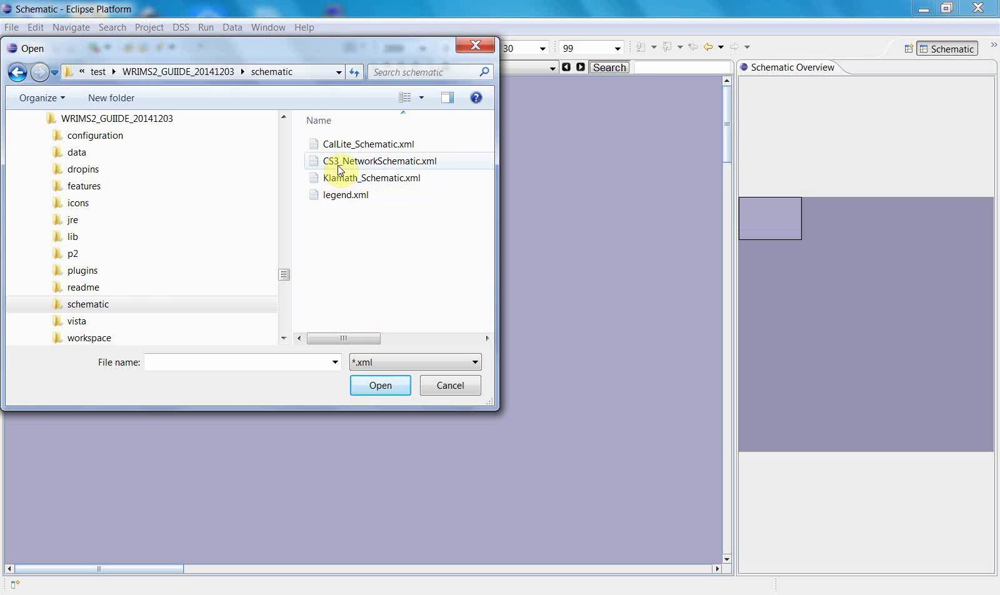

This step connects the graphical layout definition to the current study view and prepares the display for navigation.

**5. Display the full network**

Once the schematic definition is loaded, the display area is refreshed and the network becomes available in the schematic canvas.

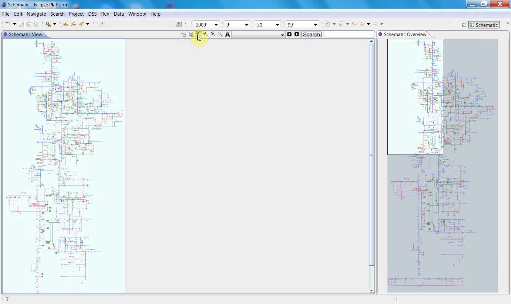

The full network can then be displayed in the main canvas.

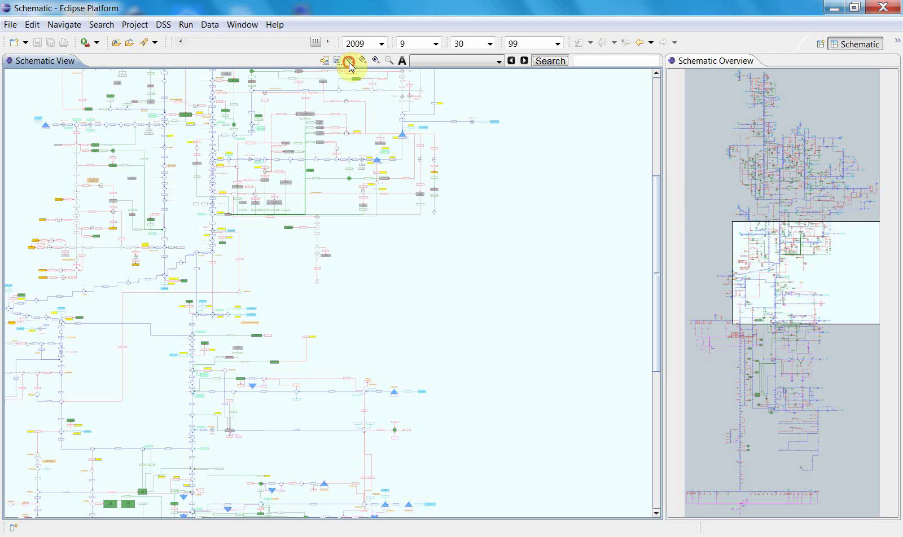

At this point, users can begin navigating from the full-system view into local regions.

**6. Navigate between the main view and the overview pane**

As the schematic is displayed, the overview pane on the side shows the complete network while the main canvas shows the current working extent.

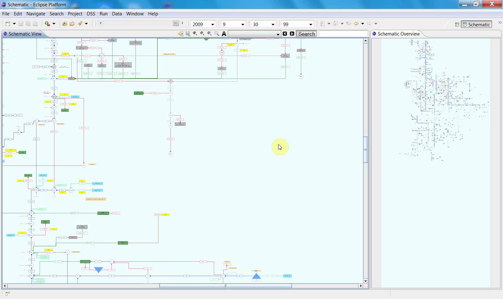

This relationship is important:

- the **main view** is used for detailed inspection;
- the **overview pane** keeps the full-system context visible;
- the current viewing window can be tracked as the user zooms or pans.

**7. Zoom to a local portion of the network**

Use the toolbar and canvas controls to zoom into a specific part of the schematic.

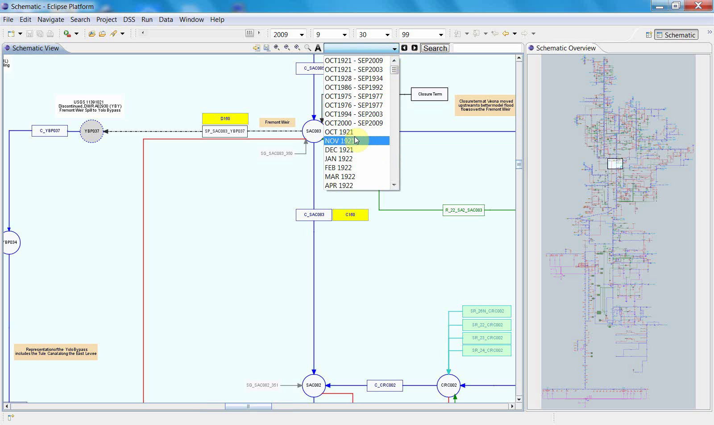

After zooming in, labels, nodes, and connecting lines become easier to inspect. This is the main working mode for local schematic analysis.

**8. Use the display controls**

The top toolbar includes controls for changing the display state, including the time selector shown in the video.

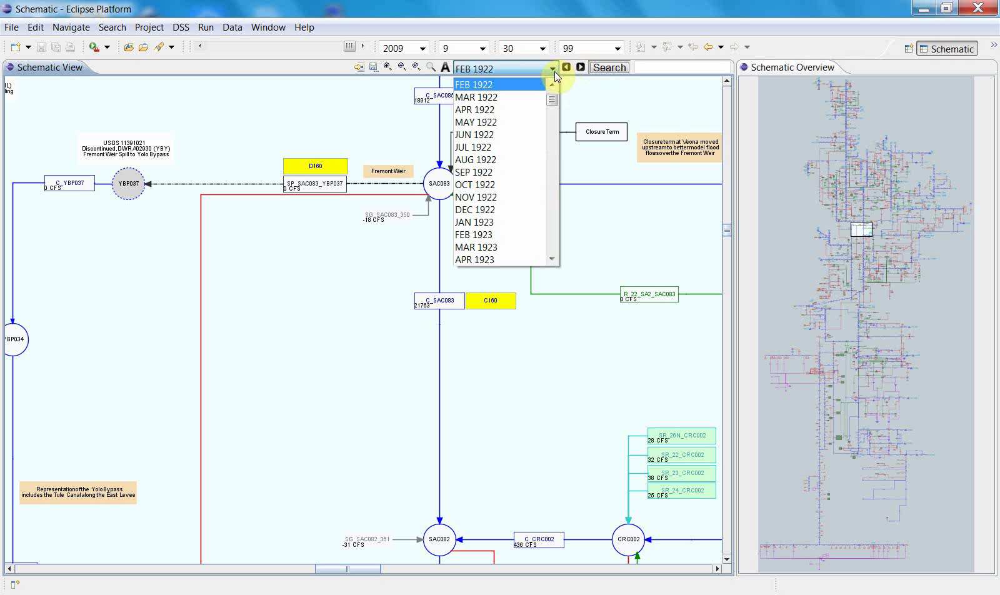

This allows the schematic display to be viewed under a selected display context while remaining in the same navigation environment.

**Notes**

- **Schematic View** depends on the current study context, selected files, and the schematic definition used for rendering.
- The **main canvas** and **overview pane** are intended to be used together.
- This workflow supports display and navigation, not schematic editing.
- **Schematic View** is especially useful when users need to move between full-system context and local detail without leaving the same interface.

**Related sections**

- :ref:`2.5 Basic Perspectives <25-basic-perspectives>`
- :ref:`9.2 Schematic Editor Workflow <92-schematic-editor-workflow>`
- :ref:`8.1 DSS Wrims DSS Perspective <81-dss-wrims-dss-perspective>`

.. _92-schematic-editor-workflow:

9.2 Schematic Editor Workflow
-----------------------------

**Purpose**

This chapter explains how to use the **Schematic Editor** to open a schematic editing workspace, prepare the required file context, edit schematic objects on the canvas, and save the updated schematic as an XML file.

**Before you start**

Before starting, make sure that:

- a WRIMS workspace or study is already open;
- the project includes the schematic-related files needed for editing;
- you have access to the **Schematic Editor** interface;
- you know where the target schematic XML file will be loaded from or saved to.

**Procedure**

The workflow begins in the standard WRIMS project workspace, moves into the **Schematic Editor**, prepares the editor through file-selection and setup steps, and then proceeds to canvas-based editing before the updated schematic is saved.

**1. Start from the WRIMS project workspace**

The workflow begins in the standard WRIMS workspace, with the project tree visible. This establishes the starting context for the editing session.

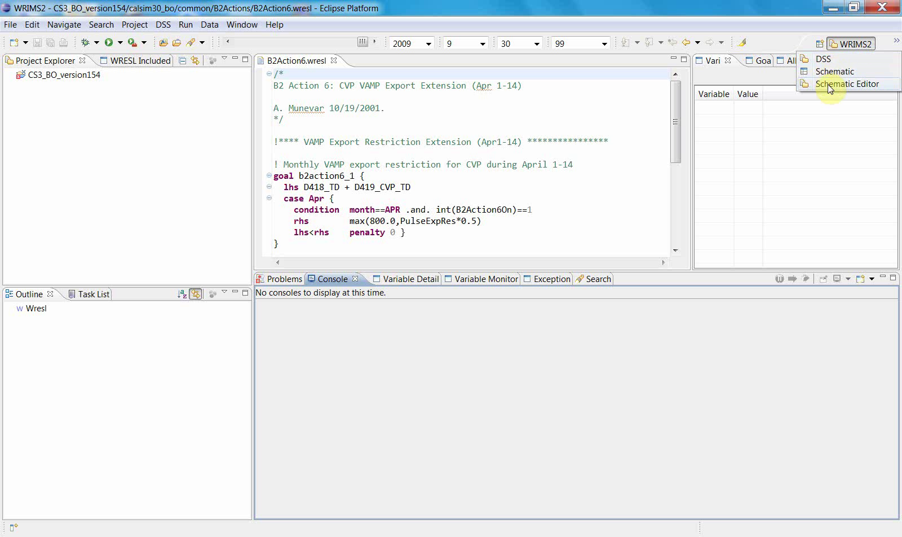

At this stage, the user is still in the normal WRIMS project environment. The next steps move from the general workspace into the dedicated editor.

**2. Open the Schematic Editor**

After the editor is launched, a dedicated **Schematic Editor** interface appears.

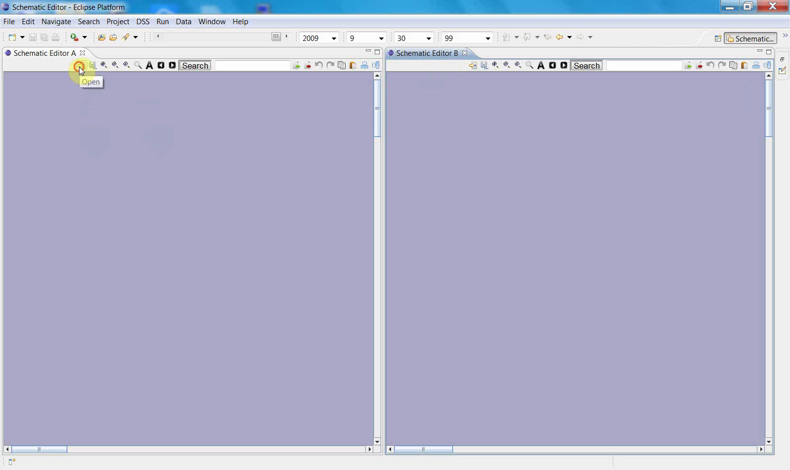

This screen shows the transition from the general WRIMS workspace to a specialized editing view. The large panes indicate that the editor has opened, but the working content has not yet been fully prepared.

**3. Select the initial file or resource needed for the editor**

A file-selection dialog appears next.

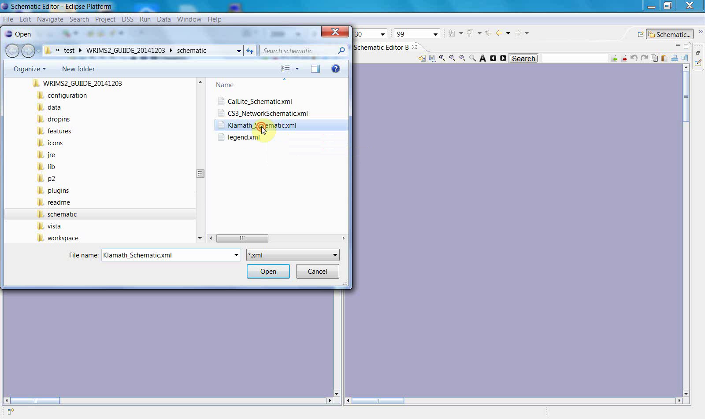

This step indicates that the editor requires an input file, resource, or configuration before the drawing area can be populated. The workflow has now moved from simply opening the editor to preparing an editable workspace.

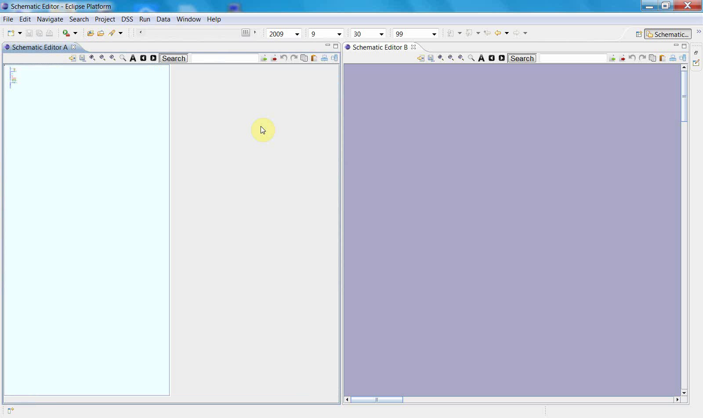

This toolbar action leads to a second file-selection dialog.

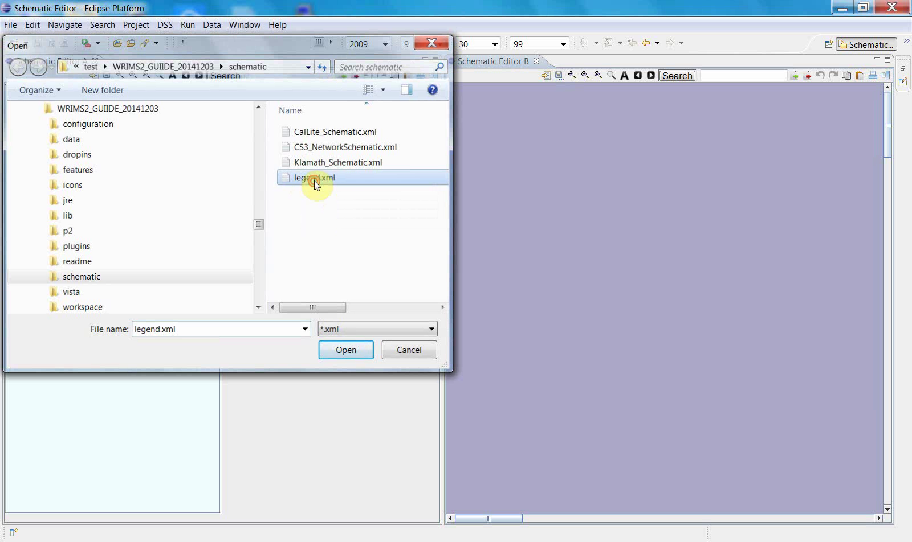

Taken together, these screens show that editor setup is completed in stages. The first file operation opens the editing context, while the second step loads an additional resource or confirms the schematic file to be edited.

**4. Prepare the editor workspace**

After the file-selection step, the editor returns to a partially prepared workspace.

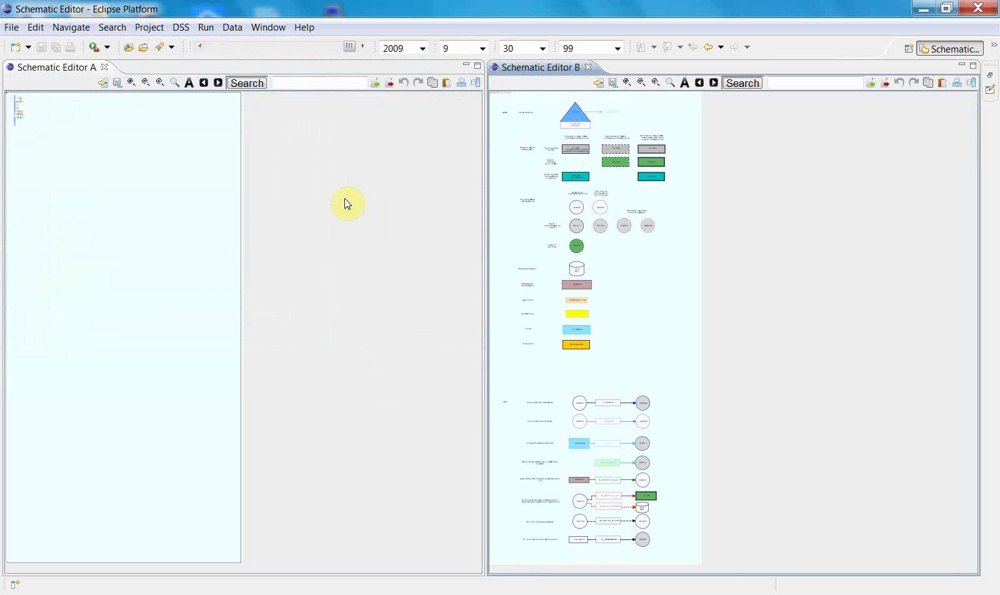

The main canvas area is visible, but the editor is not yet fully configured for diagram work. A toolbar action is then performed to continue the setup.

**5. Display the full editing layout**

This is the transition from setup to active editing. The main drawing canvas is now visible together with a symbol palette on the right.

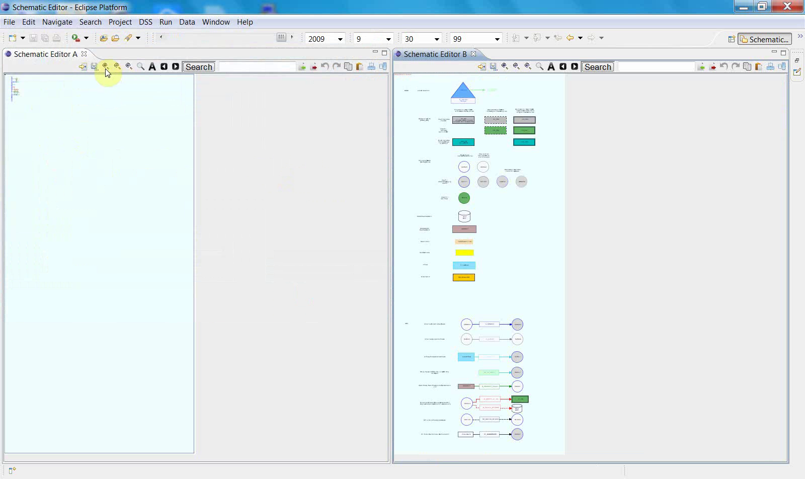

This toolbar interaction appears to activate the editing mode or tool state used in the remaining steps.

**6. Edit the schematic on the canvas**

This is the first point in the workflow where the canvas contains a recognizable network of symbols, labels, and connections. The image below shows the schematic in an active editing state.

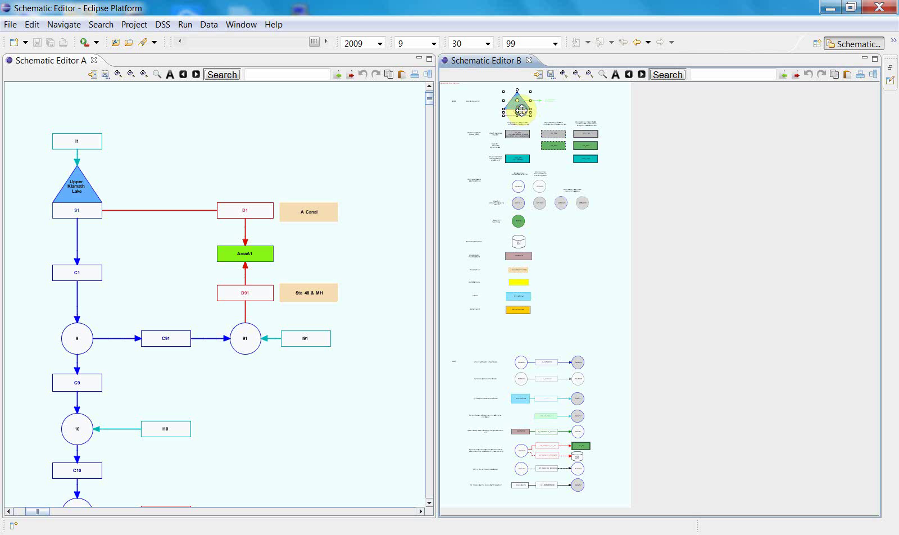

Copy the items from the right panel to the left panel.

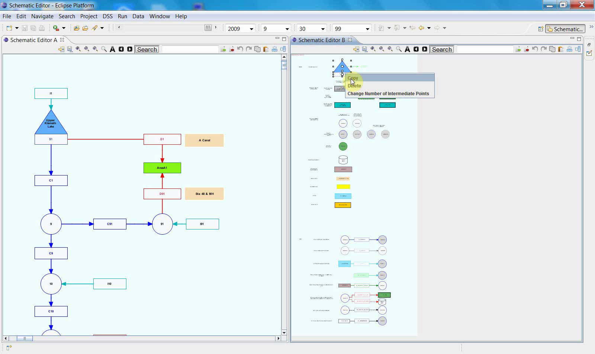

Right-click and paste the figure into the right panel.

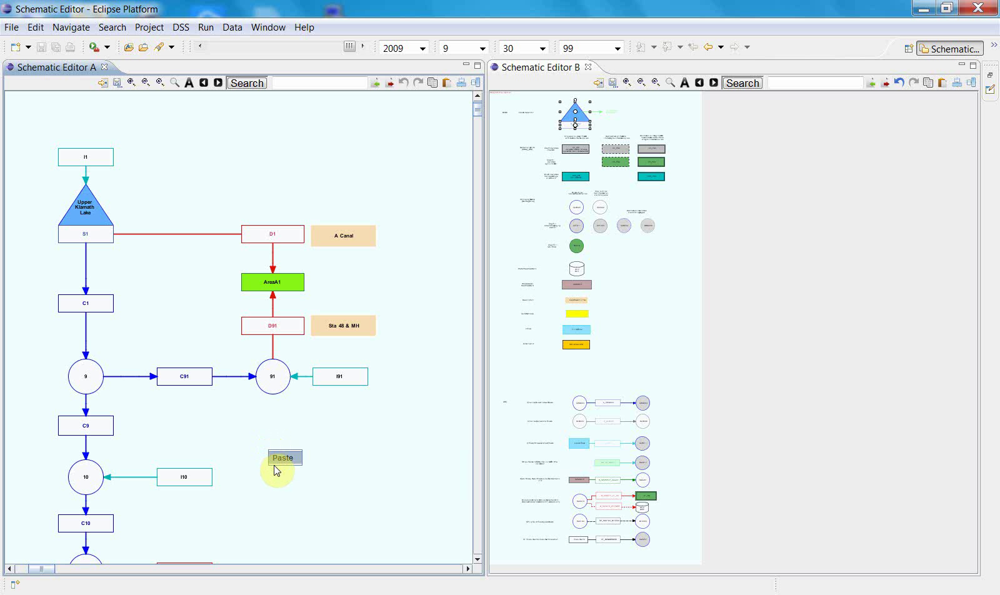

**7. Align objects**

To align a new object with an existing one, click the two objects that you want to align.

Once those two objects have been selected,

click the upper-right corner button to align them vertically.

**8. Copy and reposition an object**

You can also copy an object within this file.

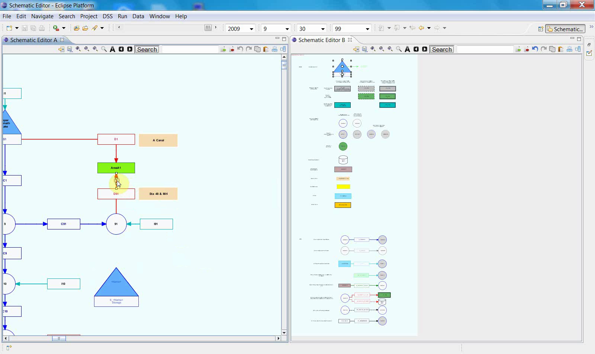

Right-click the object and then copy it.

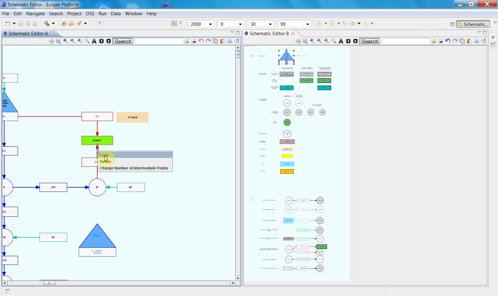

Then paste it.

This new object can be dragged to the object or position you want.

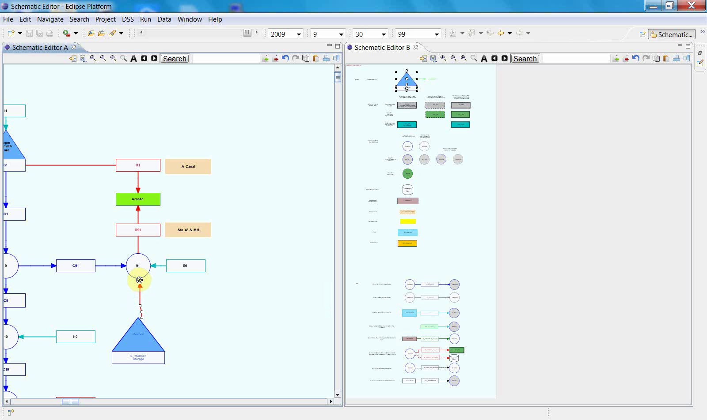

It can also be aligned vertically.

Click the upper-right corner button to align it vertically.

**9. Save the schematic to XML**

Once the editing steps are complete, save the updated schematic.

The sequence ends with a save dialog.

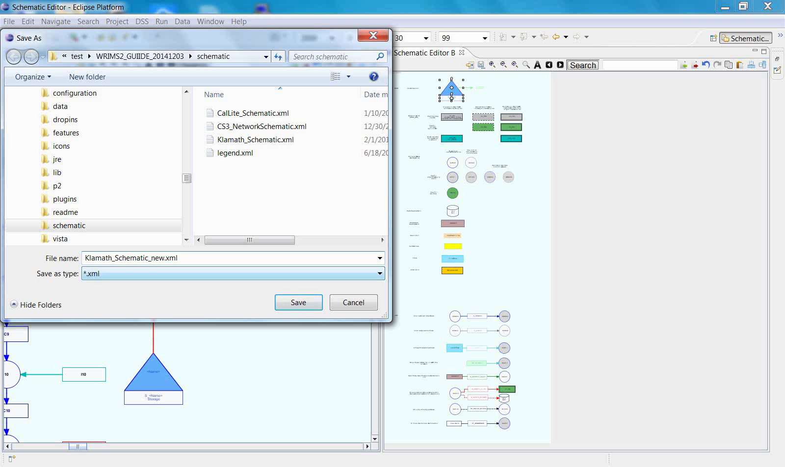

This final screen confirms that the edited schematic is saved to an XML file.

**Notes**

- The **Schematic Editor** workflow should be read as a continuous sequence rather than as isolated interface examples.
- File-selection and setup steps are part of preparing the editing context and are required before diagram editing can begin.
- The symbol palette and fully visible canvas indicate that the editor is ready for active editing.
- The workflow ends by saving the edited schematic to an XML file.

**Related sections**

- :ref:`2.5 Basic Perspectives <25-basic-perspectives>`
- :ref:`9.1 Schematic View Workflow <91-schematic-view-workflow>`
