.. _7-special-executions:

7. Special Executions
=====================

This section covers advanced WRIMS execution workflows that go beyond a single standard study run. These workflows include batch execution, command-line execution, multi-study runs, position analysis, and sensitivity analysis across multiple predefined cases.

.. _71-special-batch-run-gui:

7.1 Special Batch Run GUI
-------------------------

**Purpose**

This chapter explains how to run multiple studies through the GUI.

**Before you start**

- You already have one or more valid launch files.
- **WRIMS 3 GUI** is open.

**Procedure**

Open **WRIMS 3 GUI**, then go to:

- **Run > Batch Run**

The Batch Run dialog appears.

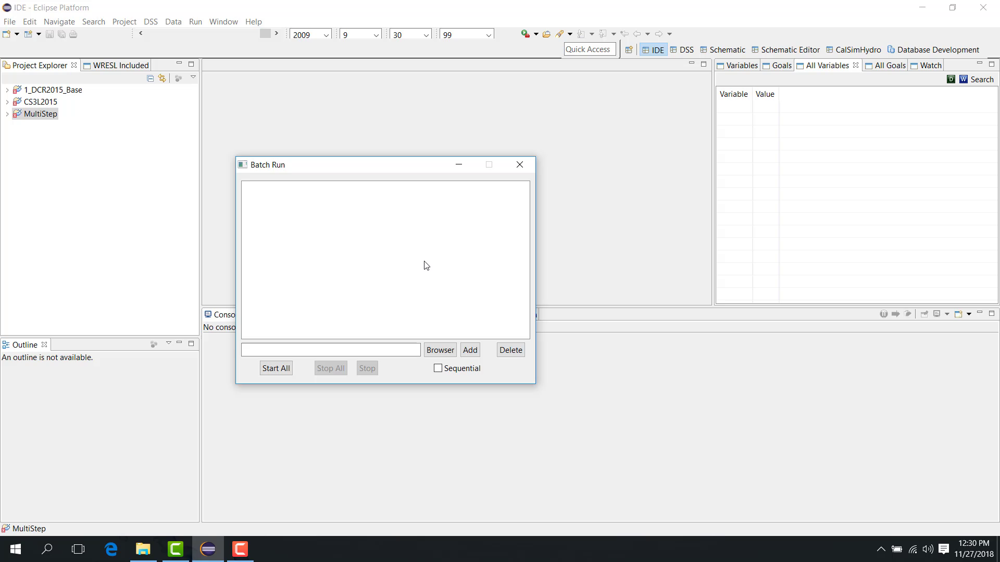

You can add launch files for different study types, such as:

- a regular study;
- a multi-step study;
- a position-analysis study.

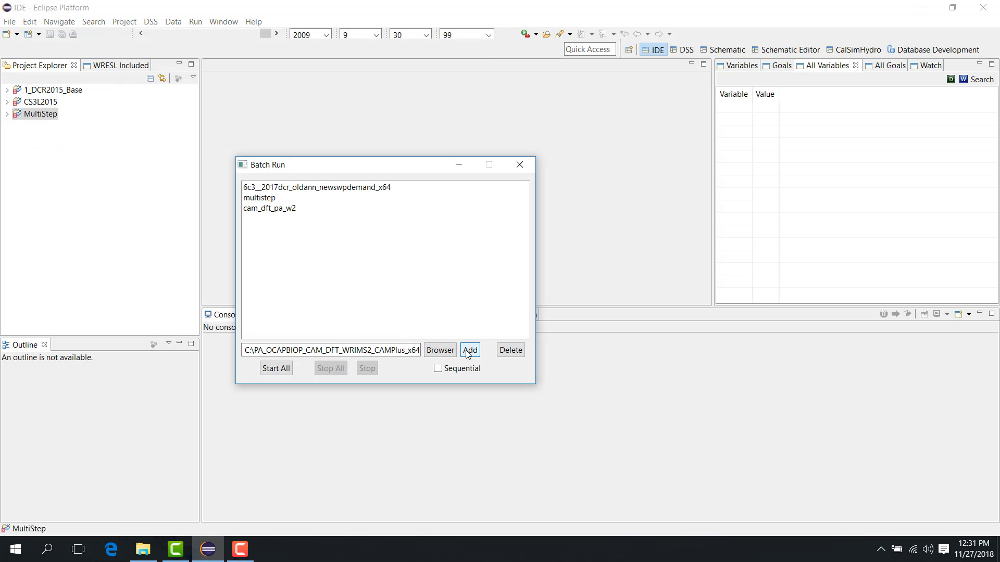

To add launch files:

1. Browse to the launch file.

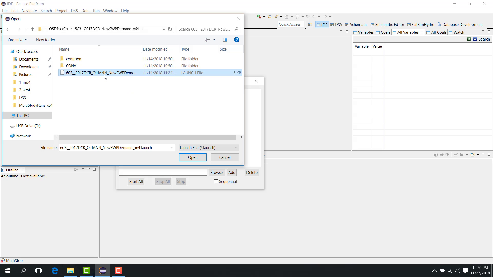

2. Select it.
3. Click **Add**.

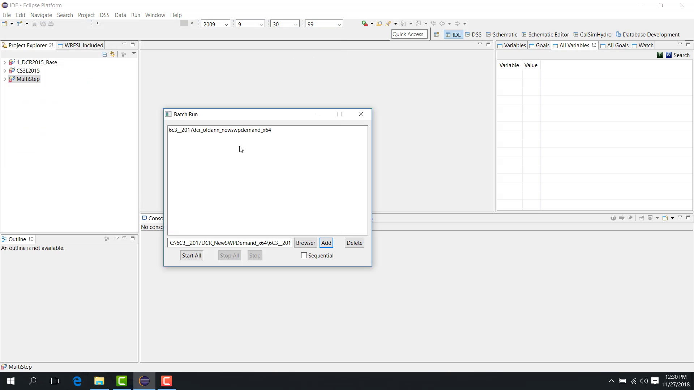

**Sequential vs parallel**

The Batch Run dialog includes a checkbox that determines whether the studies run:

- **sequentially**;
- **in parallel**.

If the checkbox is selected, the runs are sequential. If it is cleared, the runs are parallel.

**Start all**

After the launch files are added and the run mode is selected:

1. Click **Start All**.

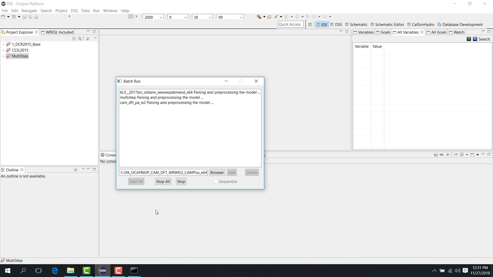

All selected studies begin running. Depending on the run types, multiple command windows may appear, and multi-step or position-analysis studies may proceed in blocks with intermediate processing between periods.

**Notes**

- Parallel execution can increase resource usage significantly.
- Make sure each launch file is valid before adding it to the batch list.

**Related sections**

- :ref:`7.2 Special Batch Run Cmd <72-special-batch-run-cmd>`
- :ref:`7.3 Special Multi Study Run <73-special-multi-study-run>`
- :ref:`8.1 DSS Wrims DSS Perspective <81-dss-wrims-dss-perspective>`

.. _72-special-batch-run-cmd:

7.2 Special Batch Run Cmd
-------------------------

**Purpose**

This chapter explains how to run multiple studies outside **WRIMS 3 GUI** from the command line.

**Before you start**

- You have one or more valid launch files.
- You can access the WRIMS package ``batchrun`` folder.

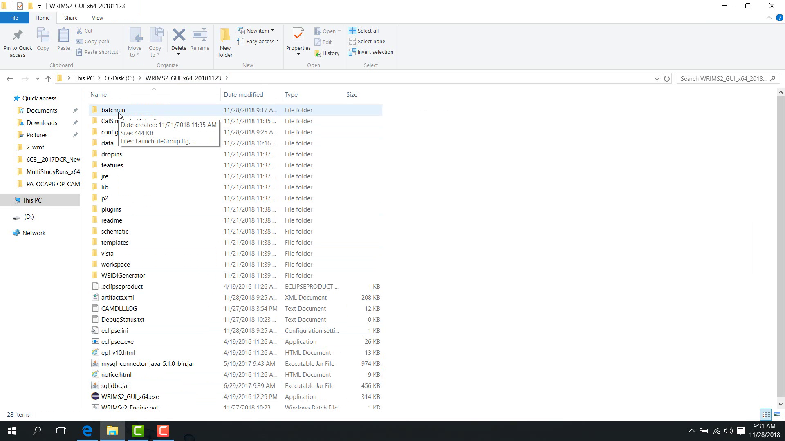

**Procedure**

The WRIMS 3 package contains a ``batchrun`` folder. In this folder, the following batch files are available:

- ``parallelbatchrun``
- ``sequentialbatchrun``

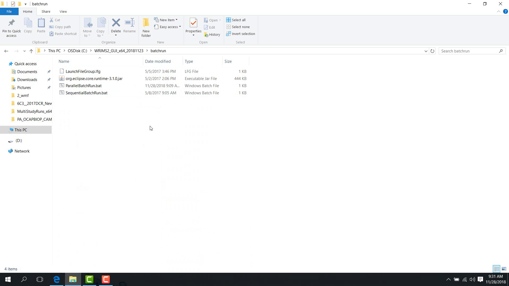

These scripts support:

- regular studies;
- multi-step studies;
- position-analysis studies;
- combinations of these workflows.

**Launch file group**

Before running the batch scripts, create a launch-file group file, ``.lfg``, which lists the launch files to run.

To prepare it:

1. Open the ``.lfg`` file in a text editor.

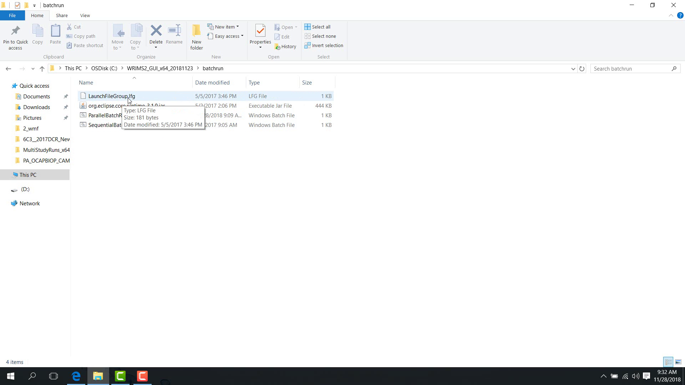

2. Put one launch-file path on each line.

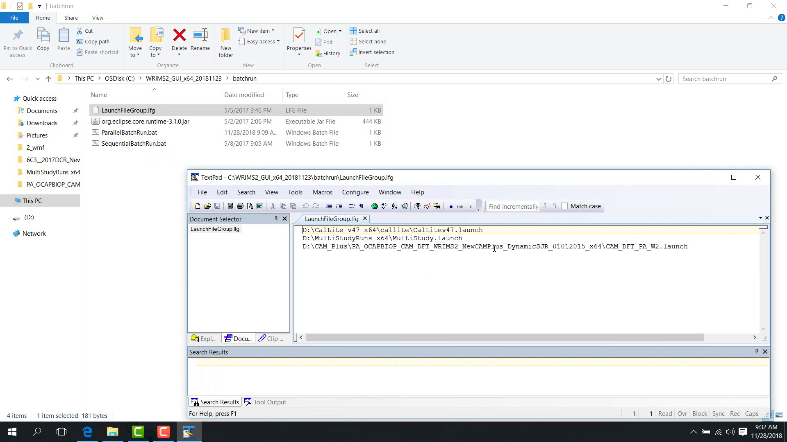

3. Save the file.

A single ``.lfg`` file can contain, for example:

- one regular study launch file;
- one multi-step study launch file;
- one position-analysis study launch file.

**Run the batch script**

Return to the ``batchrun`` folder and run:

- ``parallelbatchrun`` for parallel execution;
- ``sequentialbatchrun`` for sequential execution.

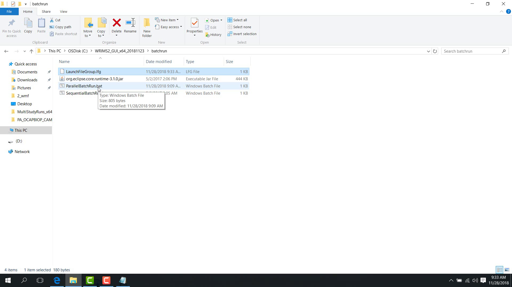

The example shown here uses the parallel batch run and displays multiple studies running at the same time.

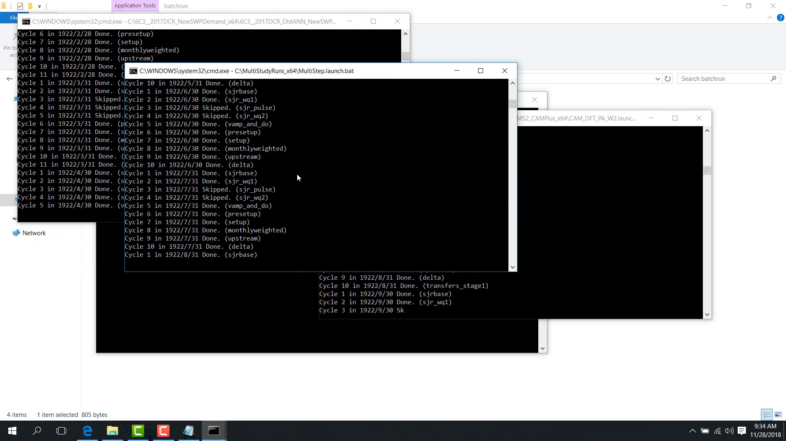

**Notes**

- The ``.lfg`` file is the primary input list for command-line batch running.
- Choose the parallel or sequential script based on workflow requirements and available machine resources.

**Related sections**

- :ref:`7.1 Special Batch Run GUI <71-special-batch-run-gui>`
- :ref:`7.3 Special Multi Study Run <73-special-multi-study-run>`
- :ref:`7.4 Special Position Analysis <74-special-position-analysis>`

.. _73-special-multi-study-run:

7.3 Special Multi Study Run
---------------------------

**Purpose**

This chapter depends on concepts introduced in launch file creation and batch execution. Review **03. Basic Create Launch File**, **7.1 Special Batch Run GUI**, and **7.2 Special Batch Run Cmd** before configuring multi-study workflows.

This chapter shows how to set up and run a **multi-study run**.

**Before you start**

- You have a coordinated workflow that requires multiple studies to run in sequence or in blocks.
- You know the file paths and time settings for each study in the group.

**Procedure**

A multi-study run contains several studies that run together as a coordinated workflow.

In the example shown here, there are three studies:

- study one;
- study two;
- study three.

The launch file is placed above the study folders so that it can control all of them.

**Open the configuration**

1. Load the multi-study run project.

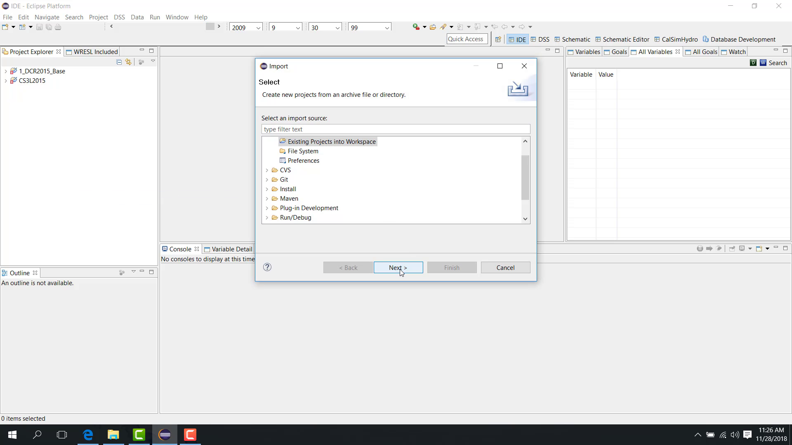

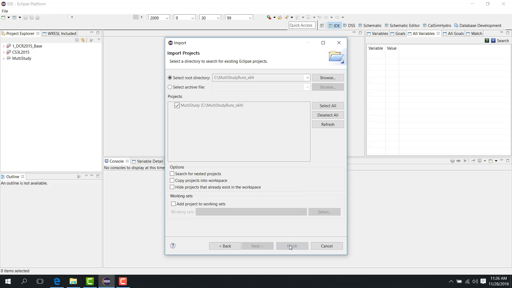

2. Open **Run Configuration**.

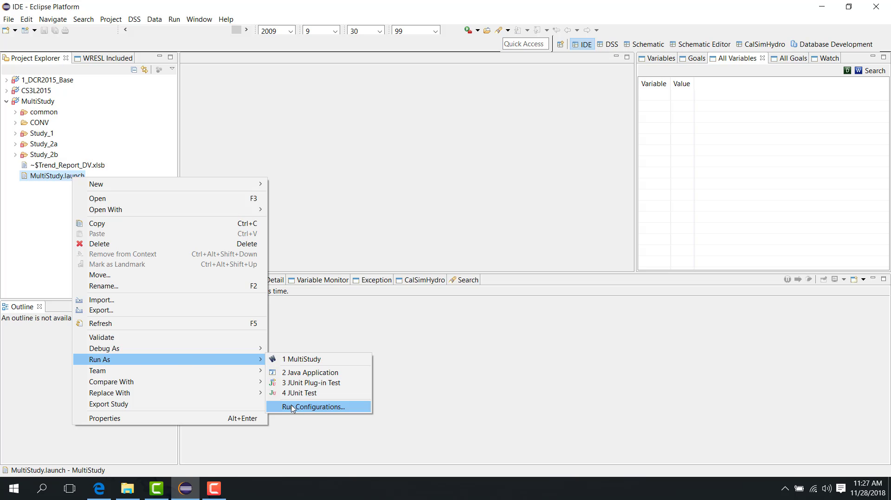

3. Select the multi-study launch file.

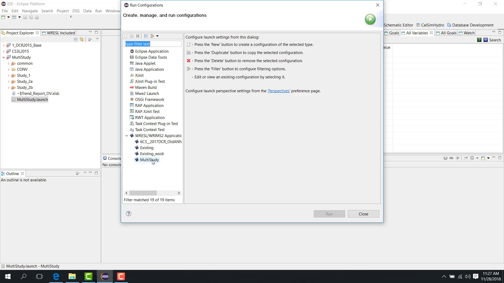

**Main tab**

In the **Main** tab:

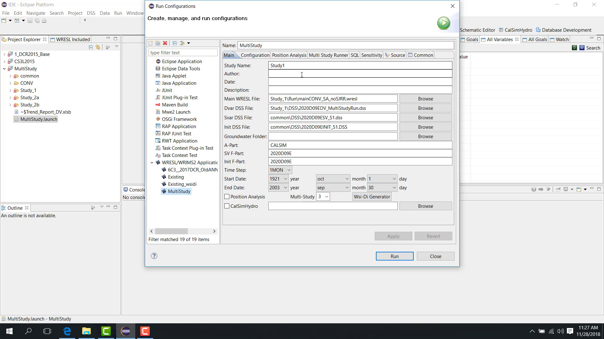

1. Specify the number of studies, such as ``3``.
2. Configure the main WRESL file, DV file, SV file, initial file, Part A, Part F, start date, and end date for study one.

Relative paths are recommended.

**Multi Study Runner tab**

In the **Multi Study Runner** tab, choose whether the run uses:

- **fixed duration**;
- **variable duration**.

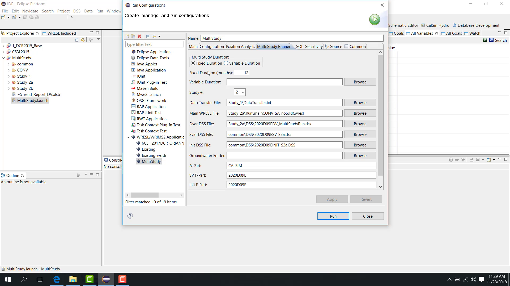

**Fixed duration**

With fixed duration, specify a number of months, such as ``12``.

The execution pattern is then:

- study one runs 12 months;
- study two runs 12 months;
- study three runs 12 months;
- the run returns to study one for the next block.

**Variable duration**

With variable duration, specify a variable-duration file. A sample file may be available in the templates area.

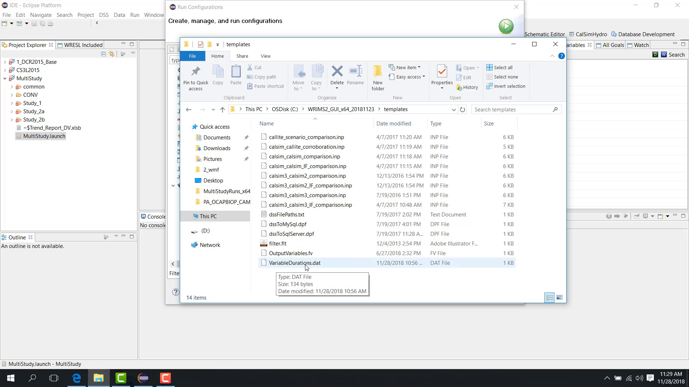

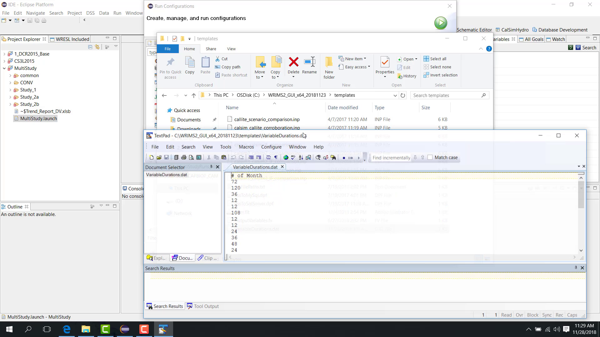

A variable-duration file can define different month blocks for different rounds, such as:

- 72 months;
- then 120 months;
- then 36 months.

**Configure study two and study three**

For each additional study, configure:

- main WRESL file;
- DV file;
- SV file;
- initial file;
- Part A;
- Part F;
- initial Part F;
- SV Part F.

**Initial condition logic**

Initial-condition transfer works as follows:

- In the first round, each study uses its own initial file.
- After the first round:

  - study one DV becomes the initial condition for study two;
  - study two DV becomes the initial condition for study three;
  - the last study DV becomes the initial condition for study one in the next round.

**Data transfer files**

**Data transfer files** move selected DSS records from one study to the next.

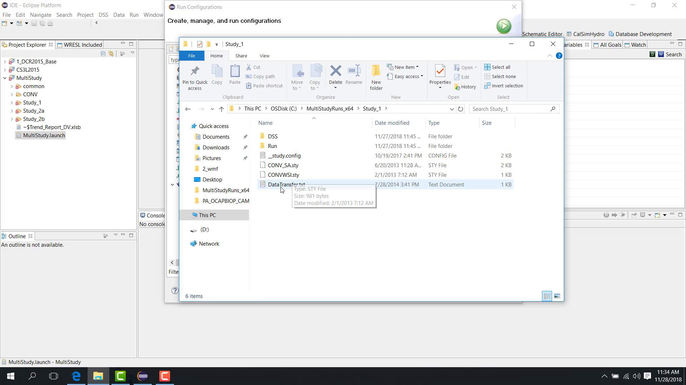

A transfer file can include:

- **DV to DV** transfer;
- **DV to SV** transfer.

Examples include:

- a time series in the DV file of study one can be transferred to the DV file of study two;
- a time series in the DV file of study one can also be transferred to the SV file of study two.

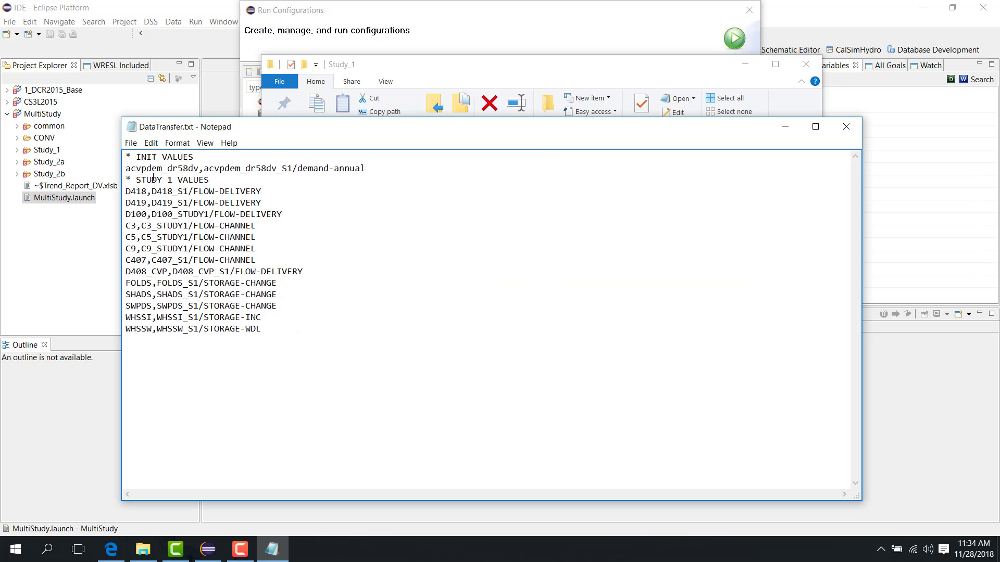

The source and destination Part B values are mapped, while Part C remains the same.

**Run the multi-study workflow**

After all settings are configured, click **Run**.

The studies then rotate through the selected time blocks and continue forward through the simulation period.

**Notes**

- Relative paths are strongly recommended.
- Choose fixed or variable duration based on how long each study should run before handing control to the next one.

**Related sections**

- :ref:`7.1 Special Batch Run GUI <71-special-batch-run-gui>`
- :ref:`7.2 Special Batch Run Cmd <72-special-batch-run-cmd>`
- :ref:`8.1 DSS Wrims DSS Perspective <81-dss-wrims-dss-perspective>`

.. _74-special-position-analysis:

7.4 Special Position Analysis
-----------------------------

**Purpose**

This chapter depends on launch-file setup and is closely related to re-simulation concepts. Review **03. Basic Create Launch File** and **5.3 Debug Force Variable Resimulation** before using position analysis.

This chapter shows how to set up and run a **Position Analysis** study.

**Before you start**

- You have a study suitable for repeated simulation with shifted initial conditions.
- You understand the desired start interval and duration for each position-analysis block.

**Procedure**

A Position Analysis study has a folder structure similar to a regular study. The main difference is in the launch configuration.

In Position Analysis:

- the same initial condition is reused for different simulation periods;
- the initial condition is shifted forward by a selected interval.

For example:

- the initial condition from October 1921 is used to simulate October 1921 to September 1922;
- then it is shifted and used again for October 1922 to September 1923;
- then again for October 1923 to September 1924.

**Configure Position Analysis**

1. Open the study launch configuration.

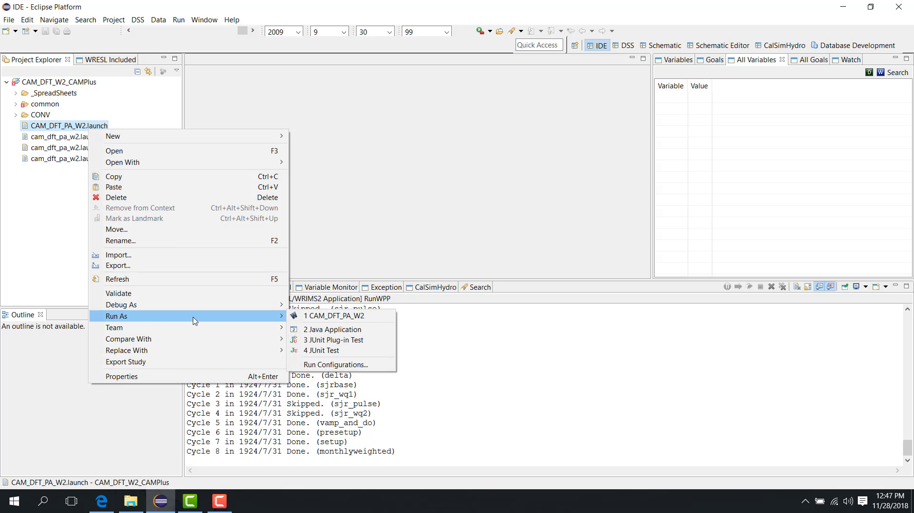

2. In the **Main** tab, check **Position Analysis**.

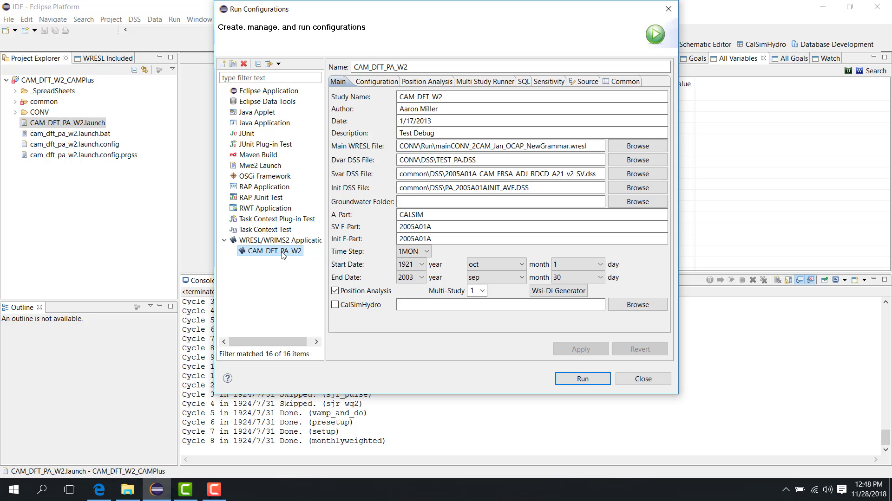

3. Set the usual file fields and dates.

Then open the **Position Analysis** tab.

**PA Start Interval**

The **PA Start Interval** defines how often the initial condition is shifted forward.

For example:

- ``12`` months means the same initial condition is reused every 12 months.

**PA Duration**

The **PA Duration** defines how long each simulation block runs.

For example:

- ``12`` months means each shifted run simulates 12 months.

The interval and duration do not need to be the same, although they often are.

**Delete shifted initial files**

The option **Delete PA Initial File After run completed** controls whether the shifted initial-condition files are deleted after the run.

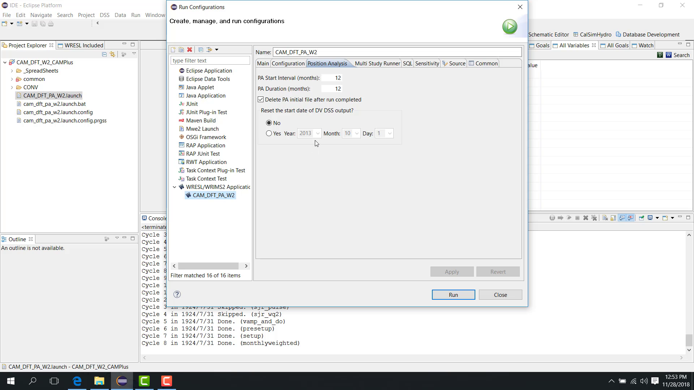

**Reset output start date**

The option **Reset the Start Date of DV DSS Output** allows the simulated output to be shifted to another output year, such as mapping all results to a common year like 2013.

**Important date rule**

The start date must be the **first day of the month**.

For example:

- use **October 1**;
- do not use **October 31**.

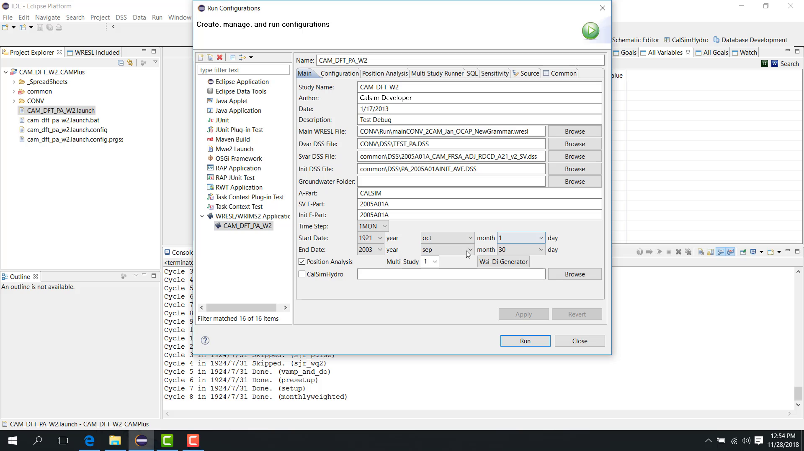

Using the first day of the month avoids problems when shifting the initial condition by a number of months.

**Run**

After configuration, click **Run**.

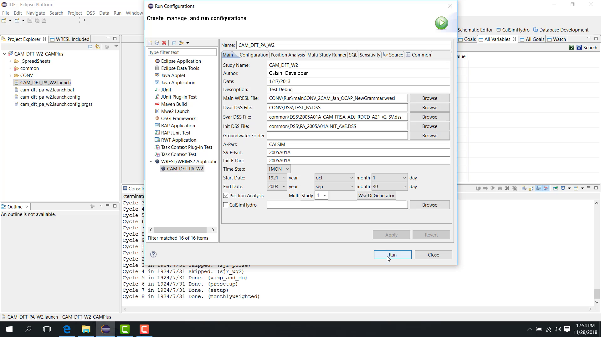

The run then follows a repeating pattern:

- simulate a block;
- shift the initial condition;
- simulate the next block;
- continue through the study period.

**Notes**

- This workflow is useful for understanding how the same starting position performs across different historical windows.
- Choose **PA Start Interval** and **PA Duration** carefully; they do not have to be the same.

**Related sections**

- :ref:`1.4 Basic Create Launch File <14-basic-create-launch-file>`
- :ref:`5.3 Debug Force Variable Resimulation <53-debug-force-variable-resimulation>`
- :ref:`8.1 DSS Wrims DSS Perspective <81-dss-wrims-dss-perspective>`

.. _75-sensitivity-analysis-in-wrims:

7.5 Sensitivity Analysis in WRIMS
---------------------------------

**Purpose**

This chapter explains how to configure and run a sensitivity analysis in WRIMS using a sensitivity index table, WRESL logic, and a launch configuration. The workflow shown in the training frames demonstrates how a single study can be executed multiple times with different sensitivity cases, without manually editing the study for each run. This chapter focuses on setup and execution rather than on detailed interpretation of the resulting outputs.

**Before you start**

Before running a sensitivity analysis, make sure the study includes all of the following:

- a WRESL file that defines a sensitivity index variable;
- a lookup table that stores the sensitivity index values;
- WRESL logic that maps each sensitivity index to a parameter value or multiplier;
- a ``.launch`` file configured for WRIMS execution;
- a valid study structure that can run successfully in WRIMS.

In the example shown here, the required files include:

- ``Forecast.wresl``
- ``SensitivityIndex.table``
- ``Oroville_Sensitivity.launch``

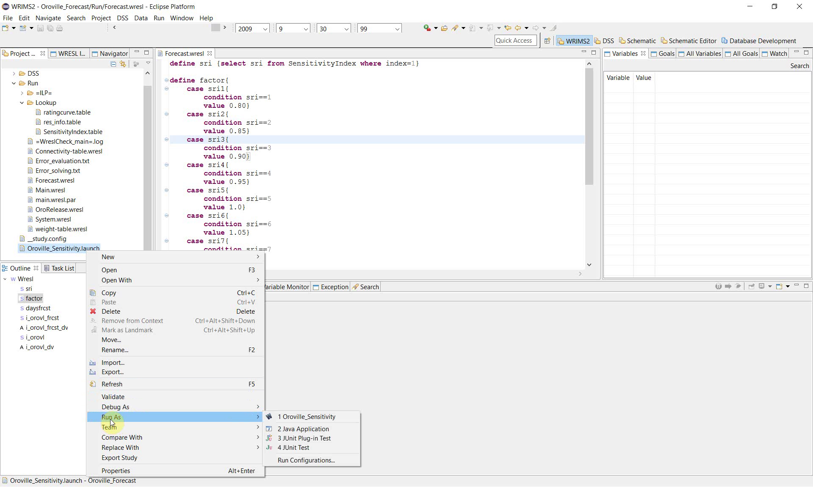

**Procedure**

The sensitivity workflow depends on three connected parts:

- the **sensitivity index table**, which provides the value that identifies the current sensitivity case;
- the **WRESL logic**, which reads that value and converts it into a parameter value used by the study;
- the **launch configuration**, which tells WRIMS to execute the study repeatedly as a sensitivity run.

**1. Review the sensitivity logic in Forecast.wresl**

Open ``Forecast.wresl`` and locate the sensitivity-related definitions. The example defines a variable named ``sri`` by reading the ``SensitivityIndex`` table.

.. code-block:: text

   define sri {select sri from SensitivityIndex where index=1}

This definition establishes the sensitivity control variable used by the study.

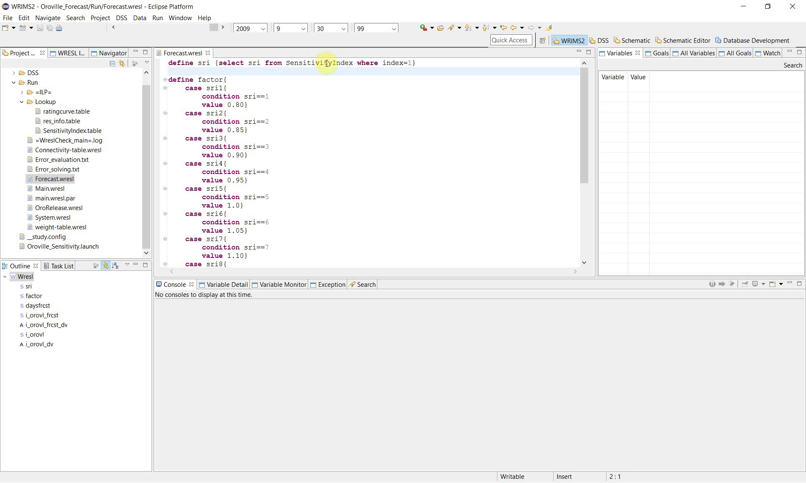

**2. Map the sensitivity index to a parameter value**

After defining ``sri``, the study defines ``factor`` using a set of ``case`` conditions. Each sensitivity case corresponds to a different multiplier.

The example show the following pattern:

.. code-block:: text

   define factor{
       case sri1{
           condition sri==1
           value 0.80}
       case sri2{
           condition sri==2
           value 0.85}
       case sri3{
           condition sri==3
           value 0.90}
       case sri4{
           condition sri==4
           value 0.95}
       case sri5{
           condition sri==5
           value 1.0}
       case sri6{
           condition sri==6
           value 1.05}
       case sri7{
           condition sri==7
           value 1.10}
       case sri8{
           condition sri==8
           value 1.15}
       case sri9{
           condition sri==9
           value 1.20}
       case other{
           condition always
           value 1.0}
   }

This structure converts the sensitivity case number into a usable parameter value. In other words, ``sri`` identifies the case, and ``factor`` is the value applied by the study for that case.

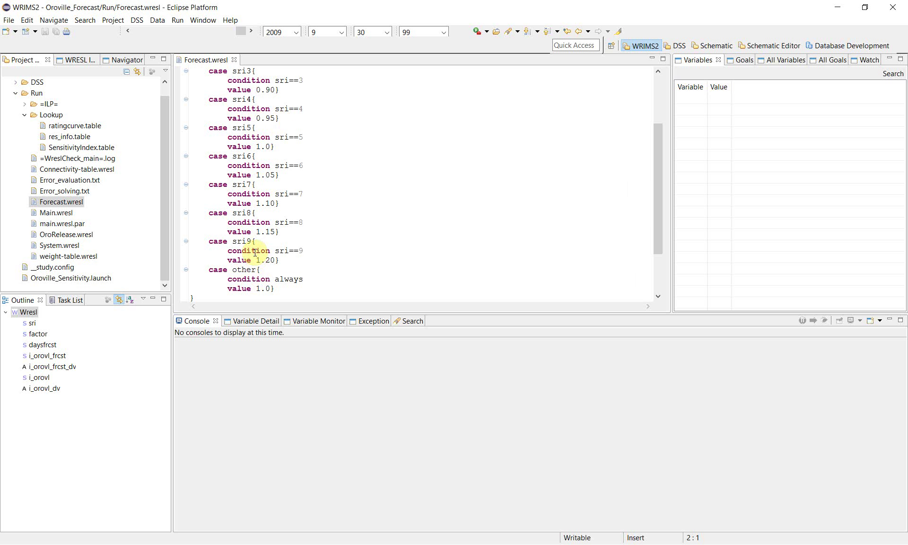

**3. Apply the sensitivity factor in the study logic**

Once ``factor`` has been defined, it should be used in the relevant WRESL expressions that you want to test. This is the step that makes each sensitivity run produce different model results.

The example clearly show the creation of ``sri`` and ``factor``, but they do not fully show the later expression where ``factor`` is applied. When adapting this workflow for your own study, make sure that the chosen sensitivity parameter is actually referenced in the study logic. Otherwise, the sensitivity runs will execute, but the model results will not change.

**4. Open the launch configuration**

In **Project Explorer**, right-click ``Oroville_Sensitivity.launch``, then click **Run As** and open the WRIMS run configuration.

This step connects the WRESL sensitivity logic to the WRIMS execution settings.

**5. Configure the Sensitivity tab**

In the **Run Configurations** window, open the **Sensitivity** tab.

Enable the following settings:

- **Sensitivity Run**: checked
- **Sensitivity Index Table Name**: ``SensitivityIndex``
- **Number of Sensitivity Runs**: ``9``

The interface text also explains the expected WRESL definition:

.. code-block:: text

   define sri {select sri from SensitivityIndex where index=1}

In this example, WRIMS loops the sensitivity index from **1 through 9**, so the study is executed a total of **9 times**. The default table used for this loop is **``SensitivityIndex.table``**. During a sensitivity run, **``SensitivityIndex.table``** is reserved for sensitivity-index control and should not be used for any other purpose.

WRIMS uses this variable and the default sensitivity table to look up the sensitivity values during execution.

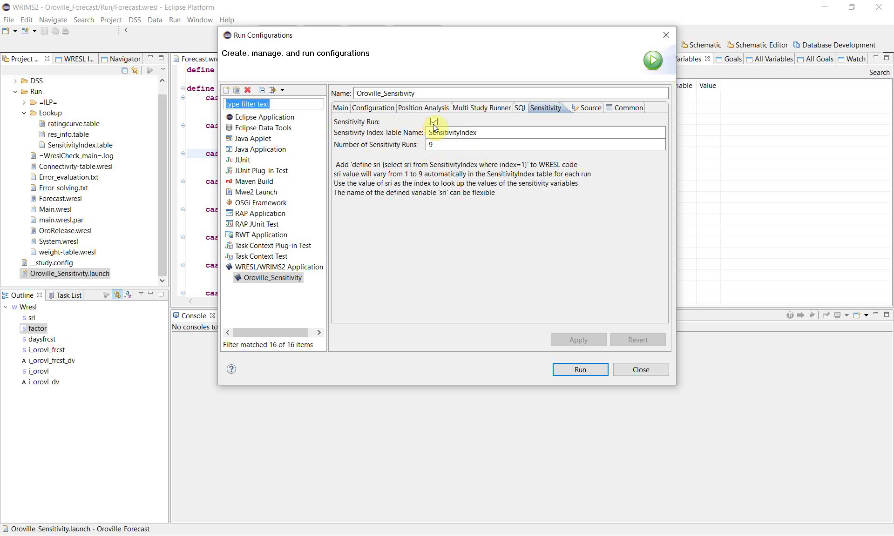

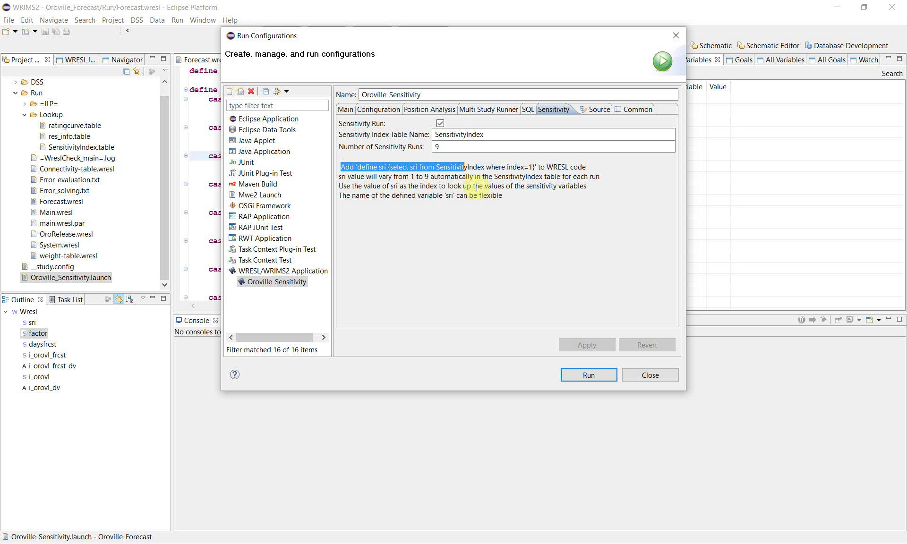

**6. Start the sensitivity run**

After the sensitivity settings are complete, click **Run**.

WRIMS launches the study and begins the execution process.

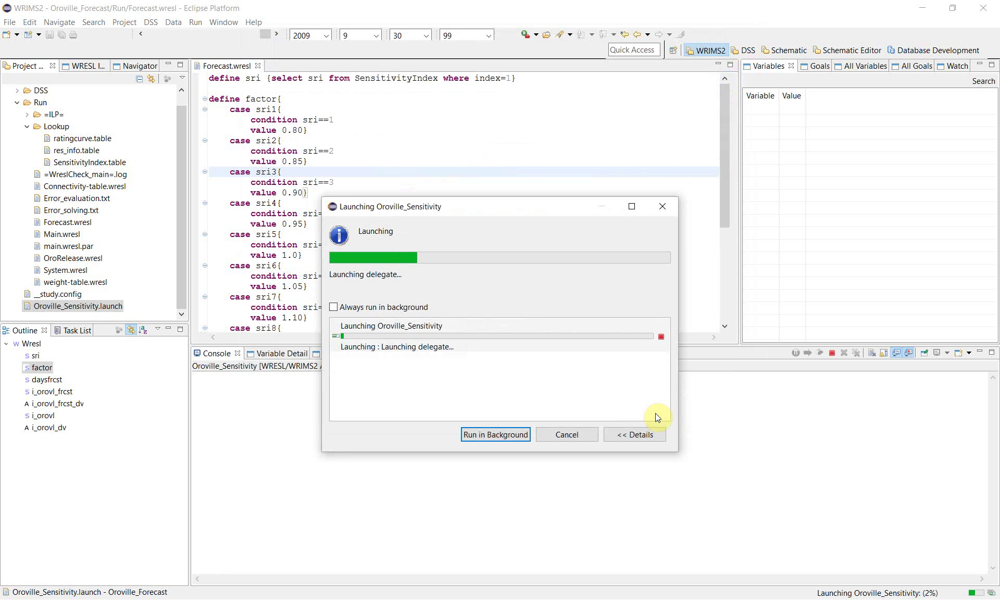

**7. Monitor the console during execution**

Use the **Console** view to confirm that the study is running correctly. The console shows the major processing stages, including:

- parsing WRESL files;
- converting aliases and constraints;
- checking study variables;
- reading time series;
- running the model cycle.

These messages are useful for confirming that the sensitivity configuration is valid and that the study is progressing normally.

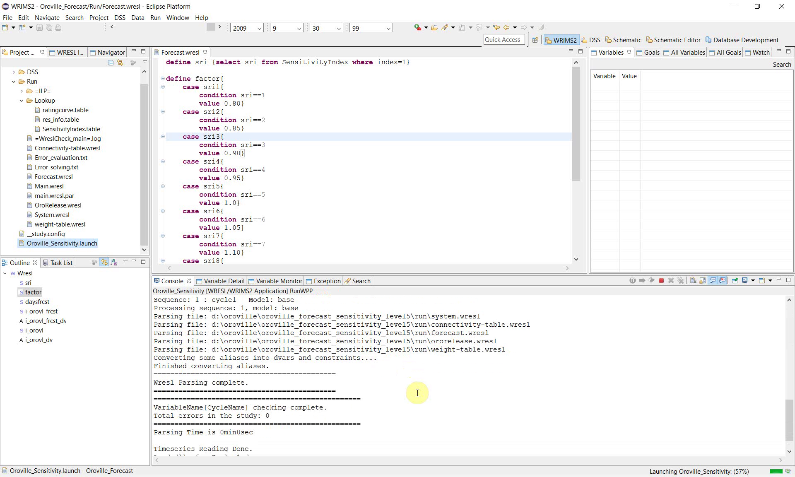

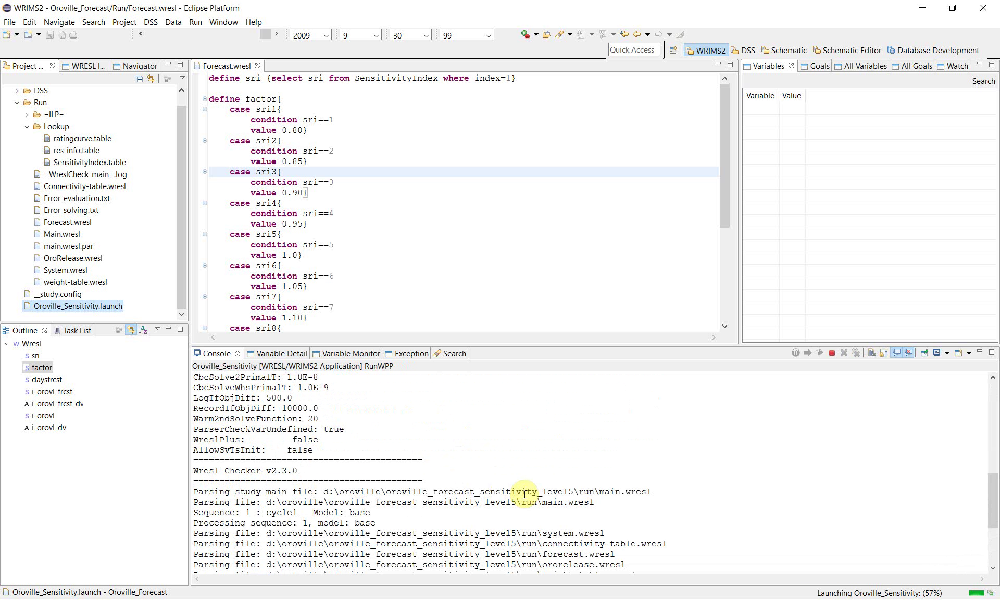

**8. Confirm that the run completed successfully**

At the end of the run, the console shows completion messages such as:

- daily run progress;
- DSS writing messages;
- ``Run ends!``;
- total run time.

This indicates that the sensitivity workflow completed successfully.

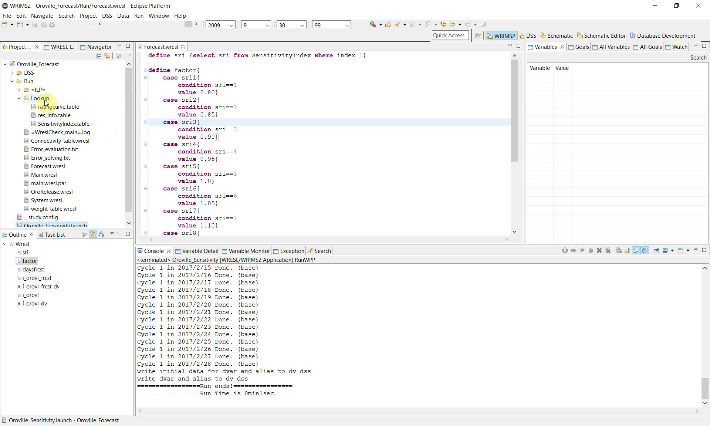

**9. Review the sensitivity index table**

After the run, open ``SensitivityIndex.table`` to confirm the table structure used by the study.

The example figure shows a table named ``SensitivityIndex`` with columns for ``Index`` and ``SRI``.

This table is the source used by the WRESL definition of ``sri``. In this workflow, it is also the default table WRIMS uses to loop the sensitivity index from 1 to 9. It should not be reused for another purpose during the same sensitivity run.

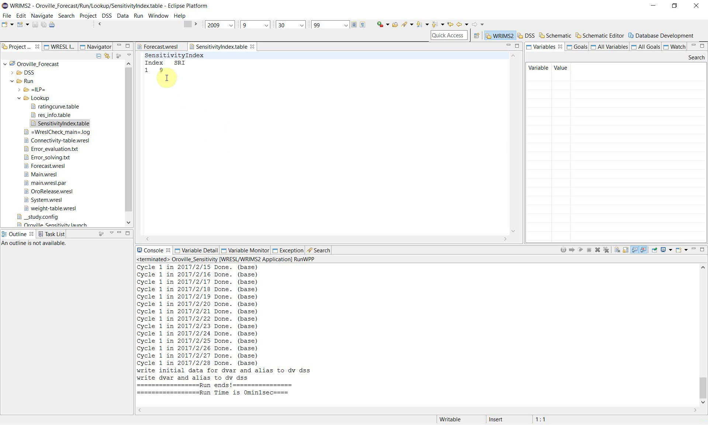

**10. Review the DSS outputs for each sensitivity case**

Open the ``DSS`` folder in the study and review the generated files.

The example produces a separate set of DSS outputs for multiple sensitivity cases, including files such as:

- ``SR1_Orovl_DV.dss``
- ``SR2_Orovl_DV.dss``
- ``SR3_Orovl_DV.dss``
- ...
- ``SR9_Orovl_DV.dss``

This file naming pattern shows that WRIMS executed the study repeatedly and wrote separate outputs for each sensitivity run.

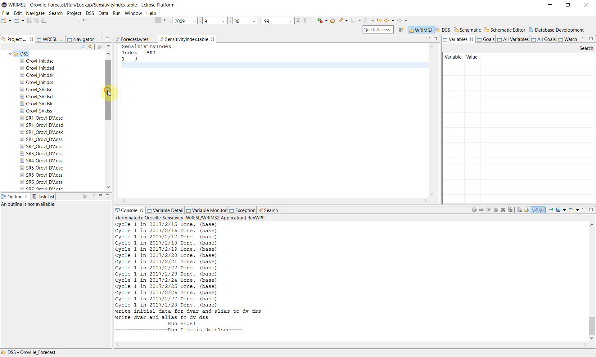

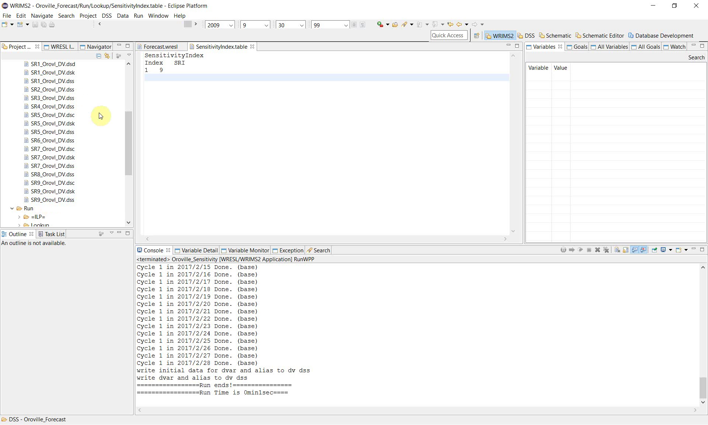

**Notes**

- This workflow allows a single WRIMS study to be tested under multiple parameter assumptions without manually editing and rerunning the study for each case.
- The sensitivity index table controls the case selection, WRESL translates the selected case into a parameter value, and WRIMS executes the full set of runs automatically.
- Separate DSS outputs are generated for each sensitivity case, which makes later comparison easier.
- This chapter focuses on configuration and execution of the sensitivity run. Detailed comparison and interpretation of the resulting outputs can be documented separately if needed.

**Related sections**

- :ref:`1.4 Basic Create Launch File <14-basic-create-launch-file>`
- :ref:`1.5 Basic Modify Launch File <15-basic-modify-launch-file>`
- :ref:`7.1 Special Batch Run GUI <71-special-batch-run-gui>`
- :ref:`8.1 DSS Wrims DSS Perspective <81-dss-wrims-dss-perspective>`
