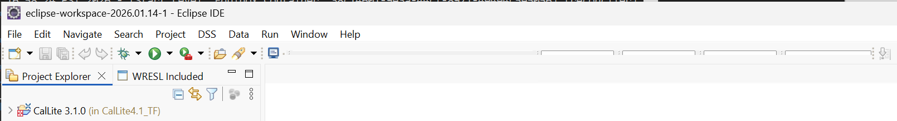

.. _troubleshooting:

10. Troubleshooting
===================

This section contains troubleshooting information for common WRIMS 3 GUI
configuration and display problems.

.. _gui-scaling-high-dpi-windows:

10.1 GUI Scaling on High-DPI Windows Displays
----------------------------------------------

Problem
~~~~~~~

Some Windows users may experience GUI scaling problems on high-DPI
displays.

A clear indication of this issue is that the toolbar date-selection
dropdowns are cut off vertically or do not display completely. These
controls are used to select the year, month, date, and cycle for pausing
a debug run.

Resolution
~~~~~~~~~~

First update the Windows high-DPI compatibility setting for WRIMS.

1. Close **WRIMS 3 GUI**.
2. Open the WRIMS 3 installation folder.
3. Right-click ``eclipse.exe`` and select **Properties**.
4. Select the **Compatibility** tab.
5. Under **Settings**, click **Change high DPI settings**.
6. Select **Use this setting to fix scaling problems for this program
   instead of the one in Settings**.
7. Click **OK**.
8. Click **Apply** and close the Properties window.

Next, update the WRIMS GUI scaling preference.

9. Start WRIMS using ``WRIMS3_GUI_Start.bat``.
10. Select **Window > Preferences**.
11. Go to **General > Appearance**.
12. Clear the **Use monitor-specific UI scaling** checkbox.
13. Click **Apply**.
14. Restart WRIMS if prompted.

Verification
~~~~~~~~~~~~

Return to the WRIMS IDE perspective and inspect the toolbar.

Verify that the year, month, date, and cycle selection controls are fully
visible. The date-selection controls should remain usable for pausing a
debug compute at the selected simulation time.

If the controls are still partially hidden, verify that both the Windows
high-DPI compatibility setting and the WRIMS monitor-specific UI scaling
setting were changed.
