.. _3-model-structure-and-source-navigation:

3. Model Structure and Source Navigation
========================================

.. _31-basic-wresl-plus:

3.1 Basic WRESL Plus
--------------------

**Purpose**

This chapter shows how to turn **WRESL Plus** on or off.

**Before you start**

- A WRESL file is open in the editor.

**Procedure**

Some models use **WRESL**, while others use **WRESL Plus**, which supports extended language features.
WRIMS 3 now defaults to **WRESL Plus** support to ensure compatibility with all models.

To turn the feature on or off:

1. Open the launch configuration using either **Run Configuration** or **Debug Configuration**.

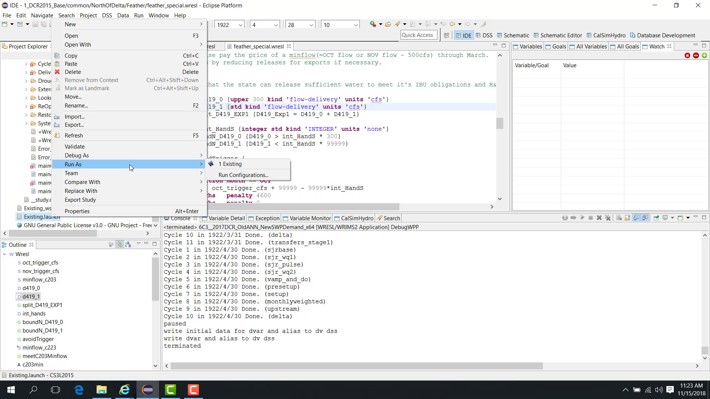

2. Select the launch file.
3. Open the **Configuration** tab.

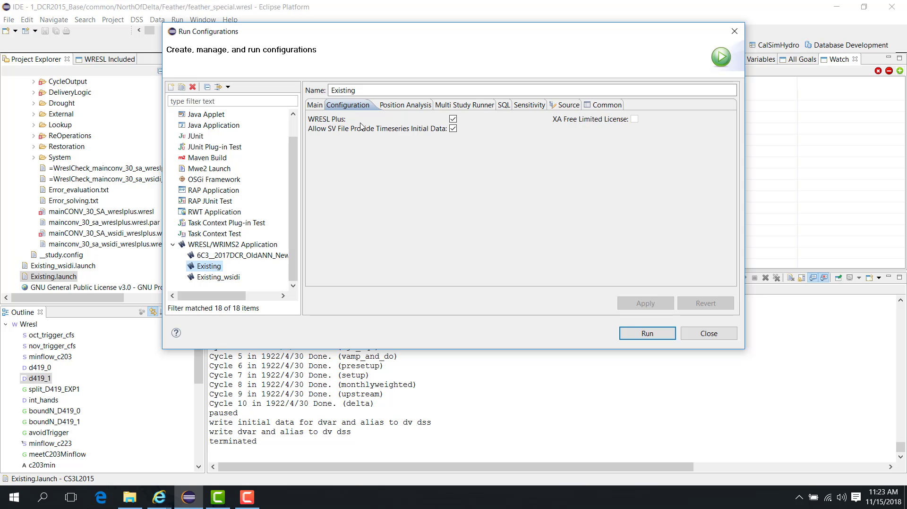

4. Locate the **WRESL Plus** option.
5. Turn it on or off as needed.

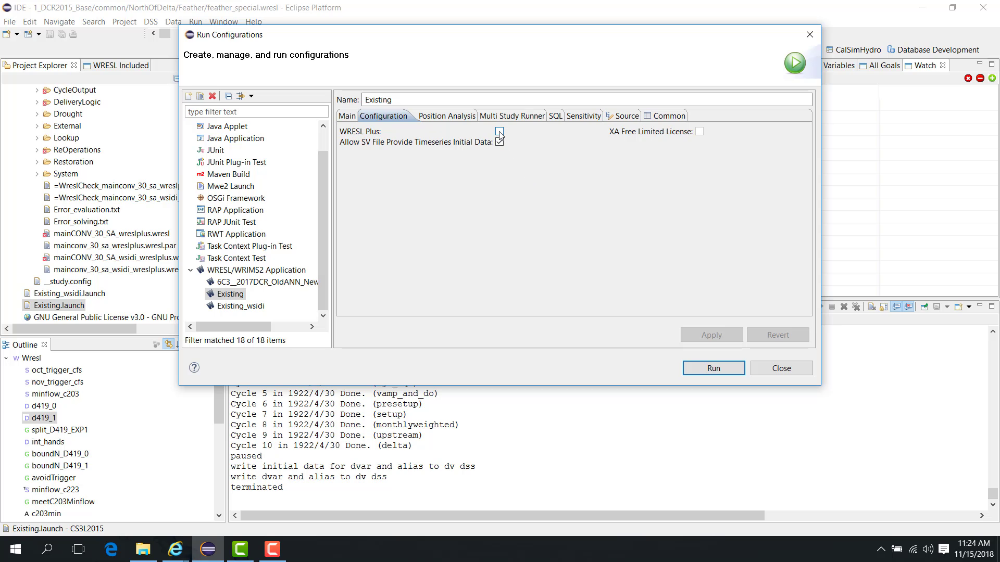

6. Click **Apply**.

If the model was written in **WRESL Plus**, this option must be enabled so that WRIMS 3 GUI can parse the model correctly.

This behavior can also be confirmed in **Debug** mode:

- open the launch file in **Debug Configuration**;
- confirm that **WRESL Plus** is enabled;
- start the model in **Debug** mode;
- check the console for the message **WRESL Plus parsing completed**.

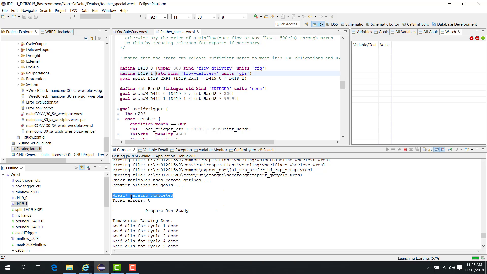

If the model uses regular WRESL instead, the console shows **WRESL parsing completed**.

At the end of the run, terminating the study saves the results to DSS and ends execution.

**Notes**

- This setting affects model parsing behavior in the editor and launch configuration.
- Use **WRESL Plus** only when the model requires the extended language features.

**Related sections**

- :ref:`2.6 Basic Outline Panel for the WRESL File <26-basic-outline-panel-for-the-wresl-file>`
- :ref:`4.1 Debug Pause Variable Goal View <41-debug-pause-variable-goal-view>`
- :ref:`3.2 Debug Find Reference <32-debug-find-reference>`

.. _32-debug-find-reference:

3.2 Debug Find Reference
------------------------

**Purpose**

This chapter explains how to use **Find Reference** in the WRESL editor.

**Before you start**

- A WRESL file is open in the editor.

**Procedure**

In the WRESL editor, point to a variable, right-click it, and choose **Find Reference**.

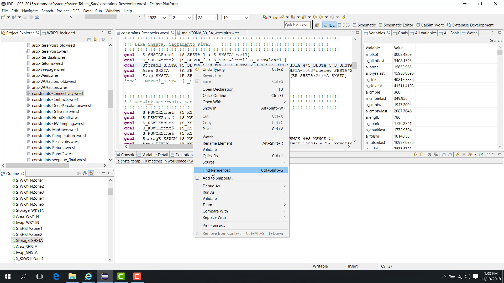

WRIMS 3 GUI then lists all locations where that exact variable is used.

The example shown here uses a variable such as ``s_shsta``.

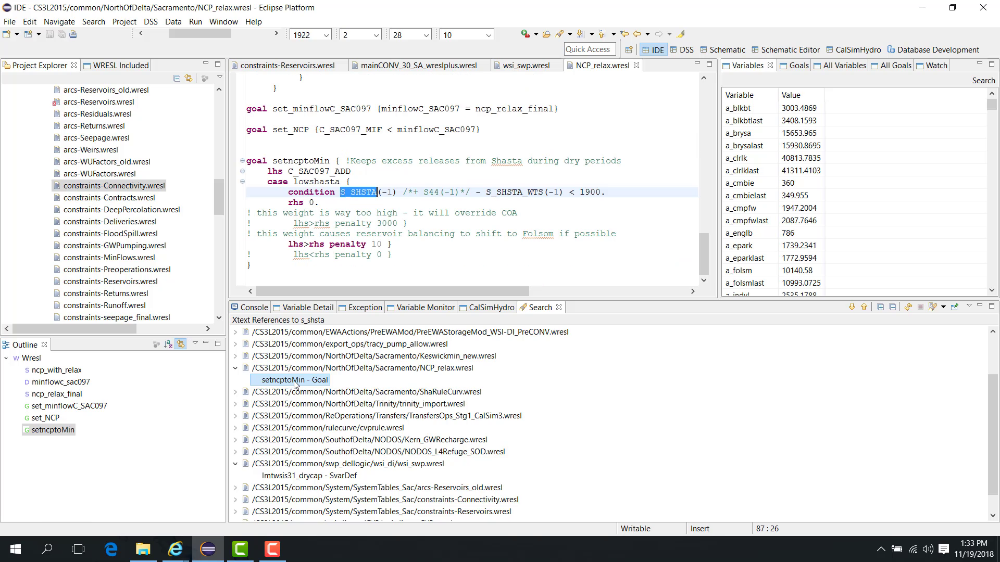

The results list:

- the files where the variable is used;
- the lines where it appears.

Selecting a result opens the file and highlights the variable occurrence.

**Find Reference vs Search**

**Find Reference** and regular **Search** behave differently:

- **Find Reference** matches the exact variable name only.
- **Search** may return partial matches such as variables that contain the same text, for example:
  - ``s_shsta``
  - ``s_shsta_1``
  - ``s_shsta2``

Use **Find Reference** when precision is required.

**Notes**

- This feature is useful when tracing model logic before editing or debugging a variable.

**Related sections**

- :ref:`3.1 Basic WRESL Plus <31-basic-wresl-plus>`
- :ref:`2.6 Basic Outline Panel for the WRESL File <26-basic-outline-panel-for-the-wresl-file>`
- :ref:`4.6 Debug Error Source Code Link <46-debug-error-source-code-link>`

.. _33-debug-study-cycle-wresl:

3.3 Debug Study Cycle WRESL
---------------------------

**Purpose**

This chapter explains how to display the WRESL files used by the study as a whole or by a selected cycle.

**Before you start**

- A study is loaded.
- You want to know which WRESL files are included globally or for a specific cycle.

**Procedure**

Start from the **main WRESL file**.

When you right-click the main file, two options are available:

- **Study WRESL**
- **Cycle WRESL**

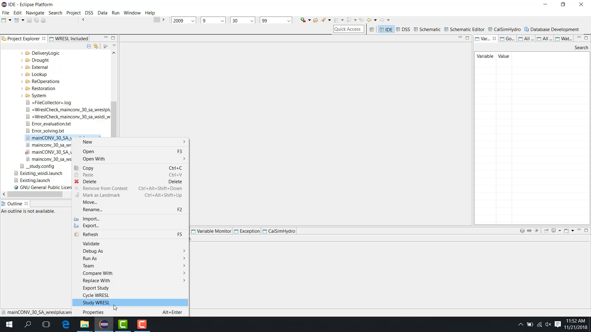

**Study WRESL**

If you choose **Study WRESL**, WRIMS 3 GUI parses the main file and determines all WRESL files used by the study.

The results are displayed in the **WRESL Included** panel.

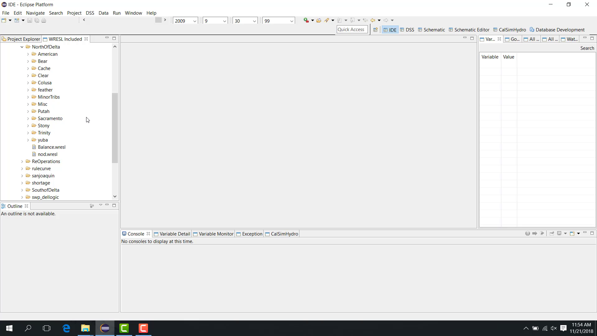

The included list may contain folders such as:

- ``misc``
- ``yuba``
- ``sacramento``
- ``trinity``

If multiple main files exist in the study, only the one actually used by the study is included.

Selecting a file in the **WRESL Included** panel opens it in the editor.

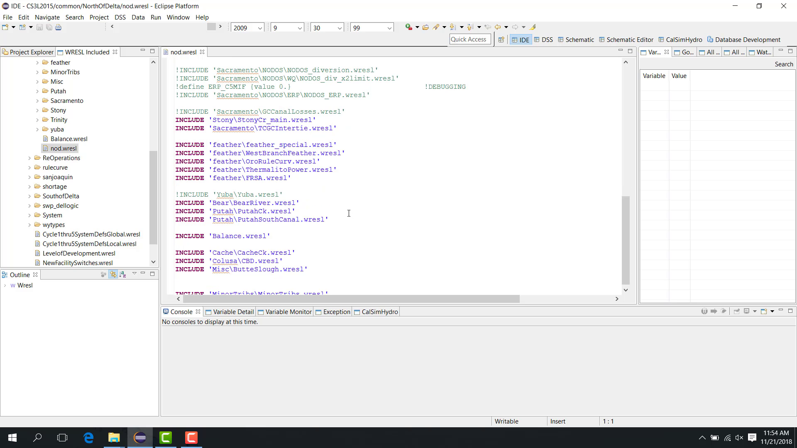

**Cycle WRESL**

If you choose **Cycle WRESL**, WRIMS 3 GUI prompts you to select the cycle to inspect.

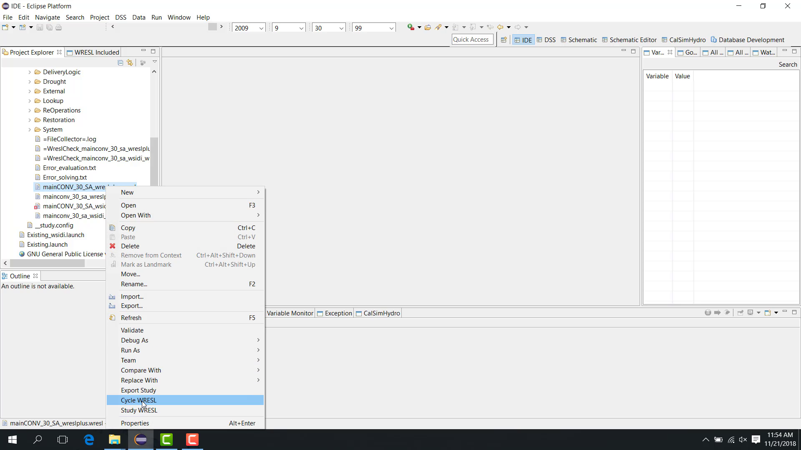

After you select a cycle, WRIMS 3 GUI parses the study and determines only the WRESL files used in that cycle.

The results again appear in the **WRESL Included** panel, but this time only the files active in the selected cycle are shown.

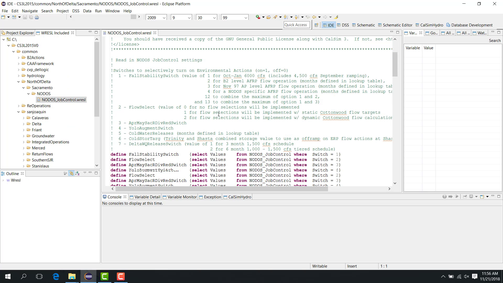

**Notes**

- **Study WRESL** shows the full included set.
- **Cycle WRESL** narrows the list to files active in the selected cycle.

**Related sections**

- :ref:`2.6 Basic Outline Panel for the WRESL File <26-basic-outline-panel-for-the-wresl-file>`
- :ref:`4.6 Debug Error Source Code Link <46-debug-error-source-code-link>`
- :ref:`5.2 Debug Filter Goals <52-debug-filter-goals>`
