# WRIMS IDE Debugging Guide

This guide describes how to run a **CalSim study in debug mode** using the WRIMS IDE.

The debugging workflow allows users to:

- inspect variables
- monitor goals
- compare DSS values
- step through model cycles

---

# Table of Contents

1. Start WRIMS GUI
2. Import Study
3. Verify Project Explorer
4. Set Breakpoint
5. Run Debug Mode
6. Inspect WRESL Variables
7. Load DSS Files
8. Watch Variables
9. Resume / Pause Execution
10. Terminate Debug Run

---

# 1. Start WRIMS GUI

Start the WRIMS GUI by clicking:

```
WRIMS2_GUI_Start.bat
```

located in the **root folder of the WRIMS2 GUI package**.

---

# 2. Import Study

Example study directory:

```
C:\9.3.1_danube_adj_hist
```

If the project file exists:

```
C:\9.3.1_danube_hist\.project
```

Import the project:

1. Click **File → Import**
2. Select **General**
3. Select **Existing Projects into Workspace**
4. Choose the root project directory

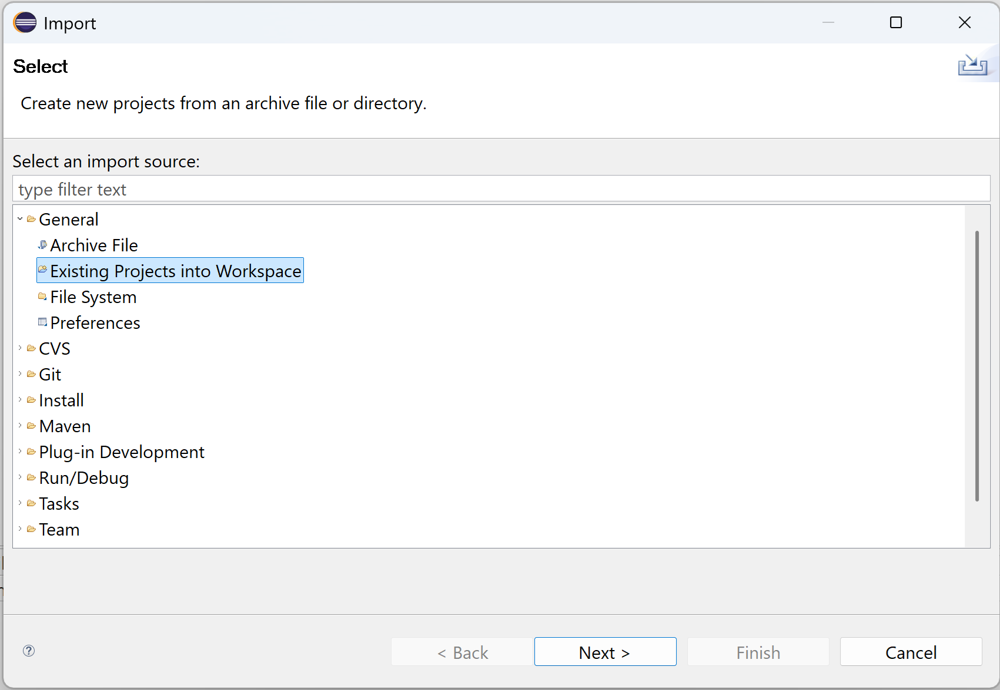

---

## Create a New Project (Alternative)

If the project does not exist:

1. Click **File → New → Project**
2. Select **General Project**
3. Enter the project name
4. Uncheck **Use default location**
5. Select the project folder

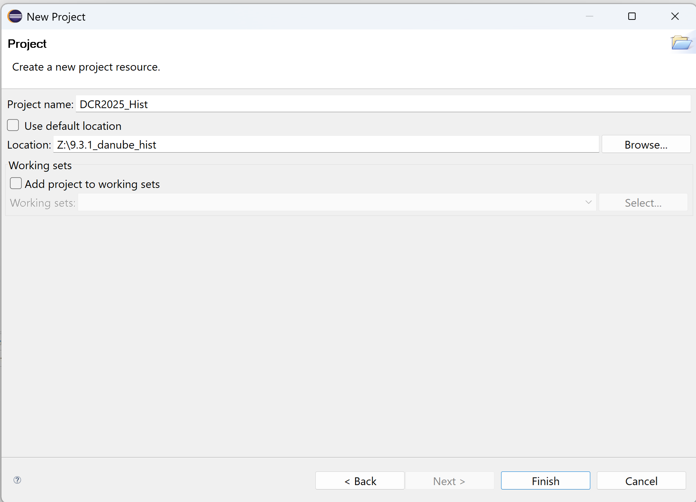

---

# 3. Verify Project Explorer

After importing the project, the **Project Explorer** should appear as follows:

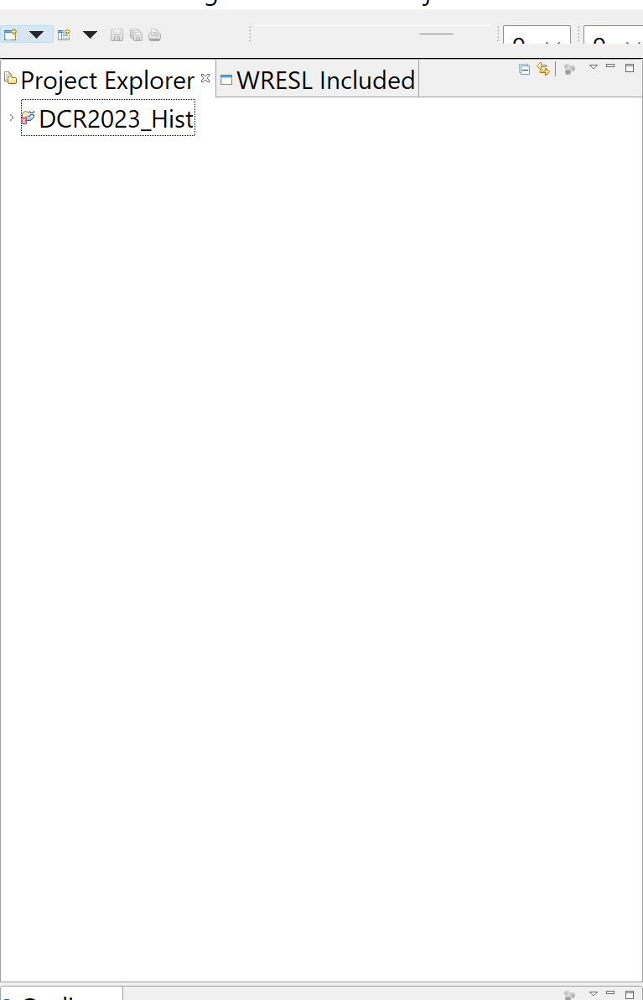

---

# 4. Set Breakpoint

Set a breakpoint with the following values:

| Parameter | Value |
|-----------|------|
| Year | 1923 |
| Month | 10 |
| Day | 31 |
| Cycle | 1 |

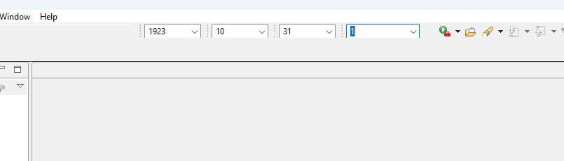

---

# 5. Run Debug Mode

1. Expand project **DCR2025_Hist**
2. Right click inside **Project Explorer**
3. Select **Debug As → Debug Configurations**
4. Choose launch configuration **CS3_Hist_Dev** under **WRESL / WRIMS2 Application**
5. Click **Debug**

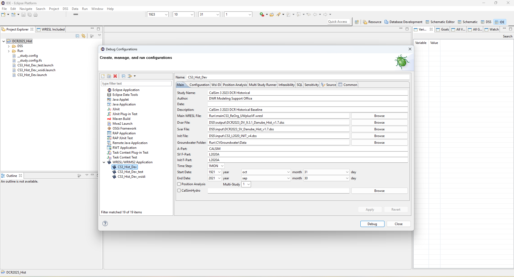

---

## Debug Console

The study will begin execution:

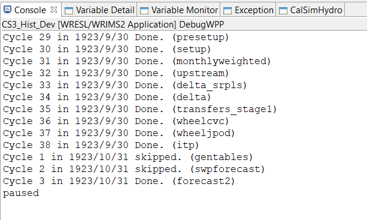

---

# 6. Continue Execution

When the breakpoint is reached:

1. Click **Next Step**
2. Click **Next Cycle**

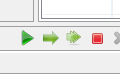

The study continues running:

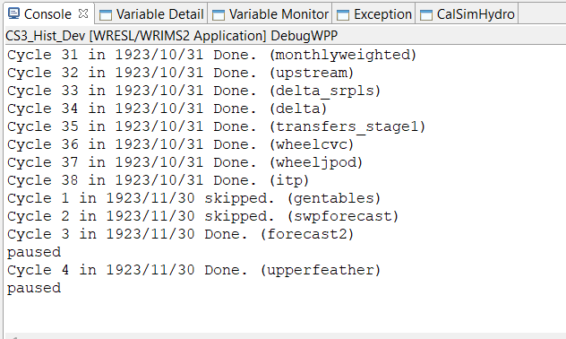

---

# 7. Inspect WRESL Variables

Open a WRESL file such as:

```
C:\9.3.1_danube_adj\Run\COA\coa.wresl
```

Check the following views:

- Variables
- Goals
- All Variables
- All Goals


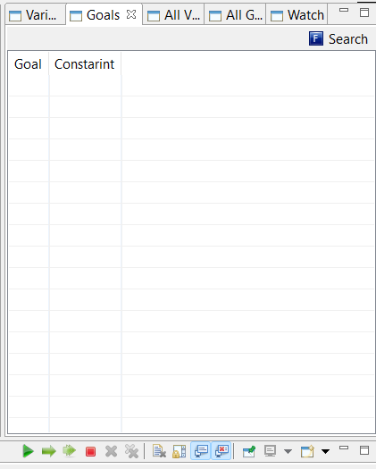

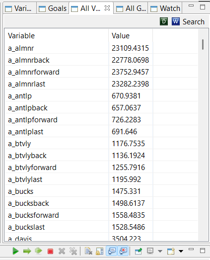

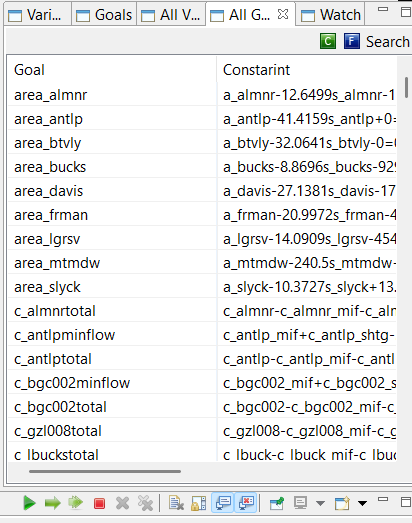

Notes:

- **Goals view may be empty** if the file is not used in the current cycle.
- **Variables view shows active variables** used in the run.

---

# 8. Load DSS Files

Navigate to:

```
Data → Load Dss / Studies
```

Load the following files:

DV DSS

```
DCR2023_DV_9.3.1_Danube_Hist_v1.7.dss
```

SV DSS

```
DCR2023_SV_Danube_Hist_v1.7.dss
```

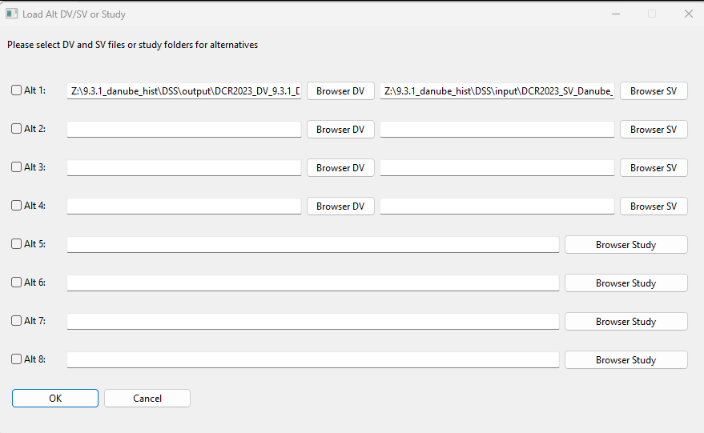

The Variables view will update:

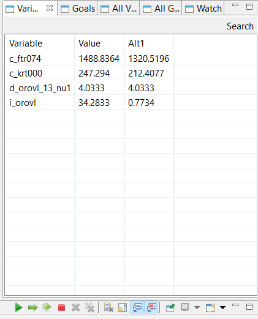

---

# 9. View All Variables

Open the **All Variables** view and click **All Variables from DSS** to compare values across runs.

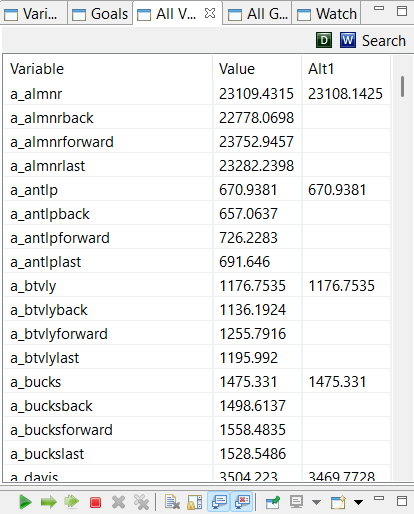

---

# 10. View Control Goals

Open **All Goals** view and click **Control Goals**.

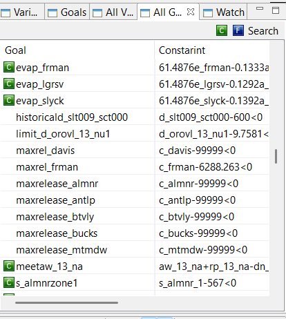

---

# 11. Watch Variables

Open the **Watch** view.

Add:

Variable

```
s_shsta
```

Constraint

```
coa_cvp3
```

Then remove the constraint.

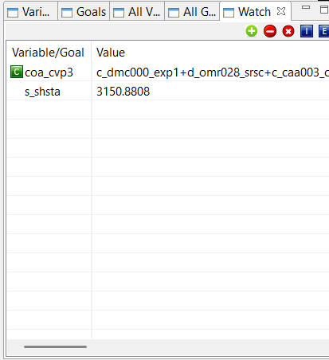

---

# 12. Hover Variable Inspection

Hover over:

Variable

```
I_SHSTA
```

Constraint

```
swp_storage_change
```

inside

```
C:\9.3.1_danube_hist\Run\COA\coa.wresl
```

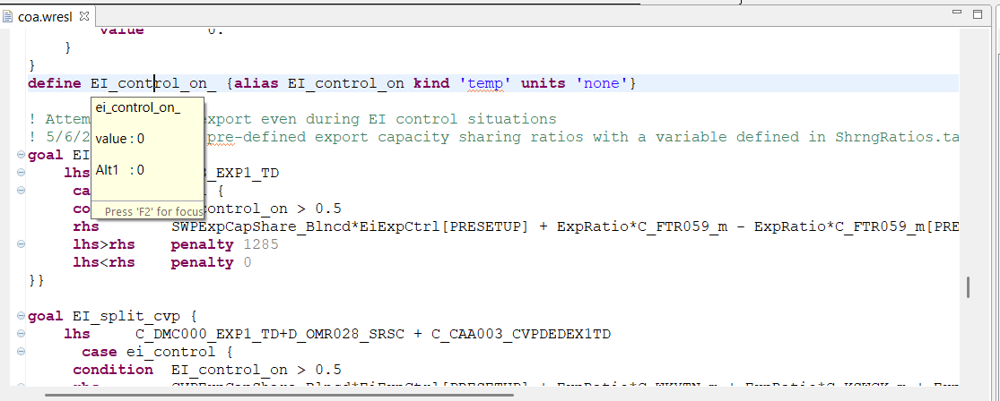

---

# 13. Resume and Pause Execution

1. Click **Resume**
2. Wait approximately **2 seconds**
3. Click **Pause**

---

# 14. Terminate Debug Run

Click **Terminate** to stop execution.

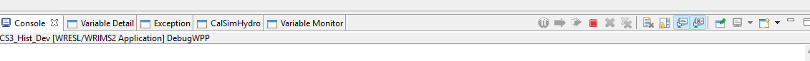

Console output:

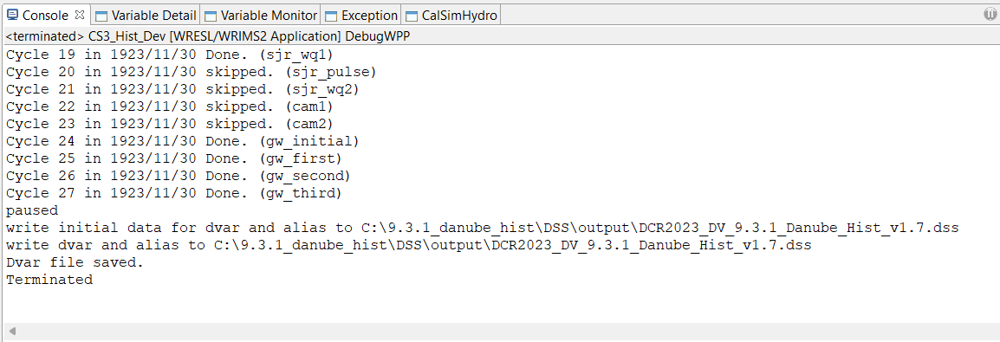

